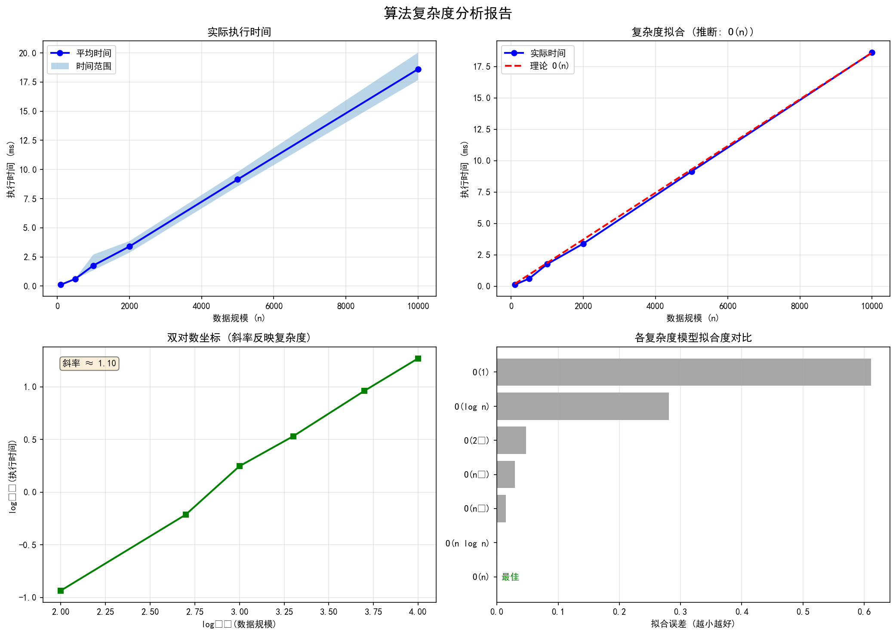

# 算法分析报告

**算法源码**: [merge_sort](#source-code)
**生成时间**: 2026-03-10 22:42:10

---

## 1. 执行摘要

- **正确性测试**: ✅ 通过
- **推断复杂度**: `O(n)`
- **置信度**: 95.0%

## 2. 正确性测试

**总计**: 8 个测试用例
**通过**: 8
**失败**: 0

| 测试用例 | 状态 | 输入 | 输出/错误 |
|----------|------|------|-----------|
| 空数组 | ✅ 通过 | `[]` | `[]` |
| 单元素 | ✅ 通过 | `[1]` | `[1]` |
| 基本排序 | ✅ 通过 | `[3, 1, 2]` | `[1, 2, 3]` |
| 逆序数组 | ✅ 通过 | `[5, 4, 3, 2, 1]` | `[1, 2, 3, 4, 5]` |
| 已排序数组 | ✅ 通过 | `[1, 2, 3, 4, 5]` | `[1, 2, 3, 4, 5]` |
| 重复元素 | ✅ 通过 | `[2, 2, 1, 1, 3, 3]` | `[1, 1, 2, 2, 3, 3]` |
| 包含负数 | ✅ 通过 | `[-3, -1, -2, 0, 1]` | `[-3, -2, -1, 0, 1]` |
| 大数值 | ✅ 通过 | `[1000000, 1, 500]` | `[1, 500, 1000000]` |

## 3. 效率测试

**测试轮数**: 每规模 5 轮
**总测试次数**: 30 次

| 数据规模 | 平均时间 (ms) | 最小时间 (ms) | 最大时间 (ms) |
|----------|---------------|---------------|---------------|
| 100 | 0.116 | 0.112 | 0.122 |
| 500 | 0.611 | 0.604 | 0.634 |
| 1000 | 1.764 | 1.354 | 2.704 |
| 2000 | 3.394 | 2.860 | 3.855 |
| 5000 | 9.147 | 8.556 | 9.791 |
| 10000 | 18.615 | 17.674 | 20.035 |

## 4. 复杂度分析

**推断复杂度**: `O(n)`
**置信度**: 95.0%
**增长趋势**: 线性增长
**数据点**: 6 个

### 增长率分析

| 规模变化 | 时间变化倍数 | 对数时间比 |
|----------|--------------|------------|
| 5.00x | 5.258x | 2.395 |
| 2.00x | 2.888x | 1.530 |
| 2.00x | 1.924x | 0.944 |
| 2.50x | 2.695x | 1.430 |
| 2.00x | 2.035x | 1.025 |

### 各复杂度模型拟合度

| 复杂度 | 拟合误差 (越小越好) |
|--------|---------------------|
| O(n) | 0.0001 ⭐ |
| O(n log n) | 0.0003  |
| O(n²) | 0.0144  |
| O(n³) | 0.0291  |
| O(2ⁿ) | 0.0475  |
| O(log n) | 0.2811  |
| O(1) | 0.6116  |

## 5. 可视化分析



## 6. 结论与建议

### ✅ 正确性
算法通过了所有正确性测试用例，实现正确。

### 📊 复杂度评估
算法表现为 `O(n)`，这是非常优秀的线性时间复杂度。

# Source Code

```python
def sort(nums: list[int]) -> list[int]:
    nums = list(nums)
    if len(nums) <= 1:
        return nums
    arr_1 = sort(nums[0:len(nums)//2])
    arr_2 = sort(nums[len(nums)//2:len(nums)])
    merged_arr = []
    i, j = 0, 0
    while i < len(arr_1) and j < len(arr_2):
        if arr_1[i] > arr_2[j]:
            merged_arr.append(arr_2[j])
            j += 1
        else:
            merged_arr.append(arr_1[i])
            i += 1
    if i == len(arr_1):
        merged_arr += arr_2[j:len(arr_2)]
    else:
        merged_arr += arr_1[i:len(arr_1)]
    return merged_arr

```
