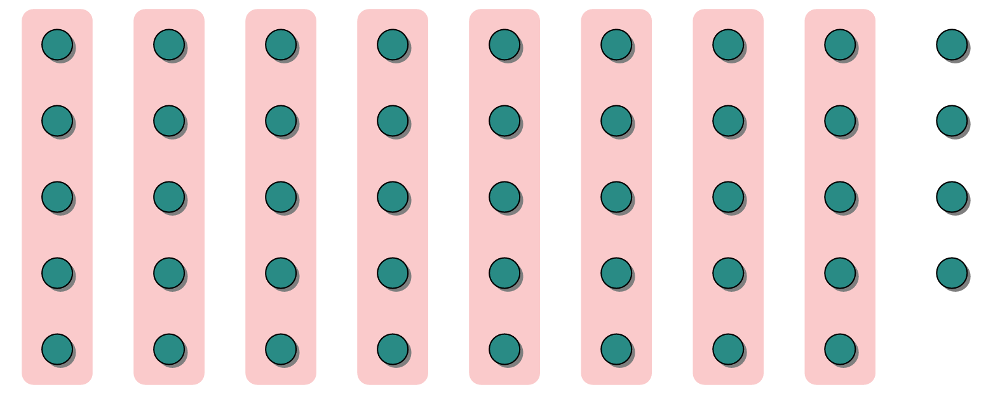
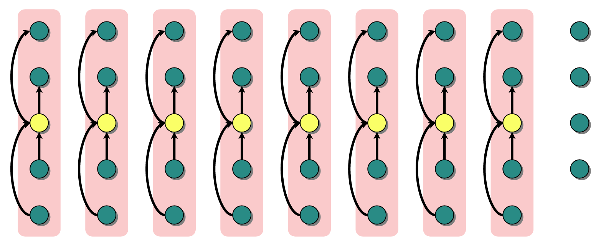
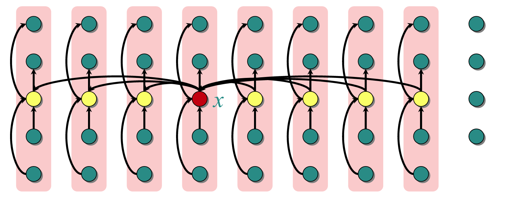
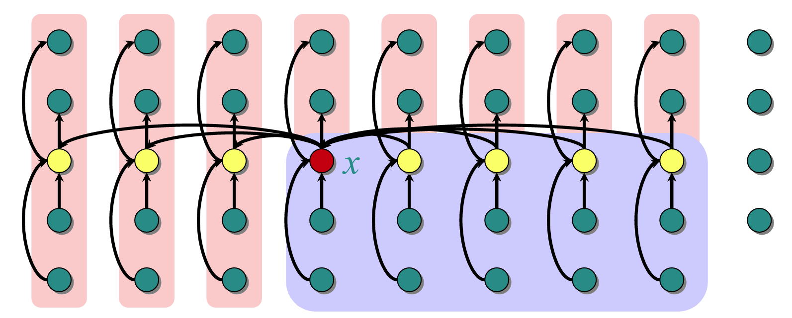

# 核心任务:
	Top-K问题: 在一个数组中找第k小/大的元素
隶属于任务: [Order Statistic 顺序统计量](/blog/cs-major-courses/algorithm-analysis-and-design/order-statistic-顺序统计量/)
# 参考方法:
[Quick Select 快速选择](/blog/cs-major-courses/algorithm-analysis-and-design/quick-select-快速选择/)

# 算法实现:
step1: 分组, 5个元素一组


step2: 找每组的中位数(给每组的5个数排序)


step3: 找中位数中的中位数pivot


step4: 按pivot分区,确定pivot的rank(每次至少减少30%数据)


step5: 递归查找
```
if i == k:
	return pivot
elif i < k:
	go to [ 小于 pivot ]
elif i > k:
	go to [ 大于 pivot]
```

# 时间复杂度
$T(n)=T(n/5)+T(7n/10)+O(n)$
$1/5+7/10=9/10<1$
$T(n)=O(n)$
判断依据: [Trick for Analyzing Recursive Time Complexity](/blog/cs-major-courses/algorithm-analysis-and-design/trick-for-analyzing-recursive-time-complexity/)

# 算法优劣
## 优:
解决了Quick Select在极端情况下的高时间复杂度问题, 且在任何情况下都是线性时间.
## 劣:
时间复杂度低, 但是常数大, 在大部分情况下效率不如Quick Select

# 拓展

## 为什么3个一组不行?
$T(n)=T(n/3)+T(2n/3)+O(n)=O(nlog⁡n)$

## 为什么7个一组不行?
$T(n)=T(n/7)+T(5n/7)+O(n)=O(n)$
$1/7+5/7=6/7<9/10$
虽然时间复杂度更低, 但是常数大, 效率不如5个一组.

## 为什么4个一组不行?
因为没有唯一中位数，分析不自然，不是标准方案.