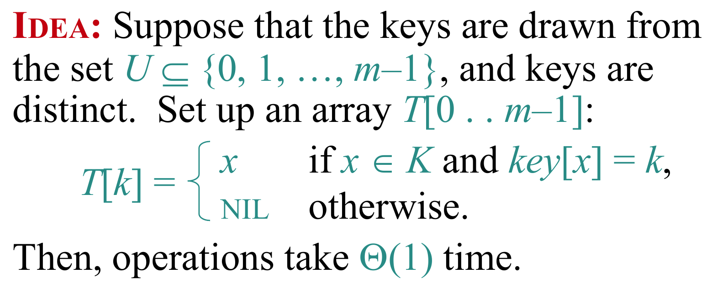

# Direct-Access Table 直接寻址表
## 算法实现

## 存在问题

Direct-access table = 用空间换时间的极限方案：  
**用一个巨大数组，实现真正的 Θ(1) 查找，但通常空间不可接受。**

## 为了解决空间的不可接受性, 推出Hashing Table

# Hashing Table 哈希表
哈希表由两个部分组成: **Hashing Function 哈希函数** 和 **Collision Solution Strategy 冲突管理策略**

## Hashing Function 哈希函数
指的是用于将key映射到真实存储地址的函数.

将不同的key映射到同一个地址, 则称为Collision 冲突, 最坏的情况, hashing function将所有key都映射到了同一个地址, 则时间复杂度达到 $O(n)$. 即使不是最坏的情况, 时间复杂度也会因collision而超过 $O(1)$ 达到 $O(1+\alpha)$, 其中 $\alpha$ 为 load factor 负载因子