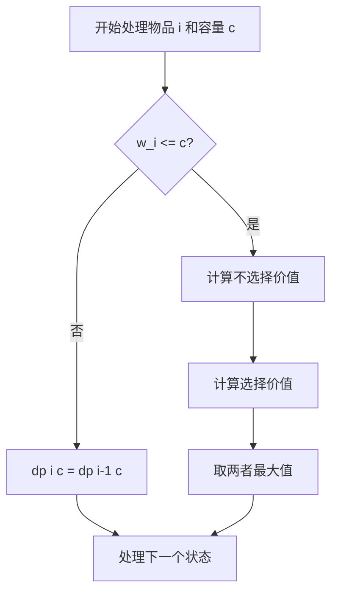

# 0-1 Knapsack Problem（0-1 背包问题）

> [!abstract] 核心结论
> 对每件物品只有“选择”和“不选择”两种决策。动态规划按照物品逐个扩展状态，对两种决策产生的价值取最大值。
>
> 二维实现的时间复杂度为 $\Theta(nW)$、空间复杂度为 $\Theta(nW)$；使用滚动数组后，空间可优化为 $\Theta(W)$。

## 1. 问题定义

给定 $n$ 件物品，物品索引为 $0,1,\dots,n-1$：

- 物品 $i$ 的重量为 $w_i$；
- 物品 $i$ 的价值为 $v_i$；
- 背包容量为 $W$；
- 每件物品最多选择一次，并且不能拆分。

使用决策变量 $x_i\in\{0,1\}$ 表示是否选择物品 $i$，则问题可以形式化为：

$$
\max \sum_{i=0}^{n-1}v_i x_i
$$

满足：

$$
\sum_{i=0}^{n-1}w_i x_i\le W,
\qquad x_i\in\{0,1\}.
$$

其中：

- $x_i=1$：选择物品 $i$；
- $x_i=0$：不选择物品 $i$。

> [!info] “0-1”的含义
> “0-1”表示每件物品只能选择 $0$ 次或 $1$ 次，而不是指物品的重量或价值只能为 0 或 1。

## 2. 基本思想

0-1 背包是典型的[Dynamic Programming 动态规划](/blog/cs-major-courses/introduction-to-algorithms/dynamic-programming-动态规划/)问题。

处理物品 $i$ 时，对每个容量 $c$，只有两种可能：

1. **不选择物品 $i$**：最优价值保持为只考虑前面物品时的结果；
2. **选择物品 $i$**：需要从容量中扣除 $w_i$，并增加价值 $v_i$。

因此，当前状态的最优值等于两种决策中的较大值：

$$
\text{当前最优值}
=
\max(\text{不选择当前物品},\text{选择当前物品}).
$$

> [!warning] 不能直接使用单位重量价值贪心
> 0-1 背包通常不具有贪心选择性质。按照 $v_i/w_i$ 从大到小选择可能错过全局最优解。
>
> 可以按单位重量价值贪心求解的是允许拆分物品的分数背包问题，不是 0-1 背包。

## 3. 动态规划状态设计

### 3.1 二维状态定义

定义：

$$
dp[i][c]
$$

表示：

> 只允许使用物品 $0,1,\dots,i$，且背包容量上限为 $c$ 时，可以获得的最大总价值。

其中：

- $0\le i<n$；
- $0\le c\le W$；
- `dp` 的大小为 $n\times(W+1)$。

这里第二维需要 $W+1$ 个位置，因为容量状态包括 $0$ 和 $W$。

### 3.2 边界条件

只考虑物品 $0$ 时：

$$
dp[0][c]=
\begin{cases}
0, & c<w_0,\\
v_0, & c\ge w_0.
\end{cases}
$$

即：

- 当前容量装不下物品 $0$，价值为 0；
- 当前容量能够装下物品 $0$，选择它可获得价值 $v_0$。

### 3.3 状态转移方程

对于物品 $i$，其中 $1\le i<n$：

#### 情况一：当前容量装不下物品 $i$

当 $w_i>c$ 时，只能不选择物品 $i$：

$$
dp[i][c]=dp[i-1][c].
$$

#### 情况二：当前容量能够装下物品 $i$

当 $w_i\le c$ 时：

- 不选择物品 $i$：价值为 $dp[i-1][c]$；
- 选择物品 $i$：价值为 $dp[i-1][c-w_i]+v_i$。

因此：

$$
dp[i][c]
=
\max\left(
    dp[i-1][c],
    dp[i-1][c-w_i]+v_i
\right).
$$

完整转移方程为：

$$
dp[i][c]=
\begin{cases}
dp[i-1][c], & w_i>c,\\
\max\left(dp[i-1][c],\ dp[i-1][c-w_i]+v_i\right), & w_i\le c.
\end{cases}
$$

最终答案为：

$$
dp[n-1][W].
$$

## 4. 具体过程

1. 创建大小为 $n\times(W+1)$ 的二维数组 `dp`，初始值均为 0。
2. 根据物品 $0$ 的重量和价值初始化 `dp[0][c]`。
3. 按照物品索引 $i=1,2,\dots,n-1$ 依次处理物品。
4. 对每个容量 $c=0,1,\dots,W$：
   - 若 $w_i>c$，不能选择当前物品；
   - 否则比较选择与不选择当前物品的价值。
5. 将较大的价值写入 `dp[i][c]`。
6. 返回 `dp[n-1][W]`。



## 5. 伪代码

### 5.1 二维动态规划

```text
ZERO-ONE-KNAPSACK(weights, values, W)
    n <- length(weights)

    if n = 0 or W = 0
        return 0

    dp <- n x (W + 1) array filled with 0

    // 初始化：只允许使用物品 0
    for c <- weights[0] to W
        dp[0][c] <- values[0]

    // 依次处理物品 1 到 n - 1
    for i <- 1 to n - 1
        for c <- 0 to W
            dp[i][c] <- dp[i - 1][c]

            if weights[i] <= c
                take <- dp[i - 1][c - weights[i]] + values[i]
                dp[i][c] <- max(dp[i][c], take)

    return dp[n - 1][W]
```

### 5.2 一维空间优化

观察状态转移可知，第 $i$ 行只依赖第 $i-1$ 行，因此可以将二维数组压缩为一维数组。

定义：

$$
dp[c]
$$

表示处理完当前范围内的物品后，在容量上限为 $c$ 时能够获得的最大价值。

```text
ZERO-ONE-KNAPSACK-OPTIMIZED(weights, values, W)
    n <- length(weights)
    dp <- array[0 ... W] filled with 0

    for i <- 0 to n - 1
        for c <- W downto weights[i]
            dp[c] <- max(
                dp[c],
                dp[c - weights[i]] + values[i]
            )

    return dp[W]
```

> [!danger] 容量必须倒序遍历
> 一维 0-1 背包中，容量必须从 $W$ 递减到 $w_i$。
>
> 若容量从小到大遍历，较小容量处刚更新的 `dp` 会被当前物品再次使用，相当于允许同一物品被选择多次，算法就会退化为完全背包问题的转移方式。

## 6. 为什么一维状态能够正确工作

二维转移中，选择物品 $i$ 时使用的是上一行状态：

$$
dp[i-1][c-w_i].
$$

将二维数组压缩为一维后，必须保证读取 `dp[c-w_i]` 时，它仍然表示“尚未处理当前物品 $i$”的状态。

由于 $c-w_i<c$，当容量从大到小更新时：

- 当前正在更新较大的 `dp[c]`；
- 较小的 `dp[c-w_i]` 尚未被当前物品更新；
- 因此物品 $i$ 不会被重复选择。

这正是倒序遍历的本质。

## 7. 正确性说明

### 7.1 最优子结构

考虑状态 $dp[i][c]$ 的一个最优解。

- 若最优解不包含物品 $i$，则该解完全来自物品 $0,\dots,i-1$，其价值为 $dp[i-1][c]$；
- 若最优解包含物品 $i$，删除物品 $i$ 后，剩余部分必须是在容量 $c-w_i$ 下使用物品 $0,\dots,i-1$ 的最优解，其价值为 $dp[i-1][c-w_i]$。

否则，可以用一个更优的子问题解替换剩余部分，从而得到更优的原问题解，与原解最优矛盾。

因此状态转移覆盖了最优解的全部可能情况。

### 7.2 数学归纳

对物品索引 $i$ 进行归纳：

- **基础情况**：$i=0$ 时，只有选择或不选择物品 $0$ 两种情况，初始化正确；
- **归纳假设**：假设第 $i-1$ 行的所有状态均正确；
- **归纳步骤**：第 $i$ 行分别考虑不选择和选择物品 $i$，并取最大值，因此第 $i$ 行也正确。

所以最终状态 $dp[n-1][W]$ 是原问题的最优值。

## 8. 时空复杂度

设物品数量为 $n$，背包容量为 $W$。

| 实现方式 | 时间复杂度 | 空间复杂度 | 是否便于恢复所选物品 |
|---|---:|---:|---|
| 暴力枚举所有子集 | $\Theta(2^n)$ | 取决于实现 | 是 |
| 二维动态规划 | $\Theta(nW)$ | $\Theta(nW)$ | 是 |
| 一维动态规划 | $\Theta(nW)$ | $\Theta(W)$ | 通常不便 |

> [!important] $O(nW)$ 是伪多项式复杂度
> 输入容量 $W$ 若采用二进制表示，只需要 $\Theta(\log W)$ 位。
>
> 因此 $O(nW)$ 是关于数值 $W$ 的多项式，而不一定是关于输入位数的多项式。这类复杂度称为**伪多项式时间复杂度**（pseudo-polynomial time）。

## 9. 问题需要具有的性质

### 9.1 动态规划所需性质

#### 最优子结构

原问题的最优解可以由规模更小的背包子问题的最优解构造。

#### 重叠子问题

递归搜索过程中，相同的“物品范围 + 剩余容量”状态会被多次计算，适合使用 `dp` 表保存结果。

#### 状态数量可控

标准容量型动态规划共有约 $n(W+1)$ 个状态。当 $W$ 不过大时，这些状态可以被枚举和存储。

### 9.2 标准转移成立所需的建模条件

- 每件物品最多选择一次；
- 物品不能拆分；
- 总重量是各物品重量之和；
- 总价值是各物品价值之和；
- 物品之间不存在额外的依赖、互斥或组合奖励；
- 重量和容量通常应为非负整数，以便将容量作为数组下标；
- 一般假设 $w_i>0$，否则需要单独处理零重量物品。

> [!warning] 标准模型的失效情况
> 若物品之间存在“选择 A 后才能选择 B”、互斥关系、分组限制或非线性组合收益，标准 0-1 背包状态通常不足，需要增加状态维度或改用其他模型。

### 9.3 不需要具备贪心选择性质

动态规划只要求最优子结构和可复用的重叠子问题，不要求每一步的局部最优选择必然属于某个全局最优解。

## 10. 典型例子

给定 4 件物品：

| 物品索引 $i$ | 重量 $w_i$ | 价值 $v_i$ |
|---:|---:|---:|
| 0 | 2 | 3 |
| 1 | 3 | 4 |
| 2 | 4 | 5 |
| 3 | 5 | 6 |

背包容量：

$$
W=8.
$$

### 10.1 二维 `dp` 表

表中第 $i$ 行表示只允许使用物品 $0,\dots,i$ 时的结果。

| $i\backslash c$ | 0 | 1 | 2 | 3 | 4 | 5 | 6 | 7 | 8 |
|---:|---:|---:|---:|---:|---:|---:|---:|---:|---:|
| 0 | 0 | 0 | 3 | 3 | 3 | 3 | 3 | 3 | 3 |
| 1 | 0 | 0 | 3 | 4 | 4 | 7 | 7 | 7 | 7 |
| 2 | 0 | 0 | 3 | 4 | 5 | 7 | 8 | 9 | 9 |
| 3 | 0 | 0 | 3 | 4 | 5 | 7 | 8 | 9 | 10 |

### 10.2 关键状态计算

计算 $dp[3][8]$ 时，当前物品为物品 3：

- 不选择物品 3：

$$
dp[2][8]=9;
$$

- 选择物品 3：

$$
dp[2][8-w_3]+v_3
=dp[2][3]+6
=4+6
=10.
$$

因此：

$$
dp[3][8]=\max(9,10)=10.
$$

最优方案为选择：

- 物品 1：重量 3，价值 4；
- 物品 3：重量 5，价值 6。

总重量：

$$
3+5=8.
$$

总价值：

$$
4+6=10.
$$

## 11. 从二维 `dp` 表恢复一个最优方案

从状态 $(n-1,W)$ 逆向检查：

- 若 $dp[i][c]=dp[i-1][c]$，可以不选择物品 $i$；
- 若 $dp[i][c]\ne dp[i-1][c]$，说明某个最优方案选择了物品 $i$，随后令 $c\leftarrow c-w_i$。

```text
RECONSTRUCT(weights, values, W, dp)
    n <- length(weights)
    selected <- empty list
    c <- W

    for i <- n - 1 downto 1
        if dp[i][c] != dp[i - 1][c]
            append i to selected
            c <- c - weights[i]

    if c >= weights[0] and dp[0][c] = values[0]
        append 0 to selected

    reverse(selected)
    return selected
```

> [!note] 多个最优解
> 当“选择”和“不选择”得到相同价值时，问题可能存在多个最优方案。上述回溯规则只恢复其中一个。

## 12. 常见错误

### 12.1 将一维容量正序遍历

错误写法：

```text
for c <- weights[i] to W
```

这会让同一物品在一轮中被重复使用。

正确写法：

```text
for c <- W downto weights[i]
```

### 12.2 混淆容量与实际装入重量

`dp[i][c]` 中的 $c$ 表示允许使用的**容量上限**，不要求最优方案恰好装满到 $c$。

### 12.3 误认为 $O(nW)$ 一定优于 $O(2^n)$

当 $W$ 极大而 $n$ 较小时，容量型动态规划可能比枚举、[Backtracking 回溯法](/blog/cs-major-courses/introduction-to-algorithms/backtracking-回溯法/)或[Branch and Bound 分支限界法](/blog/cs-major-courses/introduction-to-algorithms/branch-and-bound-分支限界法/)更慢。算法选择应同时考虑 $n$ 与 $W$ 的规模。

### 12.4 将 0-1 背包与其他背包模型混淆

| 模型 | 每件物品可选次数 | 一维容量遍历方向 |
|---|---:|---|
| 0-1 背包 | 最多 1 次 | 从大到小 |
| 完全背包 | 任意多次 | 从小到大 |
| 多重背包 | 有限多次 | 需拆分或使用专门优化 |
| 分数背包 | 可选择一部分 | 通常使用贪心 |

## 13. 方法对比

| 方法 | 核心搜索空间 | 典型复杂度 | 特点 |
|---|---|---:|---|
| 暴力枚举 | 所有物品子集 | $\Theta(2^n)$ | 简单但指数级 |
| 动态规划 | 物品索引与容量 | $\Theta(nW)$ | 稳定，适合容量不大的整数输入 |
| [Backtracking 回溯法](/blog/cs-major-courses/introduction-to-algorithms/backtracking-回溯法/) | 二叉子集树 | 最坏 $O(2^n)$ | 可通过约束和上界剪枝 |
| [Branch and Bound 分支限界法](/blog/cs-major-courses/introduction-to-algorithms/branch-and-bound-分支限界法/) | 活结点与优先队列 | 最坏仍为指数级 | 优先扩展更可能产生最优解的结点 |

## 14. 复习检查

- [ ] 能写出 0-1 背包的数学模型。
- [ ] 能准确解释 `dp[i][c]` 的含义。
- [ ] 能推导选择与不选择两种转移。
- [ ] 能说明一维优化为什么必须倒序遍历容量。
- [ ] 能区分 0-1 背包、完全背包和分数背包。
- [ ] 能解释为什么 $O(nW)$ 是伪多项式复杂度。
- [ ] 能从二维 `dp` 表恢复一个最优物品集合。

## 15. 相关笔记

- [Dynamic Programming 动态规划](/blog/cs-major-courses/introduction-to-algorithms/dynamic-programming-动态规划/)
- [Backtracking 回溯法](/blog/cs-major-courses/introduction-to-algorithms/backtracking-回溯法/)
- [Branch and Bound 分支限界法](/blog/cs-major-courses/introduction-to-algorithms/branch-and-bound-分支限界法/)

## 16. 参考资料

1. Cormen, T. H., Leiserson, C. E., Rivest, R. L., & Stein, C. (2009). *Introduction to Algorithms* (3rd ed.). MIT Press，Chapter 15: Dynamic Programming.
2. 课程资料：`greedy.ppt`。其中对比了 0-1 背包与分数背包，指出前者通常不具备贪心选择性质。
3. 课程资料：`第5章 回溯法.pdf`，第 5.6 节“0-1 背包问题”，用于对比动态规划与回溯求解框架。
4. 课程资料：`第6章 分支限界法.pdf`，用于对比分支限界法求解 0-1 背包的思路。
5. [Obsidian Flavored Markdown Skill](https://github.com/kepano/obsidian-skills/tree/main/skills/obsidian-markdown)，用于本文档的 Obsidian Markdown 格式规范。
