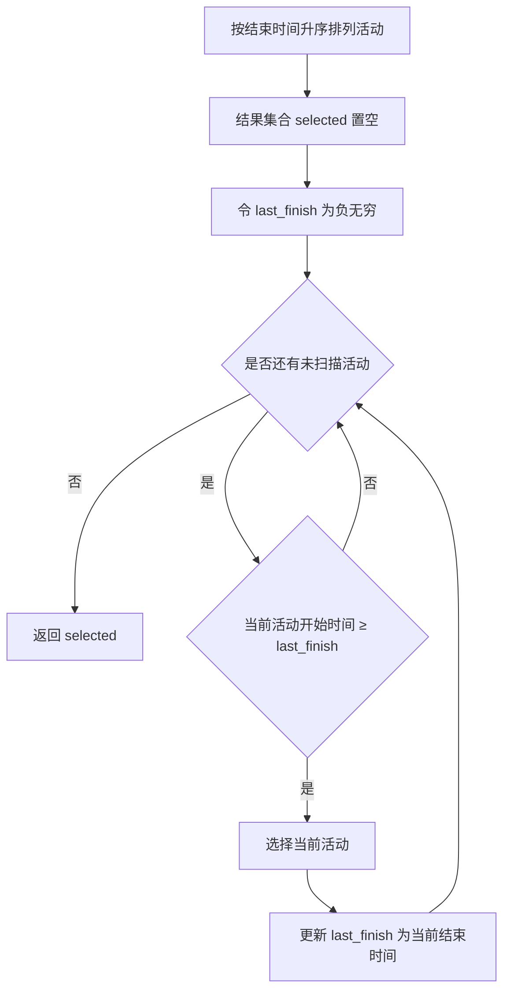

# Activity Selection 活动选择问题

> [!abstract] 核心结论
> 对所有活动按**结束时间从早到晚**排序,然后依次选择与已选活动兼容的活动,即可得到数量最多的互不重叠活动集合。
>
> - 输入已按结束时间排序:时间复杂度为 $\Theta(n)$。
> - 输入未排序:总时间复杂度为 $O(n\log n)$。
> - 贪心选择:==每次选择当前可选活动中结束最早的活动==。

## 1. 问题定义

给定 $n$ 个活动组成的集合:

$$
S=\{a_0,a_1,\dots,a_{n-1}\}
$$

每个活动 $a_i$ 占用一个半开时间区间:

$$
a_i=[s_i,f_i)
$$

其中:

- $s_i$:活动 $a_i$ 的开始时间;
- $f_i$:活动 $a_i$ 的结束时间;
- 满足 $s_i<f_i$。

采用半开区间 $[s_i,f_i)$ 后,若一个活动恰好在另一个活动结束时开始,则二者兼容。

两个活动 $a_i$ 和 $a_j$ 兼容,当且仅当它们的时间区间不重叠:

$$
f_i\le s_j
\quad\text{或}\quad
f_j\le s_i
$$

目标是在所有活动中选择一个集合 $A\subseteq S$,使得:

1. $A$ 中任意两个活动相互兼容;
2. $|A|$ 最大。

形式化表示为:

$$
\max |A|
$$

$$
\text{s.t. } \forall a_i,a_j\in A,\ i\ne j,\quad
[f_i\le s_j]\lor[f_j\le s_i]
$$

> [!important] 优化目标
> 活动选择问题最大化的是**活动数量**,而不是总持续时间、总价值或资源利用率。

---

## 2. 基本思想

活动选择问题使用 [Greedy Algorithm 贪心算法](/blog/cs-major-courses/introduction-to-algorithms/greedy-algorithm-贪心算法/) 求解。

贪心策略是:

> 在所有与当前已选活动兼容的候选活动中,选择**结束时间最早**的活动。

选择结束最早的活动,会使资源尽早空闲,从而为后续活动保留尽可能大的可用时间范围。

设上一个被选择活动的结束时间为 `last_finish`。对于按结束时间升序排列后的每个活动 $a_i$:

- 若 $s_i\ge \text{last\_finish}$,选择该活动;
- 否则,该活动与上一个已选活动冲突,跳过它。

> [!tip] 记忆方式
> **结束得越早,留给后续活动的空间越大。**

### 2.1 为什么不是选择开始最早的活动

开始最早的活动可能持续很长时间,从而阻塞大量后续活动。

例如:

- $a_0=[0,10)$
- $a_1=[1,2)$
- $a_2=[2,3)$
- $a_3=[3,4)$

若选择开始最早的 $a_0$,只能选择 $1$ 个活动;而选择 $a_1,a_2,a_3$ 可以选择 $3$ 个活动。

### 2.2 为什么不是选择持续时间最短的活动

持续时间最短并不意味着结束最早。一个很短但开始较晚的活动,可能浪费前面的大段可用时间,也可能阻塞后续安排。

因此,活动选择问题的正确贪心关键字是:

$$
\boxed{\text{finish time}}
$$

而不是开始时间或持续时间。

---

## 3. 具体过程

### 3.1 算法步骤

1. 将所有活动按照结束时间 $f_i$ 从小到大排序。
2. 初始化结果集合 $A=\varnothing$。
3. 选择排序后第一个活动,将其加入 $A$。
4. 记录最近一次选择的活动结束时间 `last_finish`。
5. 从前到后扫描剩余活动:
   - 若当前活动开始时间满足 $s_i\ge \text{last\_finish}$,则选择当前活动;
   - 更新 `last_finish = f_i`;
   - 否则跳过当前活动。
6. 扫描结束后返回 $A$。

### 3.2 流程图



### 3.3 循环不变量

在每次扫描活动 $a_i$ 之前:

1. `selected` 中的活动两两兼容;
2. `last_finish` 是 `selected` 中最后一个活动的结束时间;
3. 对已经扫描过的活动,`selected` 是按照"结束最早"策略得到的最优前缀选择。

当算法选择满足 $s_i\ge\text{last\_finish}$ 的活动时,新活动与之前所有活动兼容,因为之前选中的最后一个活动结束得最晚,而当前活动仍在其结束后开始。

---

## 4. 伪代码

### 4.1 输入未排序的通用版本

```text
ACTIVITY-SELECTION(activities):
    # activities[i] = (start, finish, id)
    # 使用 0-based 下标

    activities ← SORT-BY-FINISH-TIME-ASCENDING(activities)

    selected ← empty list
    last_finish ← -∞

    for i ← 0 to LENGTH(activities) - 1:
        if activities[i].start ≥ last_finish:
            APPEND(selected, activities[i])
            last_finish ← activities[i].finish

    return selected
```

### 4.2 输入已按结束时间排序的版本

```text
GREEDY-ACTIVITY-SELECTOR(activities):
    n ← LENGTH(activities)

    if n = 0:
        return empty list

    selected ← [activities[0]]
    last_selected ← 0

    for i ← 1 to n - 1:
        if activities[i].start ≥ activities[last_selected].finish:
            APPEND(selected, activities[i])
            last_selected ← i

    return selected
```

> [!note] 两种初始化方式
> 可以先选择排序后的第一个活动,也可以令 `last_finish = -∞` 后统一扫描全部活动。后者更容易处理空输入。

### 4.3 递归版本

假设活动已经按结束时间升序排列,`last` 表示上一个已选活动的下标:

```text
RECURSIVE-ACTIVITY-SELECTOR(activities, last, next):
    n ← LENGTH(activities)
    i ← next

    while i < n and activities[i].start < activities[last].finish:
        i ← i + 1

    if i = n:
        return empty list

    return [activities[i]] +
           RECURSIVE-ACTIVITY-SELECTOR(activities, i, i + 1)
```

递归版本通常需要额外设置一个结束时间为 $-\infty$ 的虚拟活动,或单独处理第一次选择。实际实现更推荐迭代版本。

---

## 5. Python 实现

```python
from dataclasses import dataclass
from typing import Iterable


@dataclass(frozen=True)
class Activity:
    """一个半开时间区间 [start, finish)。"""

    id: str
    start: int
    finish: int

    def __post_init__(self) -> None:
        if self.start >= self.finish:
            raise ValueError(
                f"活动 {self.id} 必须满足 start < finish,"
                f"实际得到 ({self.start}, {self.finish})"
            )


def activity_selection(activities: Iterable[Activity]) -> list[Activity]:
    """返回数量最多的一组两两兼容活动。"""

    # 不修改调用者传入的数据,并保留确定性的并列排序规则。
    ordered = sorted(
        activities,
        key=lambda activity: (
            activity.finish,
            activity.start,
            activity.id,
        ),
    )

    selected: list[Activity] = []
    last_finish = float("-inf")

    for activity in ordered:
        if activity.start >= last_finish:
            selected.append(activity)
            last_finish = activity.finish

    return selected


if __name__ == "__main__":
    activities = [
        Activity("a0", 1, 4),
        Activity("a1", 3, 5),
        Activity("a2", 0, 6),
        Activity("a3", 5, 7),
        Activity("a4", 3, 9),
        Activity("a5", 5, 9),
        Activity("a6", 6, 10),
        Activity("a7", 8, 11),
        Activity("a8", 8, 12),
        Activity("a9", 2, 14),
        Activity("a10", 12, 16),
    ]

    answer = activity_selection(activities)
    print([activity.id for activity in answer])
```

预期输出:

```text
['a0', 'a3', 'a7', 'a10']
```

### 5.1 结果验证

可以通过以下两个条件验证输出:

1. **可行性**:相邻已选活动满足

$$
f_{i_k}\le s_{i_{k+1}}
$$

2. **最优性**:对于小规模输入,可枚举所有子集,与贪心结果的活动数量进行比较。

```python
from itertools import combinations


def is_compatible(subset: tuple[Activity, ...]) -> bool:
    ordered = sorted(subset, key=lambda activity: activity.start)
    return all(
        ordered[i].finish <= ordered[i + 1].start
        for i in range(len(ordered) - 1)
    )


def brute_force_activity_selection(
    activities: list[Activity],
) -> list[Activity]:
    best: tuple[Activity, ...] = ()

    for size in range(len(activities) + 1):
        for subset in combinations(activities, size):
            if is_compatible(subset) and len(subset) > len(best):
                best = subset

    return list(best)
```

> [!warning] 暴力验证仅用于小规模测试
> 暴力枚举需要检查 $2^n$ 个子集,时间复杂度为指数级,不能替代贪心算法处理大规模输入。

---

## 6. 正确性证明

活动选择算法的正确性依赖两个性质:

1. **贪心选择性质**;
2. **最优子结构**。

### 6.1 贪心选择性质

> [!theorem] 定理
> 对任意非空活动集合,至少存在一个最优解包含结束时间最早的活动。

#### 证明:交换论证

设 $a_g$ 是所有活动中结束时间最早的活动:

$$
f_g=\min_i f_i
$$

设 $O$ 是任意一个最优解,并将 $O$ 中第一个被执行的活动记为 $a_o$。

由于 $a_g$ 的结束时间最早,因此:

$$
f_g\le f_o
$$

将最优解 $O$ 中的 $a_o$ 替换为 $a_g$。

原来排在 $a_o$ 后面的每个活动,其开始时间都不小于 $f_o$。又因为 $f_g\le f_o$,所以这些活动的开始时间也不小于 $f_g$。因此,替换后所有活动仍然相互兼容。

替换操作没有减少活动数量,所以得到的仍然是一个最优解,并且该最优解包含 $a_g$。

故结束时间最早的活动是一个**安全选择**。证毕。

### 6.2 最优子结构

选择结束时间最早的活动 $a_g$ 后,剩余候选集合为:

$$
S'=\{a_i\in S\mid s_i\ge f_g\}
$$

原问题转化为:在 $S'$ 中选择数量最多的兼容活动。

若整体最优解中关于 $S'$ 的部分不是 $S'$ 的最优解,则可以用 $S'$ 的更优解替换它,从而得到一个活动数量更多的整体解,这与原解最优矛盾。

因此,原问题的最优解由以下两部分组成:

1. 贪心选择 $a_g$;
2. 子问题 $S'$ 的最优解。

即:

$$
\operatorname{OPT}(S)
=
\{a_g\}\cup\operatorname{OPT}(S')
$$

### 6.3 归纳结论

第一次选择结束最早的活动是安全的;选择之后得到的剩余问题仍然是同类型的活动选择问题。因此,可以不断重复相同的贪心选择,最终得到全局最优解。

---

## 7. 时空间复杂度

设活动数量为 $n$,最终选择了 $k$ 个活动,其中 $0\le k\le n$。

### 7.1 输入已经按结束时间排序

算法只进行一次线性扫描:

$$
T(n)=\Theta(n)
$$

- 时间复杂度:$\Theta(n)$;
- 除输出外的额外空间复杂度:$O(1)$;
- 保存输出结果需要:$O(k)$,最坏为 $O(n)$。

### 7.2 输入没有排序

需要先按结束时间排序:

$$
T(n)=O(n\log n)+\Theta(n)=O(n\log n)
$$

- 时间复杂度:$O(n\log n)$;
- 使用新数组保存排序结果时,额外空间通常为 $O(n)$;
- 若允许原地排序,除排序算法自身空间外,贪心扫描只需 $O(1)$ 额外空间;
- 输出结果仍需 $O(k)$ 空间。

### 7.3 递归版本

递归调用深度最多为被选择活动数 $k$,最坏为 $n$:

- 时间复杂度:$\Theta(n)$,不含排序;
- 递归栈空间:$O(k)$,最坏为 $O(n)$。

| 场景 | 时间复杂度 | 除输出外额外空间 |
|---|---:|---:|
| 已排序,迭代实现 | $\Theta(n)$ | $O(1)$ |
| 未排序,先排序 | $O(n\log n)$ | 取决于排序实现 |
| 已排序,递归实现 | $\Theta(n)$ | $O(n)$ 最坏情况 |

---

## 8. 问题需要具有的性质

### 8.1 贪心选择性质

局部最优选择必须能够出现在某个全局最优解中。

对于活动选择问题,局部选择是:

$$
\text{选择结束时间最早的兼容活动}
$$

交换论证证明了该选择不会破坏最优性。

### 8.2 最优子结构

完成一次贪心选择后,剩余活动构成一个规模更小但结构相同的活动选择问题;整体最优解包含剩余子问题的最优解。

### 8.3 无后效性

一旦选择了当前活动,后续决策只需要知道该活动的结束时间,不需要重新考虑更早的活动。

当前状态可以压缩为:

$$
\text{last\_finish}
$$

### 8.4 活动价值相同

标准活动选择问题默认每个活动的收益相同,即每选择一个活动都贡献 $1$。

若每个活动具有不同价值 $w_i$,目标变为最大化:

$$
\sum_{a_i\in A} w_i
$$

则"结束最早"贪心策略通常不再正确，该问题变为带权区间调度（Weighted Interval Scheduling），通常使用 [Dynamic Programming 动态规划](/blog/cs-major-courses/introduction-to-algorithms/dynamic-programming-动态规划/) 求解。

### 8.5 单一资源与固定区间

标准问题还隐含以下条件:

- 所有活动竞争同一个不可并行使用的资源;
- 每个活动的开始、结束时间已经确定;
- 活动不可拆分;
- 选中活动后必须完整执行;
- 目标仅为最大化活动数量。

> [!danger] 不能机械套用贪心
> 只要目标函数或约束发生变化,就必须重新证明贪心选择性质。存在"区间"并不意味着一定可以使用结束时间最早策略。

---

## 9. 典型例子

给定以下活动,已经按照结束时间升序排列:

| 活动 | 开始时间 $s_i$ | 结束时间 $f_i$ | 区间 |
|---|---:|---:|---|
| $a_0$ | 1 | 4 | $[1,4)$ |
| $a_1$ | 3 | 5 | $[3,5)$ |
| $a_2$ | 0 | 6 | $[0,6)$ |
| $a_3$ | 5 | 7 | $[5,7)$ |
| $a_4$ | 3 | 9 | $[3,9)$ |
| $a_5$ | 5 | 9 | $[5,9)$ |
| $a_6$ | 6 | 10 | $[6,10)$ |
| $a_7$ | 8 | 11 | $[8,11)$ |
| $a_8$ | 8 | 12 | $[8,12)$ |
| $a_9$ | 2 | 14 | $[2,14)$ |
| $a_{10}$ | 12 | 16 | $[12,16)$ |

### 9.1 执行过程

初始:

$$
A=\varnothing,\qquad \text{last\_finish}=-\infty
$$

| 扫描活动 | 判断 | 操作 | 当前选择集合 |
|---|---|---|---|
| $a_0=[1,4)$ | $1\ge-\infty$ | 选择 | $\{a_0\}$ |
| $a_1=[3,5)$ | $3<4$ | 跳过 | $\{a_0\}$ |
| $a_2=[0,6)$ | $0<4$ | 跳过 | $\{a_0\}$ |
| $a_3=[5,7)$ | $5\ge4$ | 选择 | $\{a_0,a_3\}$ |
| $a_4=[3,9)$ | $3<7$ | 跳过 | $\{a_0,a_3\}$ |
| $a_5=[5,9)$ | $5<7$ | 跳过 | $\{a_0,a_3\}$ |
| $a_6=[6,10)$ | $6<7$ | 跳过 | $\{a_0,a_3\}$ |
| $a_7=[8,11)$ | $8\ge7$ | 选择 | $\{a_0,a_3,a_7\}$ |
| $a_8=[8,12)$ | $8<11$ | 跳过 | $\{a_0,a_3,a_7\}$ |
| $a_9=[2,14)$ | $2<11$ | 跳过 | $\{a_0,a_3,a_7\}$ |
| $a_{10}=[12,16)$ | $12\ge11$ | 选择 | $\{a_0,a_3,a_7,a_{10}\}$ |

最终结果:

$$
A=\{a_0,a_3,a_7,a_{10}\}
$$

活动数量:

$$
|A|=4
$$

### 9.2 时间轴

```text
时间:  0 1 2 3 4 5 6 7 8 9 10 11 12 13 14 15 16
选择:   [a0---) [a3-) [a7-----) [a10----------)
区间:   [1,4)   [5,7) [8,11)    [12,16)
```

不同最优解可能选择不同活动,但最大活动数量相同。算法保证返回**一个**最优解,不保证最优解唯一。

---

## 10. 常见错误

> [!failure] 错误 1:按开始时间排序
> 开始越早不代表越有利。持续时间很长的早开始活动可能占据整个时间段。

> [!failure] 错误 2:按持续时间排序
> 最短活动不一定结束最早,因此不一定为后续活动留下最大空间。

> [!failure] 错误 3:忽略预处理成本
> 若输入未排序,不能只写 $O(n)$;完整复杂度应为 $O(n\log n)$。

> [!failure] 错误 4:把 $s_i>f_j$ 写成唯一兼容条件
> 若允许一个活动在另一个活动结束的同一时刻开始,正确条件是:
>
> $$
> s_i\ge f_j
> $$

> [!failure] 错误 5:用于带权活动选择
> 标准贪心只保证最大化活动数量,不保证最大化活动总价值。

---

## 11. 与动态规划的关系

活动选择问题也可以用动态规划描述,但标准问题具有更强的贪心选择性质,因此不需要枚举所有分割位置。

| 方法 | 核心思想 | 典型复杂度 | 是否必要 |
|---|---|---:|---|
| 动态规划 | 枚举子问题与决策 | 常见为 $O(n^2)$ | 标准问题中不必要 |
| 贪心算法 | 直接选择结束最早活动 | 排序后 $\Theta(n)$ | 标准最优方法 |

贪心算法可以看作利用问题结构,将原本可能存在的多个决策分支压缩为一个安全选择。

---

## 12. 适用场景

活动选择模型常用于:

- 单个会议室安排最多场会议;
- 单台机器处理最多个固定时间作业;
- 单个教室安排最多门课程;
- 单一频道安排最多个固定时段节目;
- 单个工作人员接受最多个不冲突预约;
- 非带权区间调度最大化。

当问题出现多台机器、活动权重、活动依赖关系或可调整时间等条件时,需要使用其他模型或重新证明算法。

---

## 13. 一页总结

> [!summary]
> **问题**:选择数量最多的互不重叠活动。
>
> **排序**:按结束时间升序。
>
> **选择条件**:
>
> $$
> s_i\ge\text{last\_finish}
> $$
>
> **正确性依据**:
>
> - 贪心选择性质:结束最早的活动可以包含在某个最优解中;
> - 最优子结构:选择一个活动后,剩余问题仍是活动选择问题。
>
> **复杂度**:
>
> - 已排序:$\Theta(n)$;
> - 未排序:$O(n\log n)$;
> - 迭代扫描额外空间:$O(1)$,不含输出。
>
> **限制**:只适用于所有活动价值相同、目标为最大化活动数量的标准模型。

---

## 参考资料

- Thomas H. Cormen, Charles E. Leiserson, Ronald L. Rivest, Clifford Stein. *Introduction to Algorithms*, 3rd Edition, Section 16.1: The activity-selection problem.
- *Greedy Algorithms*, Comp 122 course slides, Fall 2003.
- [Obsidian Flavored Markdown Skill](https://github.com/kepano/obsidian-skills/blob/main/skills/obsidian-markdown/SKILL.md)
