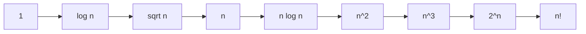

# Asymptotic Notation and Analysis 渐近记号与渐进分析

> [!abstract] 核心结论
> 渐进分析（asymptotic analysis）研究当输入规模 $n\to\infty$ 时，算法运行时间或空间使用量的增长趋势。
> 它忽略机器相关常数、低阶项和实现细节，关注增长阶。
> 渐近记号（asymptotic notation）是表达增长阶的数学语言：$O$ 表示上界，$\Omega$ 表示下界，$\Theta$ 表示紧确界，$o$ 和 $\omega$ 表示严格上界/严格下界。

## 1. 渐进分析是什么

算法分析研究计算程序的性能和资源使用，常见资源包括：

- **时间复杂度**：算法执行需要多少基本操作。
- **空间复杂度**：算法额外使用多少存储空间。

渐进分析的基本思想：

$$
\text{不比较具体秒数，而比较 } T(n) \text{ 随 } n \to \infty \text{ 的增长速度。}
$$

因此，在复杂度分析中通常：

1. 用输入规模 $n$ 参数化运行时间 $T(n)$；
2. 忽略机器速度、编程语言、编译器等常数因素；
3. 忽略低阶项和常数系数；
4. 优先给出最坏情况上界，因为它提供性能保证。

> [!note] 为什么忽略常数和低阶项
> 当 $n$ 足够大时，最高阶项主导函数增长。
> 例如：
> $$
> 3n^3+90n^2-5n+6046 = \Theta(n^3)
> $$
> 低阶项 $90n^2,-5n,6046$ 不改变整体增长阶。

## 2. 算法分析的基本对象

设算法在输入规模为 $n$ 的输入上运行时间为 $T(n)$。

### 2.1 输入规模

输入规模 $n$ 的定义依问题而定：

| 问题 | 常见输入规模 |
|---|---|
| 排序 | 元素个数 $n$ |
| 图算法 | 顶点数 $\vert V \vert$ 和边数 $\vert E \vert$ |
| 字符串算法 | 字符串长度 $n$ |
| 矩阵算法 | 矩阵维度 $n$ 或 $m\times n$ |
| 数值算法 | 输入数值的位数，而不一定是数值大小本身 |

> [!warning] 常见错误
> 不要把输入值本身直接当作输入规模。
> 例如判断一个整数 $N$ 是否为素数时，输入规模通常是二进制表示长度 $n=\lfloor \log_2 N\rfloor+1$，不是 $N$ 本身。

### 2.2 三类运行时间分析

| 分析类型 | 定义 | 使用频率 | 说明 |
|---|---|---|---|
| 最坏情况（worst-case） | $T(n)$ 是所有规模为 $n$ 的输入中最大运行时间 | 最常用 | 给出保证 |
| 平均情况（average-case） | 对所有规模为 $n$ 的输入按某个概率分布求期望 | 有时使用 | 必须说明输入分布 |
| 最好情况（best-case） | 所有规模为 $n$ 的输入中最小运行时间 | 较少用于评价算法 | 容易误导 |

形式化地，若 $I_n$ 表示规模为 $n$ 的所有输入集合，$t(x)$ 表示输入 $x$ 上的运行时间，则：

$$
T_{\text{worst}}(n)=\max_{x\in I_n} t(x)
$$

如果给定输入分布 $P(x)$，则平均情况为：

$$
T_{\text{avg}}(n)=\sum_{x\in I_n}P(x)t(x)
$$

## 3. 渐近记号总览

设 $f(n),g(n)$ 是非负函数，通常表示运行时间或空间使用量。

| 记号                  | 读法           | 含义                | 类比    |
| ------------------- | ------------ | ----------------- | ----- |
| $f(n)=O(g(n))$      | big-O        | $f$ 至多按 $g$ 的速度增长 | $\le$ |
| $f(n)=\Omega(g(n))$ | big-Omega    | $f$ 至少按 $g$ 的速度增长 | $\ge$ |
| $f(n)=\Theta(g(n))$ | big-Theta    | $f$ 与 $g$ 同阶增长    | $=$   |
| $f(n)=o(g(n))$      | little-o     | $f$ 严格慢于 $g$      | $<$   |
| $f(n)=\omega(g(n))$ | little-omega | $f$ 严格快于 $g$      | $>$   |

> [!important] 推荐表述
> 严格来说，$O(g(n))$ 是一个函数集合。
> 因此 $f(n)=O(g(n))$ 是一种约定俗成的写法，更精确地说应写作：
> $$
> f(n)\in O(g(n))
> $$
> 这种“等号”不是对称等号。

## 4. $O$ 记号：渐近上界

### 4.1 定义

$$
O(g(n))=
\left\{f(n):\exists c>0,\exists n_0>0,\forall n\ge n_0,
0\le f(n)\le c g(n)
\right\}
$$

若 $f(n)\in O(g(n))$，表示当 $n$ 足够大时，$f(n)$ 被 $g(n)$ 的某个常数倍上界控制。

### 4.2 例子

证明：

$$
2n^2=O(n^3)
$$

只需找出常数 $c,n_0$，使得：

$$
0\le 2n^2\le c n^3
$$

取 $c=1,n_0=2$，则当 $n\ge 2$ 时：

$$
2n^2\le n^3
$$

所以：

$$
2n^2=O(n^3)
$$

> [!warning] $O$ 只是上界，不一定紧
> $2n^2=O(n^3)$ 是正确的，但不紧。
> 更强的结论是：
> $$
> 2n^2=\Theta(n^2)
> $$

## 5. $\Omega$ 记号：渐近下界

### 5.1 定义

$$
\Omega(g(n))=
\left\{f(n):\exists c>0,\exists n_0>0,\forall n\ge n_0,
0\le c g(n)\le f(n)
\right\}
$$

若 $f(n)=\Omega(g(n))$，表示 $f$ 至少增长得像 $g$ 的某个常数倍一样快。

### 5.2 例子

$$
n=\Omega(\lg n)
$$

因为对足够大的 $n$，线性函数 $n$ 一定不小于对数函数 $\lg n$ 的某个常数倍。

> [!warning] 不要说“至少是 $O(n^2)$”
> $O$ 是上界记号，不表示“至少”。
> “至少”应使用 $\Omega$。

## 6. $\Theta$ 记号：渐近紧确界

### 6.1 定义

$$
\Theta(g(n))=O(g(n))\cap\Omega(g(n))
$$

等价地：

$$
\Theta(g(n))=
\left\{f(n):\exists c_1,c_2>0,\exists n_0>0,
\forall n\ge n_0,
0\le c_1g(n)\le f(n)\le c_2g(n)
\right\}
$$

### 6.2 直观理解

若：

$$
f(n)=\Theta(g(n))
$$

则 $f(n)$ 与 $g(n)$ 只差常数倍，增长阶相同。

### 6.3 例子

$$
\frac{1}{2}n^2-2n=\Theta(n^2)
$$

理由：当 $n$ 足够大时，$n^2$ 项主导增长；$-2n$ 是低阶项，不改变增长阶。

## 7. $o$ 与 $\omega$：严格渐近界

### 7.1 $o$ 记号

$$
o(g(n))=
\left\{f(n):\forall c>0,\exists n_0>0,\forall n\ge n_0,
0\le f(n)<cg(n)
\right\}
$$

$f(n)=o(g(n))$ 表示 $f$ 严格慢于 $g$。

例如：

$$
2n^2=o(n^3)
$$

因为：

$$
\lim_{n\to\infty}\frac{2n^2}{n^3}=\lim_{n\to\infty}\frac{2}{n}=0
$$

### 7.2 $\omega$ 记号

$$
\omega(g(n))=
\left\{f(n):\forall c>0,\exists n_0>0,\forall n\ge n_0,
0\le cg(n)<f(n)
\right\}
$$

$f(n)=\omega(g(n))$ 表示 $f$ 严格快于 $g$。

例如：

$$
n=\omega(\lg n)
$$

因为：

$$
\lim_{n\to\infty}\frac{n}{\lg n}=\infty
$$

## 8. 用极限快速判断增长关系

对于正函数 $f(n),g(n)$，若极限存在：

$$
L=\lim_{n\to\infty}\frac{f(n)}{g(n)}
$$

则有：

| 极限结果         | 结论                                         |
| ------------ | ------------------------------------------ |
| $L=0$        | $f(n)=o(g(n))$，因此 $f(n)=O(g(n))$           |
| $0<L<\infty$ | $f(n)=\Theta(g(n))$                        |
| $L=\infty$   | $f(n)=\omega(g(n))$，因此 $f(n)=\Omega(g(n))$ |
| $L$ 不存在      | 不能直接判断，需要回到定义或用其他方法                        |

> [!example] 例：比较 $n\log n$ 和 $n^2$
> $$
> \lim_{n\to\infty}\frac{n\log n}{n^2}
> =\lim_{n\to\infty}\frac{\log n}{n}=0
> $$
> 因此：
> $$
> n\log n=o(n^2)
> $$

## 9. 常见增长阶层级

从慢到快，常见增长阶一般为：

$$
1 \prec \log n \prec \sqrt n \prec n \prec n\log n \prec n^2 \prec n^3 \prec 2^n \prec n!
$$

常用事实：

$$
\log_a n=\Theta(\log_b n)\quad (a,b>1)
$$

所以算法分析中通常不关心对数底数。MIT/CLRS 常用 $\lg n$ 表示 $\log_2 n$。

## 10. 渐进分析的一般步骤

> [!tip] 分析算法时按这个流程写
> 1. 明确输入规模 $n$。
> 2. 明确分析对象：时间复杂度还是空间复杂度。
> 3. 选择基本操作，例如比较、赋值、数组访问、堆操作等。
> 4. 判断分析类型：最坏情况、平均情况、期望情况或最好情况。
> 5. 写出操作次数、求和式或递归式。
> 6. 化简到主导项。
> 7. 用 $O,\Omega,\Theta$ 给出结论。
> 8. 若声称 $\Theta$，应同时有上界和下界依据。

## 11. 典型例子

### 11.1 插入排序 Insertion Sort

最坏情况：输入逆序。

第 $j$ 轮最多需要移动 $j-1$ 个元素，因此：

$$
T(n)=\sum_{j=2}^{n}\Theta(j)=\Theta(n^2)
$$

平均情况：若假设所有排列等可能，每轮平均移动约 $j/2$ 个元素：

$$
T(n)=\sum_{j=2}^{n}\Theta(j/2)=\Theta(n^2)
$$

最好情况：输入已经有序。

$$
T(n)=\Theta(n)
$$

> [!warning] 评价排序算法时不要只看最好情况
> 插入排序最好情况是线性时间，但最坏情况和平均情况都是二次时间。
> 因此它适合小规模或几乎有序的数据，不适合作为大规模通用排序的最优选择。

### 11.2 归并排序 Merge Sort

归并排序将数组分成两个子数组，递归排序，然后线性时间合并。

递归式：

$$
T(n)=2T(n/2)+\Theta(n)
$$

由递归树或主方法可得：

$$
T(n)=\Theta(n\lg n)
$$

### 11.3 二分查找 Binary Search

二分查找每次只递归进入一个规模减半的子问题，额外工作为常数。

递归式：

$$
T(n)=T(n/2)+\Theta(1)
$$

因此：

$$
T(n)=\Theta(\lg n)
$$

## 12. 递归式与渐进分析

分治算法常产生递归式。

### 12.1 递归式模板

若一个规模为 $n$ 的问题被分成 $a$ 个规模为 $n/b$ 的子问题，划分与合并代价为 $f(n)$，则：

$$
T(n)=aT(n/b)+f(n)
$$

其中：

- $a$：子问题个数；
- $n/b$：每个子问题规模；
- $f(n)$：递归之外的工作量。

### 12.2 常用求解方法

| 方法                       | 核心思想                         | 适用场景     |
| ------------------------ | ---------------------------- | -------- |
| 代入法（substitution method） | 先猜答案，再用归纳法验证                 | 通用，但需要经验 |
| 递归树（recursion tree）      | 分层计算每层代价，再求和                 | 帮助猜测复杂度  |
| 主方法（master method）       | 对 $T(n)=aT(n/b)+f(n)$ 直接套用分类 | 标准分治递归式  |

### 12.3 主方法简表

设：

$$
T(n)=aT(n/b)+f(n),\quad a\ge 1,b>1
$$

比较 $f(n)$ 与：

$$
n^{\log_b a}
$$

| 情况 | 条件 | 结论 |
|---|---|---|
| Case 1 | $f(n)=O(n^{\log_b a-\varepsilon})$ | $T(n)=\Theta(n^{\log_b a})$ |
| Case 2 | $f(n)=\Theta(n^{\log_b a}\lg^k n)$ | $T(n)=\Theta(n^{\log_b a}\lg^{k+1}n)$ |
| Case 3 | $f(n)=\Omega(n^{\log_b a+\varepsilon})$ 且满足正则条件 | $T(n)=\Theta(f(n))$ |

> [!example] 归并排序
> $$
> T(n)=2T(n/2)+\Theta(n)
> $$
> 这里 $a=2,b=2$，所以：
> $$
> n^{\log_b a}=n^{\log_2 2}=n
> $$
> 又因为 $f(n)=\Theta(n)$，属于 Case 2 中 $k=0$ 的情况：
> $$
> T(n)=\Theta(n\lg n)
> $$

## 13. 常见误区

> [!warning] 误区 1：把 $O$ 当成精确复杂度
> 说“算法是 $O(n^2)$”只说明它有一个二次上界，不说明它一定需要二次时间。
> 更准确的表述是：
> - “最坏时间复杂度为 $O(n^2)$”；
> - 若能证明上下界一致，则写“最坏时间复杂度为 $\Theta(n^2)$”。

> [!warning] 误区 2：忽略分析条件
> 平均情况必须说明输入分布；随机算法的期望时间必须说明随机源和期望对象。

> [!warning] 误区 3：把实现时间等同于渐进复杂度
> 渐进复杂度比较的是大规模趋势。
> 在小规模输入上，$\Theta(n^2)$ 算法可能因常数小而快于 $\Theta(n\log n)$ 算法。

> [!warning] 误区 4：声称 $\Theta$ 但只证明 $O$
> $\Theta(g(n))$ 需要同时证明：
> $$
> f(n)=O(g(n))
> $$
> 和：
> $$
> f(n)=\Omega(g(n))
> $$

## 14. 快速判定模板

### 14.1 多项式函数

若：

$$
f(n)=a_kn^k+a_{k-1}n^{k-1}+\cdots+a_0,\quad a_k>0
$$

则：

$$
f(n)=\Theta(n^k)
$$

### 14.2 对数与多项式

对任意常数 $a>0,b>0$：

$$
(\log n)^a=o(n^b)
$$

即任意正幂多项式都渐进快于任意固定次幂对数。

### 14.3 多项式与指数

对任意常数 $a>0,b>1$：

$$
n^a=o(b^n)
$$

即指数函数渐进快于任意固定次多项式。

### 14.4 指数与阶乘

$$
2^n=o(n!)
$$

阶乘函数增长快于固定底数指数函数。

## 15. 一句话复习

> [!summary]
> 渐进分析回答的问题不是“程序跑了多少秒”，而是“当输入规模变大时，资源消耗按什么量级增长”。
> $O$ 给保证上界，$\Omega$ 给下界，$\Theta$ 给紧确阶；做算法分析时，先写出 $T(n)$，再用这些记号表达主导增长阶。

## 参考来源

- Cormen, Leiserson, Rivest, Stein. *Introduction to Algorithms*, 3rd ed. Chapter 2.2, Chapter 3.
- MIT 6.046J / 18.401J, Lecture 1: *Analysis of Algorithms*.
- MIT 6.046J / 18.401J, Lecture 2: *Asymptotic Notation and Recurrences*.
- [kepano/obsidian-skills: obsidian-markdown](https://github.com/kepano/obsidian-skills/tree/main/skills/obsidian-markdown)

## 相关笔记

- [Introduction to Algorithms 算法导论](/blog/cs-major-courses/introduction-to-algorithms/introduction-to-algorithms-算法导论/)
- [Insertion Sort 插入排序](/blog/cs-major-courses/introduction-to-algorithms/insertion-sort-插入排序/)
- [Merge Sort 归并排序](/blog/cs-major-courses/introduction-to-algorithms/merge-sort-归并排序/)
- [Divide & Conquer 分治](/blog/cs-major-courses/introduction-to-algorithms/divide--conquer-分治/)
- Recurrences 递归式
- Master Theorem 主定理
