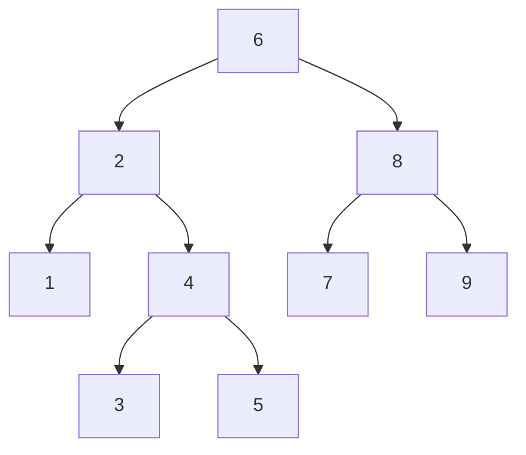
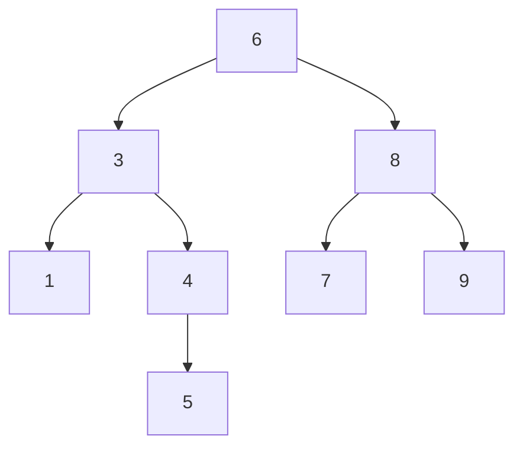

# Binary Search Tree 二叉搜索树

> [!abstract] 核心结论
> **二叉搜索树**（Binary Search Tree, BST）通过维护“左子树关键字更小、右子树关键字更大”的局部有序性，使查找、插入、删除等动态集合操作沿一条根到叶的路径完成。
>
> 所有基本操作的时间复杂度均依赖树高 $h$：一般为 $O(h)$。树较平衡时 $h=\Theta(\log n)$；退化为链表时 $h=\Theta(n)$。

## 1. 基本思想

### 1.1 定义

二叉搜索树是一棵二叉树。对树中任意结点 $x$，都满足：

- $x$ 左子树中所有结点的关键字均小于 $x.key$；
- $x$ 右子树中所有结点的关键字均大于 $x.key$；
- $x$ 的左右子树本身也分别是二叉搜索树。

本文默认 **关键字互不相同**，因此可写为：

$$
\forall y\in x.left,\quad y.key < x.key
$$

$$
\forall y\in x.right,\quad y.key > x.key
$$

> [!warning] 重复关键字
> BST 并非不能存储重复关键字，但必须预先规定统一策略，例如：
>
> - 重复关键字全部插入右子树；
> - 在结点中增加 `count` 字段记录出现次数；
> - 每个关键字对应一个值列表。
>
> 若没有统一策略，查找、插入和删除的语义会变得不明确。

### 1.2 结点结构

一个常见 BST 结点包含：

```text
Node:
    key       // 用于比较和定位的关键字
    value     // 可选：与关键字关联的数据
    left      // 左孩子
    right     // 右孩子
    parent    // 父结点，可选但便于删除、求后继和前驱
```

### 1.3 为什么能够高效查找

在当前结点 $x$ 处查找关键字 $k$：

- 若 $k=x.key$，查找成功；
- 若 $k<x.key$，右子树不可能包含 $k$，只需搜索左子树；
- 若 $k>x.key$，左子树不可能包含 $k$，只需搜索右子树。

每次比较都排除一整棵子树，因此算法只沿一条根到叶路径移动。

### 1.4 中序遍历的有序性

BST 的中序遍历顺序为：

1. 遍历左子树；
2. 访问当前结点；
3. 遍历右子树。

根据 BST 性质，中序遍历会按关键字递增顺序输出全部元素。

> [!important] BST 的本质
> BST 不是“整体排好序的数组”，而是把全序关系编码到树的结构中。其性能取决于结构是否足够平衡。

## 2. 具体过程

### 2.1 查找 Search

从根结点开始，将目标关键字与当前结点比较：

- 相等：返回当前结点；
- 更小：进入左子树；
- 更大：进入右子树；
- 到达 `NIL`：目标不存在。

查找过程中保持如下不变式：

> 若关键字 $k$ 存在于当前搜索子树中，则它一定存在于下一步选择的子树中。

### 2.2 查找最小值和最大值

- **最小值**：从某棵子树的根开始不断访问左孩子，直到左孩子为 `NIL`；
- **最大值**：从某棵子树的根开始不断访问右孩子，直到右孩子为 `NIL`。

原因是左孩子关键字更小，右孩子关键字更大。

### 2.3 查找后继和前驱

结点 $x$ 的：

- **后继**（successor）：严格大于 $x.key$ 的最小关键字；
- **前驱**（predecessor）：严格小于 $x.key$ 的最大关键字。

#### 后继

分为两种情况：

1. 若 $x$ 有右子树，则后继是右子树中的最小结点；
2. 若 $x$ 没有右子树，则沿父指针向上，找到第一个满足“$x$ 位于其左子树中”的祖先。

#### 前驱

与后继对称：

1. 若 $x$ 有左子树，则前驱是左子树中的最大结点；
2. 否则沿父指针向上，找到第一个满足“$x$ 位于其右子树中”的祖先。

### 2.4 插入 Insert

插入新结点 $z$ 时：

1. 从根结点开始查找其应处的位置；
2. 若 $z.key$ 更小，则向左走；否则向右走；
3. 到达一个 `NIL` 位置后，将 $z$ 接到该位置；
4. 设置 `z.parent`，并将其左右孩子初始化为 `NIL`。

插入的新结点一定成为叶结点，因此不会破坏其他结点之间的 BST 次序。

> [!note] 插入顺序会改变树形
> 相同的一组关键字，按不同顺序插入，可能形成高度完全不同的 BST。

### 2.5 删除 Delete

删除是 BST 中最复杂的基本操作。目标是删除结点 $z$ 后，仍保持 BST 性质。

#### 情况 1：$z$ 没有左孩子

直接用 $z.right$ 替换 $z$。

这也包含 $z$ 为叶结点的情况，因为此时 $z.right=NIL$。

#### 情况 2：$z$ 没有右孩子

直接用 $z.left$ 替换 $z$。

#### 情况 3：$z$ 同时有左右孩子

1. 在 $z$ 的右子树中找到最小结点 $y$；
2. $y$ 是 $z$ 的后继，因此没有左孩子；
3. 用 $y$ 替换 $z$；
4. 将 $z$ 的左子树和右子树正确连接到 $y$。

选择后继 $y$ 的关键原因是：

$$
\max(z.left) < y.key < \text{右子树中除 } y \text{ 外的关键字}
$$

因此 $y$ 能够占据 $z$ 原来的位置而保持 BST 次序。

### 2.6 子树移植 Transplant

删除操作常使用辅助过程 `TRANSPLANT(T, u, v)`：

- 用以 $v$ 为根的子树替换以 $u$ 为根的子树；
- 修改 $u$ 的父结点指向；
- 修改 $v.parent$；
- 不负责处理 $v$ 的左右孩子。

## 3. 伪代码

以下伪代码默认：

- 空指针记为 `NIL`；
- 树对象为 `T`，根结点为 `T.root`；
- 关键字互不相同；
- 结点包含 `key`、`left`、`right`、`parent` 字段。

### 3.1 中序遍历

```text
INORDER-TREE-WALK(x):
    if x != NIL:
        INORDER-TREE-WALK(x.left)
        OUTPUT(x.key)
        INORDER-TREE-WALK(x.right)
```

### 3.2 迭代查找

```text
TREE-SEARCH(x, k):
    while x != NIL and k != x.key:
        if k < x.key:
            x <- x.left
        else:
            x <- x.right

    return x
```

调用方式：

```text
TREE-SEARCH(T.root, k)
```

### 3.3 最小值与最大值

```text
TREE-MINIMUM(x):
    while x.left != NIL:
        x <- x.left

    return x
```

```text
TREE-MAXIMUM(x):
    while x.right != NIL:
        x <- x.right

    return x
```

### 3.4 后继与前驱

```text
TREE-SUCCESSOR(x):
    if x.right != NIL:
        return TREE-MINIMUM(x.right)

    y <- x.parent

    while y != NIL and x == y.right:
        x <- y
        y <- y.parent

    return y
```

```text
TREE-PREDECESSOR(x):
    if x.left != NIL:
        return TREE-MAXIMUM(x.left)

    y <- x.parent

    while y != NIL and x == y.left:
        x <- y
        y <- y.parent

    return y
```

### 3.5 插入

```text
TREE-INSERT(T, z):
    parent <- NIL
    current <- T.root

    while current != NIL:
        parent <- current

        if z.key < current.key:
            current <- current.left
        else:
            current <- current.right

    z.parent <- parent
    z.left <- NIL
    z.right <- NIL

    if parent == NIL:
        T.root <- z
    else if z.key < parent.key:
        parent.left <- z
    else:
        parent.right <- z
```

### 3.6 子树移植

```text
TRANSPLANT(T, u, v):
    if u.parent == NIL:
        T.root <- v
    else if u == u.parent.left:
        u.parent.left <- v
    else:
        u.parent.right <- v

    if v != NIL:
        v.parent <- u.parent
```

### 3.7 删除

```text
TREE-DELETE(T, z):
    if z.left == NIL:
        TRANSPLANT(T, z, z.right)

    else if z.right == NIL:
        TRANSPLANT(T, z, z.left)

    else:
        y <- TREE-MINIMUM(z.right)

        if y.parent != z:
            TRANSPLANT(T, y, y.right)
            y.right <- z.right
            y.right.parent <- y

        TRANSPLANT(T, z, y)
        y.left <- z.left
        y.left.parent <- y
```

> [!tip] 理解双孩子删除
> 不要把它机械记成“交换值再删除”。更准确的结构化理解是：
>
> 1. 找到后继 $y$；
> 2. 先把 $y$ 从原位置摘下；
> 3. 再让 $y$ 接管 $z$ 的位置和两棵子树。

## 4. 时空间复杂度

设：

- $n$ 为结点数；
- $h$ 为树高；
- 根结点深度为 $0$；
- 空树高度可约定为 $-1$，单结点树高度为 $0$。

### 4.1 时间复杂度

| 操作 | 一般复杂度 | 较平衡时 | 最坏退化时 |
|---|---:|---:|---:|
| 查找 `SEARCH` | $O(h)$ | $O(\log n)$ | $O(n)$ |
| 最小值 / 最大值 | $O(h)$ | $O(\log n)$ | $O(n)$ |
| 后继 / 前驱 | $O(h)$ | $O(\log n)$ | $O(n)$ |
| 插入 | $O(h)$ | $O(\log n)$ | $O(n)$ |
| 删除 | $O(h)$ | $O(\log n)$ | $O(n)$ |
| 中序遍历 | $\Theta(n)$ | $\Theta(n)$ | $\Theta(n)$ |

> [!warning] “BST 操作是 $O(\log n)$”并不总成立
> 普通 BST 不保证平衡。只有在树高为 $O(\log n)$ 时，查找、插入和删除才是 $O(\log n)$。
>
> 例如按 `1, 2, 3, 4, 5` 的顺序插入，会得到一条向右延伸的链，树高为 $\Theta(n)$。

### 4.2 建树复杂度

通过依次插入 $n$ 个关键字建树：

- 最坏情况：

$$
1+2+\cdots +(n-1)=\Theta(n^2)
$$

- 若插入顺序可视为随机排列，则期望树高为 $O(\log n)$，期望建树时间为：

$$
O(n\log n)
$$

> [!note] 随机假设
> “平均为 $O(\log n)$”必须建立在明确的随机模型上，例如所有插入排列等概率出现。不能把任意实际输入都直接视为随机输入。

### 4.3 空间复杂度

| 项目 | 空间复杂度 |
|---|---:|
| 存储 $n$ 个结点 | $\Theta(n)$ |
| 迭代查找辅助空间 | $O(1)$ |
| 递归查找辅助空间 | $O(h)$ |
| 递归中序遍历调用栈 | $O(h)$ |
| 退化树中的递归栈 | $O(n)$ |

若每个结点保存父指针，仍然只增加常数级字段，因此总存储空间仍为 $\Theta(n)$。

## 5. 需要问题具有的性质

BST 适用于满足以下条件的动态集合问题。

### 5.1 关键字具有一致的全序关系

关键字必须能够进行一致比较，例如满足：

- 三歧性：$a<b$、$a=b$、$a>b$ 恰有一个成立；
- 传递性：若 $a<b$ 且 $b<c$，则 $a<c$；
- 比较结果稳定，不会在树存在期间随意改变。

常见关键字包括整数、浮点数、字符串、时间戳以及可定义比较器的对象。

### 5.2 需要维护动态集合

BST 适合元素会持续插入和删除，同时还需要查询的场景，例如：

- `SEARCH(k)`：查找关键字；
- `INSERT(x)`：插入元素；
- `DELETE(x)`：删除元素；
- `MINIMUM()` / `MAXIMUM()`；
- `SUCCESSOR(x)` / `PREDECESSOR(x)`；
- 按序遍历全部元素。

若数据完全静态，且只进行精确查找，排序数组配合 二分查找 往往更紧凑。

### 5.3 查询利用关键字的顺序

BST 不仅支持“是否存在”，还支持顺序相关操作，例如：

- 小于某值的最大元素；
- 大于某值的最小元素；
- 区间查询；
- 排序输出；
- 前驱与后继。

若只需要精确查找而不关心顺序，[哈希表](/blog/cs-major-courses/introduction-to-algorithms/hashing-i-哈希/) 的期望常数时间可能更合适。

### 5.4 能接受普通 BST 的高度风险，或另行保证平衡

普通 BST 的性能受插入顺序影响。若必须保证最坏情况下 $O(\log n)$，应使用：

- [Red-Black Tree 红黑树](/blog/cs-major-courses/introduction-to-algorithms/red-black-tree-红黑树/)；
- AVL 树；
- B 树等平衡搜索树。

### 5.5 重复关键字策略必须明确

问题若允许重复元素，需要决定：

- 将重复元素存为独立结点；
- 使用计数器；
- 使用关键字到多个记录的映射。

## 6. 典型例子

### 6.1 建立一棵 BST

依次插入：

```text
[6, 2, 8, 1, 4, 7, 9, 3, 5]
```

得到：



该树满足：

- 根结点 `6` 左侧关键字均小于 `6`；
- 根结点 `6` 右侧关键字均大于 `6`；
- 每棵子树也满足相同性质。

### 6.2 查找关键字 5

查找路径为：

```text
6 -> 2 -> 4 -> 5
```

比较过程：

1. $5<6$，进入左子树；
2. $5>2$，进入右子树；
3. $5>4$，进入右子树；
4. 找到关键字 `5`。

共访问 4 个结点，时间与目标结点深度相关。

### 6.3 最小值、最大值、前驱和后继

对上述 BST：

- 最小值：`1`；
- 最大值：`9`；
- `4` 的前驱：`3`；
- `4` 的后继：`5`；
- `5` 没有右子树，其后继需要沿父指针向上寻找，结果为 `6`。

### 6.4 删除具有两个孩子的结点 2

结点 `2` 的左右孩子分别为 `1` 和 `4`。

1. 在 `2` 的右子树中寻找最小结点；
2. 得到后继 `3`；
3. 用 `3` 替换 `2`；
4. 将 `1` 作为 `3` 的左子树，将原右子树正确连接到 `3`。

删除后的局部结构为：



其中序遍历仍为：

```text
1, 3, 4, 5, 6, 7, 8, 9
```

### 6.5 BST Sort

BST 可以用于排序：

```text
BST-SORT(A):
    T <- empty BST

    for each element x in A:
        TREE-INSERT(T, x)

    INORDER-TREE-WALK(T.root)
```

复杂度：

- 建树：取决于树高；
- 中序遍历：$\Theta(n)$；
- 随机插入顺序下期望时间：$O(n\log n)$；
- 最坏时间：$\Theta(n^2)$。

因此普通 BST Sort 不具备归并排序或堆排序的最坏 $O(n\log n)$ 保证。

## 7. 正确性要点

### 7.1 查找正确性

设当前结点为 $x$：

- 当 $k<x.key$ 时，根据 BST 性质，$x$ 的右子树全部关键字都大于 $x.key$，因此不可能包含 $k$；
- 当 $k>x.key$ 时，$x$ 的左子树不可能包含 $k$。

所以每次选择的子树都不会丢失可能答案。

### 7.2 中序遍历正确性

对任意结点 $x$：

1. 左子树中所有关键字小于 $x.key$；
2. 递归中序遍历左子树得到递增序列；
3. 输出 $x.key$；
4. 递归中序遍历右子树得到全部大于 $x.key$ 的递增序列。

因此拼接结果整体递增。

### 7.3 插入正确性

插入算法沿查找路径到达 `NIL`，并将新结点作为叶结点接入：

- 路径上的每次方向选择都由关键字比较决定；
- 新结点与所有祖先的大小关系均与其所在方向一致；
- 新结点没有子树，不会引入额外次序冲突。

### 7.4 删除正确性

- 删除至多一个孩子的结点时，只需将其非空子树整体上移，该子树内部次序不变；
- 删除两个孩子的结点时，使用其后继替代。后继是右子树最小值，因此大于左子树全部关键字，且不大于右子树其余关键字。

## 8. 与相关结构的比较

| 结构 | 查找 | 插入 / 删除 | 有序遍历 | 最坏情况保证 | 典型特点 |
|---|---:|---:|---:|---:|---|
| 排序数组 + 二分查找 | $O(\log n)$ | $O(n)$ | $O(n)$ | 有 | 静态查询效率高 |
| 普通 BST | $O(h)$ | $O(h)$ | $O(n)$ | 无 | 结构简单，支持动态有序集合 |
| 红黑树 | $O(\log n)$ | $O(\log n)$ | $O(n)$ | 有 | 工程中常用的平衡搜索树 |
| 哈希表 | 期望 $O(1)$ | 期望 $O(1)$ | 不支持自然有序遍历 | 通常无 | 精确查找快，不维护顺序 |

## 9. 常见错误

> [!bug] 错误 1：把任意二叉树当作 BST
> 二叉树只限制每个结点最多有两个孩子；BST 还必须满足关键字次序性质。

> [!bug] 错误 2：默认 BST 永远平衡
> 普通 BST 没有自动平衡机制。单调插入可能使其退化为链表。

> [!bug] 错误 3：删除双孩子结点时随意选择替代结点
> 替代结点通常选择后继或前驱，因为它们能保持左右子树之间的次序关系。

> [!bug] 错误 4：移植子树时忘记修改父指针
> `TRANSPLANT` 既要修改原父结点的孩子指针，也要更新新子树根的 `parent`。

> [!bug] 错误 5：重复关键字没有统一规则
> 插入、查找和删除必须遵循相同的重复关键字策略。

## 10. 复习清单

- [ ] 能写出 BST 的递归定义和关键字性质
- [ ] 能解释中序遍历为什么产生递增序列
- [ ] 能手动执行查找、最小值、最大值、前驱和后继
- [ ] 能区分删除操作的三种情况
- [ ] 能写出 `TRANSPLANT` 和 `TREE-DELETE`
- [ ] 能用 $O(h)$ 分析各项基本操作
- [ ] 能解释平衡树与退化树的复杂度差异
- [ ] 能说明 BST、排序数组、哈希表和红黑树的适用场景

## 11. 相关笔记

- 二分查找
- 
- [Red-Black Tree 红黑树](/blog/cs-major-courses/introduction-to-algorithms/red-black-tree-红黑树/)
- [哈希表](/blog/cs-major-courses/introduction-to-algorithms/hashing-i-哈希/)
- [Quick Sort 快速排序](/blog/cs-major-courses/introduction-to-algorithms/quick-sort-快速排序/)
- [Order Statistic 顺序统计量](/blog/cs-major-courses/introduction-to-algorithms/order-statistic-顺序统计量/)

## 12. 参考资料

1. Cormen, T. H., Leiserson, C. E., Rivest, R. L., & Stein, C. (2009). *Introduction to Algorithms* (3rd ed.). MIT Press. Chapter 12: Binary Search Trees.
2. Demaine, E. D., & Leiserson, C. E. (2005). *MIT 6.046J/18.401J Lecture 9: Randomly Built Binary Search Trees*.
3. Kepano. *Obsidian Skills: Obsidian Flavored Markdown Skill*. GitHub.
