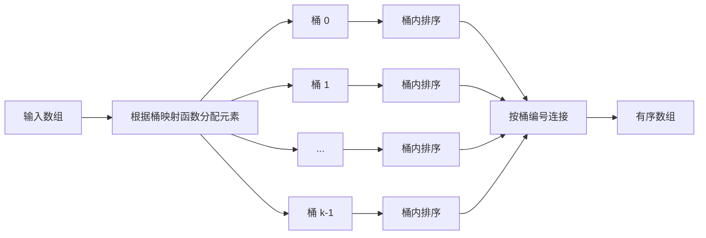

# Bucket Sort 桶排序

> [!abstract] 核心结论
> 桶排序先依据关键字范围将元素分配到若干个**有序的桶**中，再分别排序每个桶，最后按桶的顺序连接结果。
>
> 当 $n$ 个输入元素独立、均匀地分布在 $[0,1)$ 上，使用 $n$ 个桶并在桶内执行 [插入排序](/blog/cs-major-courses/introduction-to-algorithms/insertion-sort-插入排序/) 时，期望时间复杂度为 $\Theta(n)$；但当大量元素集中到同一个桶中时，最坏时间复杂度仍为 $\Theta(n^2)$。

## 1. 问题定义

给定包含 $n$ 个元素的数组：

$$
A = [A[0], A[1], \ldots, A[n-1]],
$$

桶排序要输出其非递减排列：

$$
A'[0] \leq A'[1] \leq \cdots \leq A'[n-1].
$$

经典版本假设每个元素满足：

$$
0 \leq A[i] < 1,
$$

并建立 $n$ 个桶：

$$
B[0], B[1], \ldots, B[n-1].
$$

元素 $x$ 被映射到桶：

$$
b(x) = \lfloor nx \rfloor.
$$

由于 $x \in [0,1)$，所以：

$$
0 \leq \lfloor nx \rfloor \leq n-1.
$$

## 2. 基本思想

桶排序利用了输入数据的**数值分布信息**，而不只是通过元素之间的比较确定顺序。

其核心思想可以概括为：

1. 将整个关键字范围划分为若干个连续且有序的子区间，每个子区间对应一个桶。
2. 根据元素的值，把每个元素放入对应的桶中。
3. 分别排序每个桶内部的元素。
4. 按桶编号从小到大依次连接各桶。

如果桶的划分满足：

$$
i < j \Longrightarrow \forall x \in B[i],\ \forall y \in B[j],\ x \leq y,
$$

那么在每个桶内部排好序之后，按桶编号连接即可得到全局有序序列。

> [!important] 本质
> 桶排序不是“把元素直接放到最终位置”，而是先完成一次**粗粒度排序**，再在每个桶中完成**细粒度排序**。

## 3. 具体过程

设输入数组长度为 $n$，输入元素均位于 $[0,1)$。

### 3.1 创建桶

创建 $n$ 个空桶：

$$
B[0], B[1], \ldots, B[n-1].
$$

桶 $B[i]$ 对应区间：

$$
\left[\frac{i}{n}, \frac{i+1}{n}\right).
$$

### 3.2 将元素分配到桶中

对于每个元素 $x=A[i]$，计算：

$$
j = \lfloor nx \rfloor,
$$

并将 $x$ 插入桶 $B[j]$。

### 3.3 对每个桶分别排序

对每个桶 $B[i]$ 内部执行排序。

经典分析通常采用插入排序，因为在线性期望时间成立的条件下，每个桶的期望元素数量为常数，插入排序处理小规模数组的常数开销较低。

### 3.4 按桶编号连接

依次连接：

$$
B[0], B[1], \ldots, B[n-1].
$$

连接后的序列就是最终排序结果。



## 4. 伪代码

### 4.1 经典版本

下面使用 0-based 下标，并假设 $A[i] \in [0,1)$。

```text
BUCKET-SORT(A)
    n ← length(A)
    B ← array of n empty lists

    for i ← 0 to n - 1
        bucket_index ← floor(n × A[i])
        append A[i] to B[bucket_index]

    for i ← 0 to n - 1
        INSERTION-SORT(B[i])

    result ← empty list

    for i ← 0 to n - 1
        append every element of B[i] to result

    return result
```

### 4.2 适用于任意数值区间的版本

若输入位于已知区间 $[\mathrm{minValue},\mathrm{maxValue}]$，且建立 $k$ 个桶，可以使用归一化映射：

$$
\operatorname{bucket}(x)
=
\min\left(
 k-1,
 \left\lfloor
 k\frac{x-\mathrm{minValue}}
 {\mathrm{maxValue}-\mathrm{minValue}}
 \right\rfloor
\right).
$$

其中外层的 $\min(k-1,\cdot)$ 用于保证最大值恰好等于 $\mathrm{maxValue}$ 时不会越界。

```text
BUCKET-SORT-RANGE(A, k, minValue, maxValue)
    B ← array of k empty lists

    if length(A) ≤ 1
        return A

    if minValue = maxValue
        return copy of A

    for each x in A
        normalized ← (x - minValue) / (maxValue - minValue)
        bucket_index ← min(k - 1, floor(k × normalized))
        append x to B[bucket_index]

    result ← empty list

    for i ← 0 to k - 1
        sort B[i]
        append every element of B[i] to result

    return result
```

## 5. 正确性说明

桶排序的正确性依赖两个条件。

### 5.1 桶间有序性

桶映射函数必须保持数值区间的顺序。对于任意桶编号 $i<j$：

$$
\forall x\in B[i],\ \forall y\in B[j],\quad x\leq y.
$$

因此，较小编号桶中的任何元素都不会大于较大编号桶中的元素。

### 5.2 桶内有序性

对每个桶 $B[i]$ 排序之后，桶内元素满足非递减顺序。

综合以上两点：

- 同一个桶内的元素已经有序；
- 不同桶之间按照值域区间天然有序。

所以按 $B[0],B[1],\ldots,B[k-1]$ 的顺序连接，得到的整个数组必然有序。

> [!note] 循环不变式
> 在连接阶段开始处理桶 $B[i]$ 前，`result` 中已经包含桶 $B[0],\ldots,B[i-1]$ 的全部元素，并且这些元素整体有序；同时，它们均不大于尚未连接桶中的任何元素。

## 6. 时间复杂度

设：

- 输入元素数量为 $n$；
- 桶的数量为 $k$；
- 第 $i$ 个桶中的元素数量为 $n_i$；
- 满足 $\sum_{i=0}^{k-1} n_i=n$。

### 6.1 一般形式

创建桶需要：

$$
\Theta(k).
$$

分配全部元素需要：

$$
\Theta(n).
$$

连接全部桶需要：

$$
\Theta(n+k).
$$

若桶内采用插入排序，第 $i$ 个桶的排序时间为：

$$
\Theta(n_i^2).
$$

因此总时间为：

$$
T(n)
=
\Theta\left(
 n+k+\sum_{i=0}^{k-1}n_i^2
\right).
$$

### 6.2 期望时间复杂度

经典模型取 $k=n$，并假设 $n$ 个输入元素独立、均匀地分布在 $[0,1)$。

此时，每个元素落入任意一个桶的概率均为：

$$
\frac{1}{n}.
$$

对任意桶 $B[i]$，桶中元素数量 $n_i$ 服从二项分布：

$$
n_i \sim \operatorname{Binomial}\left(n,\frac{1}{n}\right).
$$

因此：

$$
\mathbb{E}[n_i]=1,
$$

且：

$$
\begin{aligned}
\mathbb{E}[n_i^2]
&=\operatorname{Var}(n_i)+\mathbb{E}[n_i]^2\\
&=n\frac{1}{n}\left(1-\frac{1}{n}\right)+1\\
&=2-\frac{1}{n}\\
&=\Theta(1).
\end{aligned}
$$

所以：

$$
\begin{aligned}
\mathbb{E}\left[\sum_{i=0}^{n-1}n_i^2\right]
&=\sum_{i=0}^{n-1}\mathbb{E}[n_i^2]\\
&=n\left(2-\frac{1}{n}\right)\\
&=2n-1\\
&=\Theta(n).
\end{aligned}
$$

最终得到：

$$
\boxed{\mathbb{E}[T(n)]=\Theta(n)}.
$$

> [!warning] 期望线性时间的前提
> $\Theta(n)$ 是在特定概率模型下得到的**期望复杂度**，不是对任意输入都成立的最坏情况保证。

### 6.3 最坏时间复杂度

如果所有元素都进入同一个桶，则：

$$
n_0=n,
$$

其余桶为空。若桶内使用插入排序：

$$
T(n)=\Theta(n^2).
$$

因此：

$$
\boxed{T_{\mathrm{worst}}(n)=\Theta(n^2)}.
$$

### 6.4 最好时间复杂度

如果元素被均匀地分散到各个桶中，使每个桶只包含常数个元素，则：

$$
\boxed{T_{\mathrm{best}}(n)=\Theta(n+k)}.
$$

当 $k=\Theta(n)$ 时：

$$
\boxed{T_{\mathrm{best}}(n)=\Theta(n)}.
$$

### 6.5 复杂度汇总

| 情况 | 桶内采用插入排序 | 条件 |
|---|---:|---|
| 最好时间 | $\Theta(n+k)$ | 元素均匀分散，单桶规模为常数 |
| 期望时间 | $\Theta(n)$ | $k=n$，输入独立均匀分布 |
| 最坏时间 | $\Theta(n^2+k)$ | 所有元素集中到一个桶 |
| 空间复杂度 | $\Theta(n+k)$ | 存储桶结构及全部元素 |

当 $k=n$ 时，空间复杂度为：

$$
\boxed{\Theta(n)}.
$$

## 7. 需要问题具有的性质

桶排序适用的关键不在于元素是否为整数，而在于能否设计出合理的桶划分。

### 7.1 关键字具有可划分的有序范围

必须能够根据元素关键字将其映射到有序桶中。例如：

- $[0,1)$ 内的浮点数；
- 已知最小值与最大值的实数；
- 年龄、成绩、价格等具有明确区间的数据；
- 可按前缀、区间或分位点划分的复合关键字。

### 7.2 桶映射必须保持顺序

若 $x<y$，映射结果应满足：

$$
b(x)\leq b(y).
$$

否则，按照桶编号连接时无法保证全局有序。

### 7.3 数据应尽可能均匀地分布到各桶

要获得接近线性的运行时间，应避免少数桶包含大量元素。

经典的 $\Theta(n)$ 期望时间要求输入元素独立、均匀地分布在 $[0,1)$。实际数据不一定严格均匀，但桶边界应尽量使各桶负载均衡。

> [!tip] 非均匀分布的处理
> 对偏斜分布，可使用非等宽桶、分位数桶、直方图估计或自适应桶，使各桶包含的元素数量更加均衡。

### 7.4 桶的数量需要合理

桶数 $k$ 过小：

- 单桶元素过多；
- 桶内排序成本增大。

桶数 $k$ 过大：

- 初始化和遍历空桶的成本增大；
- 额外空间消耗增大。

经典分析通常选择：

$$
k=n.
$$

实际实现中，$k$ 应结合数据规模、分布和内存限制确定。

### 7.5 桶内必须能够执行排序

桶内可以使用：

- [插入排序](/blog/cs-major-courses/introduction-to-algorithms/insertion-sort-插入排序/)：适合桶很小的情况；
- [归并排序](/blog/cs-major-courses/introduction-to-algorithms/merge-sort-归并排序/)：需要稳定性或最坏情况保证；
- [快速排序](/blog/cs-major-courses/introduction-to-algorithms/quick-sort-快速排序/)：平均性能较好；
- 语言内置排序：工程实现中最常见。

## 8. 典型例子

给定数组：

$$
A=[0.78,0.17,0.39,0.26,0.72,0.94,0.21,0.12,0.23,0.68].
$$

数组长度：

$$
n=10.
$$

建立 $10$ 个桶，桶编号为 $0$ 到 $9$，映射函数为：

$$
b(x)=\lfloor 10x\rfloor.
$$

### 8.1 分配元素

| 元素 $x$ | $\lfloor 10x\rfloor$ | 所属桶 |
|---:|---:|---:|
| $0.78$ | $7$ | $B[7]$ |
| $0.17$ | $1$ | $B[1]$ |
| $0.39$ | $3$ | $B[3]$ |
| $0.26$ | $2$ | $B[2]$ |
| $0.72$ | $7$ | $B[7]$ |
| $0.94$ | $9$ | $B[9]$ |
| $0.21$ | $2$ | $B[2]$ |
| $0.12$ | $1$ | $B[1]$ |
| $0.23$ | $2$ | $B[2]$ |
| $0.68$ | $6$ | $B[6]$ |

分配完成后：

```text
B[0] = []
B[1] = [0.17, 0.12]
B[2] = [0.26, 0.21, 0.23]
B[3] = [0.39]
B[4] = []
B[5] = []
B[6] = [0.68]
B[7] = [0.78, 0.72]
B[8] = []
B[9] = [0.94]
```

### 8.2 桶内排序

```text
B[0] = []
B[1] = [0.12, 0.17]
B[2] = [0.21, 0.23, 0.26]
B[3] = [0.39]
B[4] = []
B[5] = []
B[6] = [0.68]
B[7] = [0.72, 0.78]
B[8] = []
B[9] = [0.94]
```

### 8.3 连接各桶

按照桶编号从小到大连接：

$$
[0.12,0.17,0.21,0.23,0.26,0.39,0.68,0.72,0.78,0.94].
$$

## 9. Python 实现

### 9.1 经典 $[0,1)$ 版本

```python
from __future__ import annotations


def insertion_sort(values: list[float]) -> None:
    """使用插入排序原地排列一个桶。"""
    for i in range(1, len(values)):
        key = values[i]
        j = i - 1

        while j >= 0 and values[j] > key:
            values[j + 1] = values[j]
            j -= 1

        values[j + 1] = key


def bucket_sort(values: list[float]) -> list[float]:
    """排序位于区间 [0, 1) 内的浮点数。"""
    n = len(values)

    if n <= 1:
        return values.copy()

    if any(value < 0.0 or value >= 1.0 for value in values):
        raise ValueError("经典桶排序要求所有元素位于区间 [0, 1) 内")

    buckets: list[list[float]] = [[] for _ in range(n)]

    for value in values:
        bucket_index = int(n * value)
        buckets[bucket_index].append(value)

    result: list[float] = []

    for bucket in buckets:
        insertion_sort(bucket)
        result.extend(bucket)

    return result


if __name__ == "__main__":
    data = [0.78, 0.17, 0.39, 0.26, 0.72,
            0.94, 0.21, 0.12, 0.23, 0.68]

    sorted_data = bucket_sort(data)

    print("原数组:", data)
    print("排序后:", sorted_data)

    assert sorted_data == sorted(data)
```

预期输出：

```text
原数组: [0.78, 0.17, 0.39, 0.26, 0.72, 0.94, 0.21, 0.12, 0.23, 0.68]
排序后: [0.12, 0.17, 0.21, 0.23, 0.26, 0.39, 0.68, 0.72, 0.78, 0.94]
```

### 9.2 任意数值范围版本

```python
from __future__ import annotations


def bucket_sort_range(
    values: list[float],
    bucket_count: int | None = None,
) -> list[float]:
    """对任意有限浮点数范围执行桶排序。"""
    n = len(values)

    if n <= 1:
        return values.copy()

    if bucket_count is None:
        bucket_count = n

    if bucket_count <= 0:
        raise ValueError("bucket_count 必须为正整数")

    min_value = min(values)
    max_value = max(values)

    if min_value == max_value:
        return values.copy()

    buckets: list[list[float]] = [
        [] for _ in range(bucket_count)
    ]

    value_range = max_value - min_value

    for value in values:
        normalized = (value - min_value) / value_range
        bucket_index = min(
            bucket_count - 1,
            int(bucket_count * normalized),
        )
        buckets[bucket_index].append(value)

    result: list[float] = []

    for bucket in buckets:
        bucket.sort()
        result.extend(bucket)

    return result


if __name__ == "__main__":
    data = [42.0, -3.5, 17.2, 8.8, 42.0, 0.0, 15.1]
    result = bucket_sort_range(data)

    print(result)
    assert result == sorted(data)
```

## 10. 稳定性与原地性

### 10.1 稳定性

桶排序本身是否稳定取决于两个实现细节：

1. 元素进入桶时是否保持原相对次序；
2. 桶内排序算法是否稳定。

若采用尾部追加元素、稳定的桶内排序，并按桶编号顺序连接，则桶排序可以是稳定排序。

因此：

$$
\boxed{\text{桶排序可以稳定，但稳定性取决于具体实现。}}
$$

### 10.2 原地性

标准桶排序需要额外维护多个桶，并存储所有输入元素，因此通常不是原地排序：

$$
\boxed{\text{标准桶排序不是原地排序。}}
$$

## 11. 优点与局限

### 11.1 优点

- 当数据分布适合桶划分时，可以获得期望 $\Theta(n)$ 的运行时间。
- 各桶可以独立排序，适合并行化。
- 对浮点数、区间型数据和近似均匀分布数据较有效。
- 桶内数据规模较小时，可利用插入排序的低常数开销。

### 11.2 局限

- 性能高度依赖输入分布和桶划分方式。
- 数据严重偏斜时可能退化为 $\Theta(n^2)$。
- 需要 $\Theta(n+k)$ 的额外空间。
- 需要提前知道或估计关键字范围及分布。
- 桶数选择不合理会导致时间或空间浪费。

## 12. 与其他线性时间排序的比较

| 算法                           | 主要依据        | 典型适用对象       | 时间复杂度            | 是否依赖分布      |
| ---------------------------- | ----------- | ------------ | ---------------- | ----------- |
| 计数排序 | 统计每个离散键出现次数 | 小范围整数        | $\Theta(n+k)$    | 依赖键值范围大小    |
| 基数排序    | 按位依次稳定排序    | 定长整数或字符串     | $\Theta(d(n+k))$ | 依赖位数与每位取值范围 |
| 桶排序                          | 按值域区间分桶     | 区间内近似均匀分布的数据 | 期望 $\Theta(n)$   | 强烈依赖数据分布    |

> [!question] 桶排序与计数排序有什么区别？
> - 计数排序通常为每一个离散键值建立计数位置，不需要在每个位置中再次排序。
> - 桶排序通常让一个桶对应一个值域区间，一个桶中可以包含多个不同值，因此需要桶内排序。

## 13. 常见错误

> [!failure] 错误 1：把所有桶排序都写成 $O(n)$
> 只有在输入分布与桶划分满足相应条件时，桶排序才具有线性期望时间。最坏情况仍可能为 $\Theta(n^2)$。

> [!failure] 错误 2：直接使用 $\lfloor kx\rfloor$ 处理任意范围数据
> 该映射只适用于已经归一化到 $[0,1)$ 的数据。任意范围数据需要先归一化。

> [!failure] 错误 3：忽略最大值造成的下标越界
> 对闭区间 $[\mathrm{minValue},\mathrm{maxValue}]$，最大值归一化后等于 $1$，必须将桶编号限制到 $k-1$。

> [!failure] 错误 4：桶映射不保持顺序
> 桶编号必须与关键字大小单调一致，否则连接各桶不能得到全局有序结果。

## 14. 总结

桶排序的算法框架为：

$$
\boxed{\text{划分值域}\rightarrow\text{分配到桶}\rightarrow\text{桶内排序}\rightarrow\text{顺序连接}}.
$$

其复杂度的一般形式为：

$$
\boxed{
T(n)=\Theta\left(n+k+\sum_{i=0}^{k-1}n_i^2\right)
}
$$

其中，$n_i$ 是第 $i$ 个桶中的元素数量。

当 $k=n$ 且输入独立均匀分布时：

$$
\boxed{\mathbb{E}[T(n)]=\Theta(n)}.
$$

当所有元素集中在一个桶中时：

$$
\boxed{T_{\mathrm{worst}}(n)=\Theta(n^2)}.
$$

## 15. 相关笔记

- [Insertion Sort 插入排序](/blog/cs-major-courses/introduction-to-algorithms/insertion-sort-插入排序/)
- [Counting Sort 计数排序](/blog/cs-major-courses/introduction-to-algorithms/counting-sort-计数排序/)
- [Radix Sort 基数排序](/blog/cs-major-courses/introduction-to-algorithms/radix-sort-基数排序/)
- [Sorting Algorithms 排序算法](/blog/cs-major-courses/introduction-to-algorithms/sorting-algorithms-排序算法/)

## 16. 参考资料

1. Cormen, Thomas H., Charles E. Leiserson, Ronald L. Rivest, and Clifford Stein. 2009. *Introduction to Algorithms*, 3rd ed. Chapter 8.4, “Bucket Sort.” MIT Press.
2. Ango, Steph. “Obsidian Flavored Markdown Skill.” *kepano/obsidian-skills*. [GitHub](https://github.com/kepano/obsidian-skills/tree/main/skills/obsidian-markdown).
