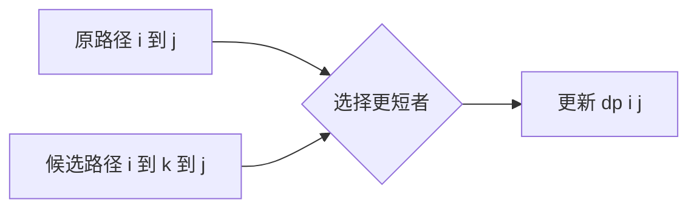

# Floyd-Warshall Algorithm

> [!abstract] 核心结论
> Floyd-Warshall 是解决**所有顶点对最短路径**（All-Pairs Shortest Paths, APSP）的动态规划算法。
> 它依次允许顶点 `0, 1, ..., n - 1` 作为路径的中间顶点，并使用
> $$
> dp[i][j] \leftarrow \min\bigl(dp[i][j],\ dp[i][k] + dp[k][j]\bigr)
> $$
> 更新任意顶点对之间的最短距离。时间复杂度为 $\Theta(V^3)$，空间复杂度为 $\Theta(V^2)$。

## 1. 问题定义

给定带权图

$$
G=(V,E), \qquad |V|=n,
$$

边权函数为

$$
w:E\rightarrow \mathbb{R}.
$$

需要计算距离矩阵 `dp`，使得

$$
dp[i][j]=\delta(i,j),
$$

其中 $\delta(i,j)$ 表示从顶点 $i$ 到顶点 $j$ 的最短路径长度；若不存在路径，则

$$
dp[i][j]=\infty.
$$

Floyd-Warshall 一次运行即可得到全部 $n^2$ 个顶点对的最短距离。

## 2. 基本思想

Floyd-Warshall 的关键不是限制路径包含多少条边，而是逐步扩大**允许作为中间顶点的集合**。

设顶点编号为

$$
0,1,\ldots,n-1.
$$

定义概念状态：

$$
dp^{(k)}[i][j]
$$

表示从 $i$ 到 $j$，且中间顶点只能来自集合

$$
\{0,1,\ldots,k-1\}
$$

时的最短路径长度。

因此：

- $dp^{(0)}[i][j]$：不允许使用任何中间顶点，只能使用直接边；
- $dp^{(1)}[i][j]$：只允许顶点 `0` 作为中间顶点；
- $dp^{(2)}[i][j]$：允许顶点 `0, 1` 作为中间顶点；
- $dp^{(n)}[i][j]$：允许所有顶点作为中间顶点，即最终答案。

### 2.1 状态转移

当准备把顶点 $k$ 加入允许的中间顶点集合时，从 $i$ 到 $j$ 的最短路径只有两种情况。

1. **不经过顶点 $k$**

   距离保持为

   $$
   dp^{(k)}[i][j].
   $$

2. **经过顶点 $k$**

   路径可以分解为

   $$
   i\leadsto k\leadsto j,
   $$

   对应距离为

   $$
   dp^{(k)}[i][k]+dp^{(k)}[k][j].
   $$

因此递推式为

$$
dp^{(k+1)}[i][j]
=
\min\left(
    dp^{(k)}[i][j],
    dp^{(k)}[i][k]+dp^{(k)}[k][j]
\right).
$$

由于每一阶段只依赖上一阶段，并且可以安全地原地更新，因此实际只需要一个二维数组：

$$
dp[i][j]
\leftarrow
\min\left(dp[i][j],dp[i][k]+dp[k][j]\right).
$$



> [!important] 循环顺序
> `k` 必须位于最外层。固定 `k` 的整轮更新表示"现在允许顶点 `k` 作为中间顶点"。
> 常见正确循环顺序是 `k → i → j` 或 `k → j → i`；不能随意把 `i` 或 `j` 放到最外层。

## 3. 初始化

构造一个 $n\times n$ 的距离矩阵 `dp`。

$$
dp[i][j]=
\begin{cases}
0, & i=j,\\
w(i,j), & (i,j)\in E,\\
\infty, & \text{其他情况}.
\end{cases}
$$

初始化时需要注意：

- 对角线设为 `0`，表示顶点到自身的空路径长度为 `0`；
- 没有直接边的位置设为 $\infty$；
- 若存在多条平行边 $(u,v)$，应取其中最小权重；
- 对无向图，需要同时设置 `dp[u][v]` 和 `dp[v][u]`；
- 若存在负权自环，使用 `min(0, w(v,v))`，不能直接覆盖掉负权自环。

## 4. 具体过程

1. 根据图的边初始化距离矩阵 `dp`。
2. 依次枚举中间顶点 `k = 0, 1, ..., n - 1`。
3. 对每个起点 `i` 和终点 `j`，比较：
   - 当前已知距离 `dp[i][j]`；
   - 经过顶点 `k` 的距离 `dp[i][k] + dp[k][j]`。
4. 将两者中的较小值写回 `dp[i][j]`。
5. 所有 `k` 处理完毕后，`dp[i][j]` 即从 $i$ 到 $j$ 的最短距离。
6. 检查主对角线：若存在 `dp[v][v] < 0`，则图中存在负权环。

> [!tip] 如何理解一轮更新
> 固定 `k` 后，算法是在问：
> **"从 `i` 到 `j` 的当前最短路，与强制经过 `k` 的路径相比，哪一个更短？"**

## 5. 伪代码

以下伪代码使用 0-based 下标，输入为顶点数 `n` 和边集合 `E`。

```text
FLOYD-WARSHALL(n, E, directed):
    dp <- n × n matrix filled with infinity

    for i <- 0 to n - 1:
        dp[i][i] <- 0

    for each edge (u, v, w) in E:
        dp[u][v] <- min(dp[u][v], w)
        if directed = false:
            dp[v][u] <- min(dp[v][u], w)

    for k <- 0 to n - 1:
        for i <- 0 to n - 1:
            for j <- 0 to n - 1:
                if dp[i][k] != infinity and dp[k][j] != infinity:
                    dp[i][j] <- min(
                        dp[i][j],
                        dp[i][k] + dp[k][j]
                    )

    negative_cycle_vertices <- empty list
    for v <- 0 to n - 1:
        if dp[v][v] < 0:
            append v to negative_cycle_vertices

    return dp, negative_cycle_vertices
```

## 6. Python 实现

```python
from math import inf
from typing import Iterable

Edge = tuple[int, int, int | float]


def floyd_warshall(
    n: int,
    edges: Iterable[Edge],
    *,
    directed: bool = True,
) -> tuple[list[list[float]], list[int]]:
    """计算所有顶点对最短距离。

    顶点必须使用 0-based 编号：0, 1, ..., n - 1。

    Returns:
        dp: 最短距离矩阵。
        negative_cycle_vertices: 满足 dp[v][v] < 0 的顶点。
    """
    if n < 0:
        raise ValueError("n 必须是非负整数")

    dp = [[inf] * n for _ in range(n)]

    for i in range(n):
        dp[i][i] = 0

    for u, v, weight in edges:
        if not (0 <= u < n and 0 <= v < n):
            raise ValueError(f"非法顶点编号: ({u}, {v})")

        # 处理平行边和负权自环。
        dp[u][v] = min(dp[u][v], weight)

        if not directed:
            dp[v][u] = min(dp[v][u], weight)

    # k 必须位于最外层。
    for k in range(n):
        for i in range(n):
            if dp[i][k] == inf:
                continue

            for j in range(n):
                if dp[k][j] == inf:
                    continue

                candidate = dp[i][k] + dp[k][j]
                if candidate < dp[i][j]:
                    dp[i][j] = candidate

    negative_cycle_vertices = [
        v for v in range(n) if dp[v][v] < 0
    ]

    return dp, negative_cycle_vertices
```

## 7. 正确性说明

### 7.1 循环不变量

在开始处理顶点 `k` 之前：

> `dp[i][j]` 等于从 $i$ 到 $j$，且中间顶点只允许来自
> $\{0,1,\ldots,k-1\}$ 的最短路径长度。

### 7.2 基础情况

处理 `k = 0` 之前，不允许使用任何中间顶点。

此时 `dp[i][j]` 只包含：

- $i=j$ 时的空路径；
- 从 $i$ 到 $j$ 的直接边；
- 不可达时的 $\infty$。

因此循环不变量成立。

### 7.3 归纳步骤

假设处理顶点 `k` 前循环不变量成立。

允许顶点 `k` 后，任意从 $i$ 到 $j$ 的最短路径可分为：

- 不经过 `k`，其长度为原来的 `dp[i][j]`；
- 经过 `k`，其长度为 `dp[i][k] + dp[k][j]`。

取两者最小值后，得到允许中间顶点

$$
\{0,1,\ldots,k\}
$$

时的最短路径长度，因此处理完 `k` 后循环不变量仍成立。

### 7.4 终止

处理完 `k = n - 1` 后，所有顶点都可以作为中间顶点，因此：

$$
dp[i][j]=\delta(i,j).
$$

这证明了算法在不存在负权环时的正确性。

## 8. 时间与空间复杂度

设顶点数为 $V$，边数为 $E$。

### 8.1 时间复杂度

初始化距离矩阵需要

$$
\Theta(V^2+E).
$$

主体包含三重循环，每一重循环执行 $V$ 次：

$$
\Theta(V)\cdot\Theta(V)\cdot\Theta(V)
=
\Theta(V^3).
$$

因此总时间复杂度为

$$
\boxed{\Theta(V^3)}.
$$

无论图是稀疏还是稠密，标准 Floyd-Warshall 都会执行三重循环。

### 8.2 空间复杂度

距离矩阵包含 $V^2$ 个元素：

$$
\boxed{\Theta(V^2)}.
$$

概念上虽然存在 $n+1$ 个阶段，但通过原地更新，不需要保存完整的三维状态数组。

若额外保存路径恢复矩阵，空间复杂度仍为

$$
\Theta(V^2).
$$

## 9. 需要问题具有的性质

### 9.1 最优子结构

最短路径的子路径也必须是对应端点之间的最短路径。

若经过顶点 $k$ 的最短路径 $i\leadsto k\leadsto j$ 中，$i\leadsto k$ 不是最短路径，则可以用更短路径替换它，从而使整条路径更短，产生矛盾。

### 9.2 路径代价可分解

路径总代价必须能够由子路径代价组合得到：

$$
w(i\leadsto k\leadsto j)
=
w(i\leadsto k)+w(k\leadsto j).
$$

标准最短路径使用加法组合子路径代价，并使用 `min` 在候选路径中选择最优值。

### 9.3 子问题数量为多项式级

状态只由以下信息确定：

- 起点 $i$；
- 终点 $j$；
- 已允许的中间顶点范围 $k$。

概念状态数为 $O(V^3)$，且每个状态只需要常数次转移。

### 9.4 不存在负权环

算法允许存在**负权边**，但若图中存在负权环，则某些顶点对之间不存在有限的最短路径，因为可以反复经过负权环使路径长度无限减小。

> [!warning] 负权边与负权环
> - 负权边本身不影响 Floyd-Warshall 的使用。
> - 若存在 `dp[v][v] < 0`，则图中存在负权环。
> - 对于能够到达该负权环、并能从该负权环到达终点的顶点对，最短距离应理解为 $-\infty$，而不是普通有限值。
> - 在标准无向图中，一条负权边通常会形成往返负环，因此无向最短路径问题一般不允许负权边。

### 9.5 可以接受二次空间和立方时间

Floyd-Warshall 需要保存完整距离矩阵，更适合：

- 顶点数中等；
- 图较稠密；
- 需要查询大量顶点对距离；
- 图在计算期间保持静态。

对于顶点数很大且边较少的稀疏图，[Johnson 算法](/blog/cs-major-courses/introduction-to-algorithms/johnsons-algorithm/)通常更合适。

## 10. 典型例子

考虑如下有向图，顶点集合为

$$
V=\{0,1,2,3\}.
$$

边集合为：

| 起点 | 终点 | 权重 |
|---:|---:|---:|
| 0 | 1 | 3 |
| 0 | 3 | 7 |
| 1 | 0 | 8 |
| 1 | 2 | 2 |
| 2 | 0 | 5 |
| 2 | 3 | 1 |
| 3 | 0 | 2 |

### 10.1 初始距离矩阵

不允许任何中间顶点时：

$$
dp^{(0)}=
\begin{bmatrix}
0 & 3 & \infty & 7\\
8 & 0 & 2 & \infty\\
5 & \infty & 0 & 1\\
2 & \infty & \infty & 0
\end{bmatrix}.
$$

### 10.2 允许顶点 `0` 作为中间顶点

例如：

- `2 → 0 → 1` 的长度为 $5+3=8$；
- `3 → 0 → 1` 的长度为 $2+3=5$。

得到

$$
dp^{(1)}=
\begin{bmatrix}
0 & 3 & \infty & 7\\
8 & 0 & 2 & 15\\
5 & 8 & 0 & 1\\
2 & 5 & \infty & 0
\end{bmatrix}.
$$

### 10.3 允许顶点 `0,1` 作为中间顶点

通过顶点 `1`：

- `0 → 1 → 2` 的长度为 $3+2=5$；
- `3 → 1 → 2` 的长度为 $5+2=7$。

得到

$$
dp^{(2)}=
\begin{bmatrix}
0 & 3 & 5 & 7\\
8 & 0 & 2 & 15\\
5 & 8 & 0 & 1\\
2 & 5 & 7 & 0
\end{bmatrix}.
$$

### 10.4 允许顶点 `0,1,2` 作为中间顶点

通过顶点 `2`：

- `0 → 1 → 2 → 3` 的长度为 $5+1=6$，优于直接边 `0 → 3` 的长度 `7`；
- `1 → 2 → 3` 的长度为 $2+1=3$。

得到

$$
dp^{(3)}=
\begin{bmatrix}
0 & 3 & 5 & 6\\
7 & 0 & 2 & 3\\
5 & 8 & 0 & 1\\
2 & 5 & 7 & 0
\end{bmatrix}.
$$

### 10.5 允许所有顶点作为中间顶点

最后允许顶点 `3`：

- `1 → 2 → 3 → 0` 的长度为 $3+2=5$，优于原来的 `7`；
- `2 → 3 → 0` 的长度为 $1+2=3$，优于直接边 `2 → 0` 的长度 `5`。

最终结果为

$$
\boxed{
dp=
\begin{bmatrix}
0 & 3 & 5 & 6\\
5 & 0 & 2 & 3\\
3 & 6 & 0 & 1\\
2 & 5 & 7 & 0
\end{bmatrix}
}.
$$

例如：

- 从 `0` 到 `3` 的最短距离为 `6`，路径为 `0 → 1 → 2 → 3`；
- 从 `1` 到 `0` 的最短距离为 `5`，路径为 `1 → 2 → 3 → 0`；
- 所有对角线元素均为 `0`，因此该图不存在负权环。

## 11. 路径恢复

仅保存 `dp` 只能得到最短距离。若需要恢复具体路径，可以额外维护矩阵 `next`。

初始化：

```text
for each edge (u, v, w):
    next[u][v] <- v
```

当通过 `k` 改进 `i → j` 时：

```text
if dp[i][k] + dp[k][j] < dp[i][j]:
    dp[i][j] <- dp[i][k] + dp[k][j]
    next[i][j] <- next[i][k]
```

恢复从 `source` 到 `target` 的路径：

```text
RECONSTRUCT-PATH(source, target, next):
    if next[source][target] is null:
        return empty list

    path <- [source]

    while source != target:
        source <- next[source][target]
        append source to path

    return path
```

## 12. 负权环的进一步处理

算法结束后，若存在顶点 `k` 满足

$$
dp[k][k]<0,
$$

则 `k` 可以到达某个负权环并返回自身。

对任意顶点对 $(i,j)$，若同时满足

$$
dp[i][k]<\infty
$$

和

$$
dp[k][j]<\infty,
$$

那么从 $i$ 到 $j$ 的路径可以经过该负权环任意多次，因此其最短距离没有有限下界，应标记为

$$
-\infty.
$$

## 13. 常见错误

> [!failure] 错误 1：把 `k` 放在内层
> 这会破坏"允许中间顶点集合逐轮扩大"的动态规划语义，不能保证得到正确结果。

> [!failure] 错误 2：未将 `dp[i][i]` 初始化为 `0`
> 这会导致顶点到自身以及依赖空路径的状态转移错误。

> [!failure] 错误 3：把不存在的边初始化为 `0`
> `0` 会被当作真实的零权边；不存在的边必须设为 $\infty$。

> [!failure] 错误 4：直接计算"无穷大 + 权重"
> Python 的 `float("inf")` 通常安全，但在 C/C++ 等使用大整数模拟无穷大时可能溢出。相加前应先判断两段路径是否可达。

> [!failure] 错误 5：忽略平行边
> 若同一对顶点间有多条边，初始化时必须保留最小边权。

> [!failure] 错误 6：认为算法不能处理负权边
> Floyd-Warshall 可以处理负权边；真正使最短路径失去定义的是负权环。

## 14. 与其他最短路径算法对比

| 算法 | 问题类型 | 负权边 | 负权环检测 | 典型复杂度 | 适用场景 |
|---|---|---:|---:|---:|---|
| Floyd-Warshall | 所有顶点对 | 支持 | 支持 | $\Theta(V^3)$ | 中等规模、稠密图 |
| 重复 Dijkstra | 所有顶点对 | 不支持 | 不支持 | 依实现而定，稀疏图通常更快 | 非负权稀疏图 |
| 重复 Bellman-Ford | 所有顶点对 | 支持 | 支持 | $O(V^2E)$ | 理论可行，但通常较慢 |
| Johnson | 所有顶点对 | 支持 | 支持 | $O(VE+V^2\log V)$ | 大规模稀疏图 |
| Dijkstra | 单源 | 不支持 | 不支持 | 常见为 $O((V+E)\log V)$ | 非负权单源最短路 |
| Bellman-Ford | 单源 | 支持 | 支持 | $O(VE)$ | 含负权边的单源最短路 |

## 15. 扩展应用

### 15.1 传递闭包

将距离矩阵替换为布尔可达矩阵，并把：

- `min` 替换为逻辑或 $\lor$；
- `+` 替换为逻辑与 $\land$。

即可得到 Warshall 传递闭包递推：

$$
reachable[i][j]
\leftarrow
reachable[i][j]
\lor
\bigl(reachable[i][k]\land reachable[k][j]\bigr).
$$

### 15.2 Min-Plus 视角

Floyd-Warshall 可以视为在 $(\min,+)$ 代数结构上的动态规划：

- 使用加法组合连续子路径；
- 使用最小值选择更优路径。

这一视角可以推广到最大瓶颈路径、可达性和其他路径问题。

## 16. 一句话记忆

> [!quote]
> 依次把每个顶点 `k` 当作可选中转站，检查 `i → k → j` 是否比当前的 `i → j` 更短。

## 17. 参考资料

1. Thomas H. Cormen, Charles E. Leiserson, Ronald L. Rivest, Clifford Stein. *Introduction to Algorithms*, 3rd ed., MIT Press, 2009, Section 25.2.
2. Erik D. Demaine, Charles E. Leiserson. *Shortest Paths III: All-Pairs Shortest Paths, Matrix Multiplication, Floyd-Warshall, Johnson*. MIT 6.046J/18.401J, Lecture 19, 2005. [MIT OpenCourseWare](https://ocw.mit.edu/courses/6-046j-introduction-to-algorithms-sma-5503-fall-2005/resources/lecture-19-shortest-paths-iii-all-pairs-shortest-paths-matrix-multiplication-floyd-warshall-johnson/)
3. Robert W. Floyd. "Algorithm 97: Shortest Path." *Communications of the ACM*, 5(6):345, 1962. [DOI](https://doi.org/10.1145/367766.368168)
4. Stephen Warshall. "A Theorem on Boolean Matrices." *Journal of the ACM*, 9(1):11–12, 1962. [DOI](https://doi.org/10.1145/321105.321107)

## 18. 相关笔记

- [Dynamic Programming 动态规划](/blog/cs-major-courses/introduction-to-algorithms/dynamic-programming-动态规划/)
- [Shortest Path 最短路径](/blog/cs-major-courses/introduction-to-algorithms/shortest-path-最短路径/)
- [Dijkstra's Algorithm 迪杰斯特拉算法](/blog/cs-major-courses/introduction-to-algorithms/dijkstras-algorithm-迪杰斯特拉算法/)
- [Bellman-Ford Algotithm 贝尔曼福特算法](/blog/cs-major-courses/introduction-to-algorithms/bellman-ford-algotithm-贝尔曼福特算法/)
- [Johnson's Algorithm](/blog/cs-major-courses/introduction-to-algorithms/johnsons-algorithm/)
