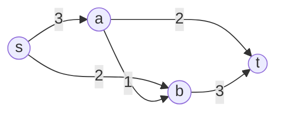

# Ford-Fulkerson Algorithm 福特福克森算法

## 1. 基本思想

**Ford-Fulkerson Algorithm** 是求解 Maximum Flow 最大流 的经典增广路方法。

核心思想：

> 从零流开始，只要还能在Residual Network 残量网络中找到一条从源点 $s$ 到汇点 $t$ 的路径，就沿这条路径增加流量；当残量网络中不存在 $s\leadsto t$ 路径时，当前流就是最大流。

形式化地说，给定流网络：

$$
G=(V,E,s,t,c)
$$

其中：

- $V$：顶点集合；
- $E$：有向边集合；
- $s$：源点 source；
- $t$：汇点 sink；
- $c(u,v)$：边 $(u,v)$ 的容量 capacity。

算法维护一个流函数 $f$，满足：

1. **容量约束 capacity constraint**

$$
0\le f(u,v)\le c(u,v)
$$

2. **流量守恒 flow conservation**

对任意中间点 $v\in V-\{s,t\}$：

$$
\sum_{u\in V} f(u,v)=\sum_{w\in V} f(v,w)
$$

3. **目标函数：最大化流值**

$$
|f|=\sum_{v\in V}f(s,v)-\sum_{v\in V}f(v,s)
$$

> [!summary] 一句话总结
> Ford-Fulkerson 的本质不是“一次找出最大流”，而是不断在残量网络中找还能继续送流的通道，并逐步增大总流量。

---

## 2. 关键概念

### 2.1 残量容量 Residual Capacity

对于原图中的边 $(u,v)$，如果当前流为 $f(u,v)$，容量为 $c(u,v)$，则：

#### 正向残量容量

$$
c_f(u,v)=c(u,v)-f(u,v)
$$

表示边 $(u,v)$ 还能继续增加多少流量。

#### 反向残量容量

$$
c_f(v,u)=f(u,v)
$$

表示最多可以撤回多少已经从 $u$ 送到 $v$ 的流量。

> [!important] 反向边的意义
> 反向边不是原网络中真实存在的“管道”，而是一种“撤销机制”。它允许算法修正之前选错的增广路径。

例如，若某条边容量为 $17$，当前已经送了 $6$ 单位流：

$$
f(u,v)=6,\qquad c(u,v)=17
$$

那么残量网络中有：

$$
c_f(u,v)=17-6=11
$$

$$
c_f(v,u)=6
$$

含义：还可以正向再送 $11$，也可以反向撤回 $6$。

---

### 2.2 残量网络 Residual Network

残量网络记作：

$$
G_f=(V,E_f,s,t,c_f)
$$

其中边集合 $E_f$ 由所有正残量边组成：

$$
E_f=\{(u,v):c_f(u,v)>0\}
$$

直观理解：

> 残量网络描述了“在当前流 $f$ 的基础上，还能怎样调整流量”。

---

### 2.3 增广路径 Augmenting Path

一条**增广路径**是残量网络 $G_f$ 中从 $s$ 到 $t$ 的简单路径。

设增广路径为：

$$
P=s\leadsto t
$$

其瓶颈容量为路径上所有残量容量的最小值：

$$
\Delta=\min_{(u,v)\in P}c_f(u,v)
$$

然后沿路径 $P$ 增加 $\Delta$ 单位流。

> [!tip] 为什么取最小值？
> 一条路径能额外送多少流，取决于路径上最窄的那条边。这个最小残量容量就是 bottleneck capacity。

---

## 3. 具体过程

Ford-Fulkerson 的过程如下：

1. 初始化所有边的流量为 $0$。
2. 根据当前流 $f$ 构造残量网络 $G_f$。
3. 在 $G_f$ 中寻找一条从 $s$ 到 $t$ 的增广路径 $P$。
4. 计算路径瓶颈容量：

$$
\Delta=\min_{(u,v)\in P}c_f(u,v)
$$

5. 沿路径 $P$ 调整流量：
   - 如果 $(u,v)$ 是原图正向边，则：

$$
f(u,v)\leftarrow f(u,v)+\Delta
$$

   - 如果 $(u,v)$ 是某条原图边 $(v,u)$ 的反向边，则：

$$
f(v,u)\leftarrow f(v,u)-\Delta
$$

6. 更新残量网络。
7. 重复步骤 3 到步骤 6，直到不存在增广路径。
8. 返回当前流 $f$。

> [!done] 终止条件
> 当残量网络中不存在从 $s$ 到 $t$ 的路径时，当前流就是最大流。

---

## 4. 伪代码

### 4.1 主算法

```text
FORD-FULKERSON(G, s, t, c)
    for each edge (u, v) in E
        f[u, v] <- 0

    construct residual network G_f from f

    while there exists an augmenting path P from s to t in G_f
        delta <- BOTTLENECK(G_f, P)
        AUGMENT(f, P, delta)
        update residual network G_f

    return f
```

---

### 4.2 增广过程

```text
AUGMENT(f, P, delta)
    for each edge (u, v) in P
        if (u, v) is an original edge
            f[u, v] <- f[u, v] + delta
        else
            // (u, v) is a residual reverse edge
            // corresponding original edge is (v, u)
            f[v, u] <- f[v, u] - delta
```

---

### 4.3 瓶颈容量

```text
BOTTLENECK(G_f, P)
    delta <- +infinity

    for each edge (u, v) in P
        delta <- min(delta, c_f[u, v])

    return delta
```

---

## 5. 正确性依据

### 5.1 增广路径定理

Ford-Fulkerson 的正确性依赖于增广路径定理：

> 一个流 $f$ 是最大流，当且仅当残量网络 $G_f$ 中不存在从 $s$ 到 $t$ 的增广路径。

即：

$$
f\text{ is max flow}\iff G_f\text{ has no }s\leadsto t\text{ path}
$$

证明直觉：

- 如果还有增广路径，就还能继续增加流量，所以不是最大流；
- 如果没有增广路径，则可以在残量网络中把从 $s$ 可达的点组成集合 $A$，其余点组成 $B$，得到一个割 $(A,B)$；
- 这个割的容量等于当前流值；
- 根据 Max-Flow Min-Cut Theorem 最大流最小割定理，当前流为最大流。

---

### 5.2 最大流最小割定理

最大流最小割定理说明：

$$
\max |f|=\min c(A,B)
$$

其中 $(A,B)$ 是任意满足 $s\in A,t\in B$ 的 $s$-$t$ 割。

因此，当某个流 $f$ 与某个割 $(A,B)$ 满足：

$$
|f|=c(A,B)
$$

就可以同时证明：

- $f$ 是最大流；
- $(A,B)$ 是最小割。

> [!note] 最优性证书
> 最大流问题的一个重要优点是：最大流可以用一个等值的最小割作为证书来验证。

---

## 6. 时空间复杂度

设：

- $n=|V|$：顶点数；
- $m=|E|$：边数；
- $|f^*|$：最大流值；
- $C$：最大边容量。

### 6.1 一次增广的代价

如果用 DFS 或 BFS 在残量网络中找一条增广路径，则一次查找代价为：

$$
O(m)
$$

更新路径上的流量不超过 $O(n)$，通常被 $O(m)$ 覆盖。

因此，一次增广的总代价为：

$$
O(m)
$$

---

### 6.2 整数容量时的时间复杂度

如果所有容量都是整数，每次增广至少使流值增加 $1$，因此增广次数不超过最大流值 $|f^*|$。

所以时间复杂度为：

$$
O(m|f^*|)
$$

若每条边容量都是 $1$ 到 $C$ 之间的整数，则通常可写为：

$$
O(mnC)
$$

> [!warning] 这不是强多项式时间
> Ford-Fulkerson 的复杂度依赖于容量数值 $C$ 或最大流值 $|f^*|$，而不是只依赖输入规模中的 $\log C$。因此朴素 Ford-Fulkerson 不是强多项式算法。

---

### 6.3 非整数容量时

- 若容量为整数：一定终止。
- 若容量为有理数：经过统一放大为整数后，也能保证终止。
- 若容量为无理数：朴素 Ford-Fulkerson 不保证终止，甚至可能不收敛到最大流。

---

### 6.4 空间复杂度

若用邻接表存储原图和残量网络，空间复杂度为：

$$
O(n+m)
$$

原因：

- 顶点信息需要 $O(n)$；
- 原边和对应残量边需要 $O(m)$；
- BFS/DFS 队列、栈、visited、parent 数组需要 $O(n)$。

---

## 7. 需要问题具有的性质

Ford-Fulkerson 适用于满足以下条件的问题：

1. **必须能建模为流网络**

$$
G=(V,E,s,t,c)
$$

即有源点 $s$、汇点 $t$、有向边和容量。

2. **容量非负**

$$
c(u,v)\ge 0
$$

通常要求正容量边才显式存储。

3. **流量必须满足容量约束**

$$
0\le f(u,v)\le c(u,v)
$$

4. **中间顶点满足流量守恒**

$$
\text{inflow}(v)=\text{outflow}(v),\qquad v\ne s,t
$$

5. **若要保证朴素算法终止，容量最好为整数或有理数**

若容量为无理数，路径选择不当时可能出现不终止问题。

6. **不同增广路径选择会影响效率**

Ford-Fulkerson 本身没有规定如何选增广路径。

常见策略：

- DFS 找任意增广路径：实现简单，但可能很慢；
- BFS 找最短边数增广路径：得到 Edmonds-Karp Algorithm 埃德蒙兹-卡普算法；
- 选瓶颈最大的路径：fat path 思路；
- 容量缩放：Capacity Scaling 容量缩放算法。

---

## 8. 典型例子

考虑如下流网络：



边容量如下：

| 边 | 容量 |
|---|---:|
| $s\to a$ | 3 |
| $s\to b$ | 2 |
| $a\to b$ | 1 |
| $a\to t$ | 2 |
| $b\to t$ | 3 |

初始时所有边流量为 $0$。

---

### 8.1 第一次增广

选择路径：

$$
P_1:s\to a\to t
$$

瓶颈容量：

$$
\Delta_1=\min\{3,2\}=2
$$

更新后：

$$
f(s,a)=2,\\quad f(a,t)=2
$$

当前流值：

$$
|f|=2
$$

---

### 8.2 第二次增广

选择路径：

$$
P_2:s\to b\to t
$$

瓶颈容量：

$$
\Delta_2=\min\{2,3\}=2
$$

更新后：

$$
f(s,b)=2,\qquad f(b,t)=2
$$

当前流值：

$$
|f|=2+2=4
$$

---

### 8.3 第三次增广

此时还有路径：

$$
P_3:s\to a\to b\to t
$$

残量容量分别为：

$$
c_f(s,a)=3-2=1
$$

$$
c_f(a,b)=1-0=1
$$

$$
c_f(b,t)=3-2=1
$$

所以瓶颈容量为：

$$
\Delta_3=\min\{1,1,1\}=1
$$

更新后：

$$
f(s,a)=3
$$

$$
f(a,b)=1
$$

$$
f(b,t)=3
$$

当前流值：

$$
|f|=f(s,a)+f(s,b)=3+2=5
$$

---

### 8.4 终止与最小割验证

此时从 $s$ 出发，边 $s\to a$ 和 $s\to b$ 都已经满流：

$$
f(s,a)=c(s,a)=3
$$

$$
f(s,b)=c(s,b)=2
$$

残量网络中已经不存在从 $s$ 到 $t$ 的增广路径，所以算法终止。

取割：

$$
A=\{s\},\qquad B=\{a,b,t\}
$$

割容量为：

$$
c(A,B)=c(s,a)+c(s,b)=3+2=5
$$

当前流值也是：

$$
|f|=5
$$

因此：

$$
|f|=c(A,B)=5
$$

根据最大流最小割定理，当前流是最大流，该割是最小割。

---

## 9. 易错点

> [!warning] 易错点 1：把 Ford-Fulkerson 当成一个固定算法
> Ford-Fulkerson 更像一个“方法框架”。它只要求不断找增广路径，但没有规定具体用 DFS、BFS 还是其他策略。

> [!warning] 易错点 2：忽略反向边
> 如果没有反向边，算法无法撤销之前的错误选择，就可能像普通贪心一样卡在非最优解。

> [!warning] 易错点 3：以为无增广路径只是“局部最优”
> 在最大流问题中，无增广路径不是局部最优，而是全局最优的充要条件。

> [!warning] 易错点 4：混淆容量和流量
> 容量 $c(u,v)$ 是上限；流量 $f(u,v)$ 是当前实际通过的量；残量 $c_f(u,v)$ 是还能调整的量。

---

## 10. 与相关算法的关系

| 算法 | 增广路径选择方式 | 时间复杂度特点 |
|---|---|---|
| Ford-Fulkerson | 任意增广路径 | $O(m|f^*|)$，依赖最大流值 |
| Edmonds-Karp | BFS 选最少边数增广路径 | $O(nm^2)$ |
| Capacity Scaling | 优先使用大残量路径 | $O(m^2\log C)$ 或相关改进形式 |
| Dinic | 分层图 + 阻塞流 | 通常优于朴素增广路法 |

> [!note] 记忆方式
> Ford-Fulkerson 是“增广路思想”；Edmonds-Karp 是“用 BFS 选增广路”的 Ford-Fulkerson 特例。

---

## 11. 最小实现思路

若用程序实现，通常维护：

- 邻接表 `graph[u]`；
- 每条边的 `to`、`capacity`、`rev`；
- 反向边用于更新残量；
- BFS/DFS 找增广路径；
- 沿 parent 数组回溯路径并更新残量。

伪代码层面可以写成：

```text
while path exists from s to t in residual graph
    delta <- minimum residual capacity on path
    for each edge on path
        decrease forward residual capacity by delta
        increase reverse residual capacity by delta
    max_flow <- max_flow + delta
```

---

## 12. 复习问题

1. 为什么 Ford-Fulkerson 需要残量网络？
2. 反向边为什么表示“撤销”而不是实际新增一条边？
3. 为什么瓶颈容量决定一次增广能增加多少流？
4. 为什么没有增广路径时，当前流一定是最大流？
5. Ford-Fulkerson 和 Edmonds-Karp 的区别是什么？

---

## 13. References

- Cormen, Thomas H.; Leiserson, Charles E.; Rivest, Ronald L.; Stein, Clifford. *Introduction to Algorithms*, 3rd edition. Chapter 26: Maximum Flow.
- Wayne, Kevin. *Network Flow I*. Princeton / Kleinberg-Tardos lecture slides.
- Ford, L. R.; Fulkerson, D. R. 1956. *Maximal Flow Through a Network*. Canadian Journal of Mathematics.
- Elias, P.; Feinstein, A.; Shannon, C. E. 1956. *A Note on the Maximum Flow Through a Network*. IRE Transactions on Information Theory.
