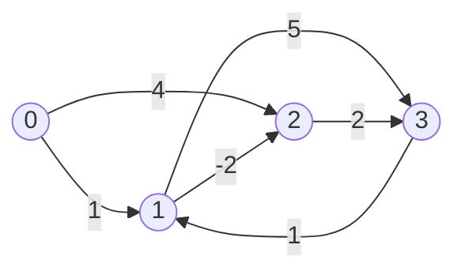

# Johnson's Algorithm 约翰逊算法

> [!abstract] 核心结论
> Johnson 算法用于求解**所有顶点对最短路径**（All-Pairs Shortest Paths, APSP），尤其适合**稀疏图**。
>
> 它先用一次 [Bellman–Ford](/blog/cs-major-courses/introduction-to-algorithms/bellman-ford-algotithm-贝尔曼福特算法/) 计算势函数 $h$，把所有边重赋权为非负权边；然后从每个顶点运行一次 [Dijkstra](/blog/cs-major-courses/introduction-to-algorithms/dijkstras-algorithm-迪杰斯特拉算法/)；最后将新图中的距离还原为原图距离。
>
> Johnson 算法允许原图包含负权边，但原图不能包含负权环。

## 1. 问题定义

给定一个带权有向图

$$
G=(V,E), \qquad |V|=n,
$$

边权函数为

$$
w:E\rightarrow\mathbb{R}.
$$

目标是计算所有顶点对之间的最短路径距离：

$$
D[u][v]=\delta(u,v), \qquad u,v\in V.
$$

其中：

- $\delta(u,v)$ 表示从顶点 $u$ 到顶点 $v$ 的最短路径长度；
- 若 $u$ 无法到达 $v$，则 $\delta(u,v)=\infty$；
- 若存在可达的负权环，则某些最短路径没有有限最小值。

> [!info] Johnson 算法解决什么问题
> Johnson 算法不是单源最短路径算法，而是通过组合一次 Bellman–Ford 和 $|V|$ 次 Dijkstra，得到全部 $|V|^2$ 个顶点对的最短距离。

## 2. 基本思想

Dijkstra 要求所有边权非负，而 Bellman–Ford 虽然允许负权边，但从每个顶点都运行一次的代价较高。

Johnson 算法的核心思路是：

1. 使用 Bellman–Ford 计算一个势函数 $h:V\rightarrow\mathbb{R}$；
2. 使用 $h$ 对边进行**重赋权**（reweighting），使所有新边权均非负；
3. 在重赋权图上从每个顶点运行 Dijkstra；
4. 将得到的距离转换回原图中的距离。


## 3. 重赋权

### 3.1 重赋权公式

对于原图中的每条边 $(u,v)\in E$，定义新边权：

$$
w_h(u,v)=w(u,v)+h(u)-h(v).
$$

这里的 $h(v)$ 称为顶点 $v$ 的**势能**或**势函数值**（potential）。

### 3.2 为什么重赋权不会改变最短路径

设一条从 $u=v_0$ 到 $v=v_k$ 的路径为

$$
p=\langle v_0,v_1,\ldots,v_k\rangle.
$$

重赋权后的路径长度为

$$
\begin{aligned}
w_h(p)
&=\sum_{i=0}^{k-1}w_h(v_i,v_{i+1})\\
&=\sum_{i=0}^{k-1}\left[w(v_i,v_{i+1})+h(v_i)-h(v_{i+1})\right]\\
&=w(p)+h(v_0)-h(v_k)\\
&=w(p)+h(u)-h(v).
\end{aligned}
$$

中间顶点的势函数值会两两抵消，只剩起点和终点的势函数值。

因此，对于相同起点 $u$ 和终点 $v$ 的任意两条路径 $p_1,p_2$：

$$
w_h(p_1)-w_h(p_2)=w(p_1)-w(p_2).
$$

所以：

- 路径之间的长短关系保持不变；
- 原图中的最短路径仍然是重赋权图中的最短路径；
- 只有路径长度整体发生了平移。

距离转换公式为

$$
\delta_h(u,v)=\delta(u,v)+h(u)-h(v),
$$

因此

$$
\boxed{
\delta(u,v)=\delta_h(u,v)-h(u)+h(v)
}
$$

> [!important] 保持的是最短路径结构
> 重赋权通常会改变路径的数值长度，但不会改变同一对起点和终点之间各条路径的相对大小，因此不会改变哪一条路径最短。

## 4. 如何得到势函数 $h$

### 4.1 添加超级源点

向原图添加一个新的超级源点 $s$，构造扩展图

$$
G'=(V\cup\{s\},E').
$$

对于每个顶点 $v\in V$，添加一条权重为 $0$ 的边：

$$
(s,v),\qquad w(s,v)=0.
$$

即

$$
E'=E\cup\{(s,v):v\in V\}.
$$

### 4.2 运行 Bellman–Ford

从超级源点 $s$ 运行 Bellman–Ford，令

$$
h(v)=\delta_{G'}(s,v).
$$

由于超级源点直接连接所有原图顶点，所以每个顶点都从 $s$ 可达。

若 Bellman–Ford 检测到负权环，则原图也存在负权环，Johnson 算法终止。

### 4.3 为什么新边权一定非负

由最短路径的三角不等式，对于任意边 $(u,v)\in E$：

$$
h(v)\le h(u)+w(u,v).
$$

移项得

$$
w(u,v)+h(u)-h(v)\ge 0.
$$

而左侧正是新边权：

$$
\boxed{w_h(u,v)\ge 0}
$$

因此可以在重赋权图上安全地运行 Dijkstra。

> [!tip] 与差分约束的关系
> 条件 $w_h(u,v)\ge 0$ 等价于
> $$
> h(v)-h(u)\le w(u,v).
> $$
> 这是一组标准的差分约束条件。Bellman–Ford 求出的最短路径距离给出该差分约束系统的一组可行解。

## 5. 具体过程

给定顶点集合 $V=\{0,1,\ldots,n-1\}$ 和边集合 $E$：

1. 添加超级源点 $s=n$。
2. 对每个原图顶点 $v$，添加零权边 $(s,v,0)$。
3. 从 $s$ 运行 Bellman–Ford。
4. 若检测到负权环，则报告不存在有限的全源最短路径解并终止。
5. 令 $h(v)=\delta(s,v)$。
6. 对每条原边 $(u,v)$ 计算
   $$
   w_h(u,v)=w(u,v)+h(u)-h(v).
   $$
7. 对每个源点 $u\in V$，在重赋权图上运行一次 Dijkstra，得到 $\delta_h(u,v)$。
8. 对每个顶点对 $(u,v)$，还原原图距离：
   $$
   \delta(u,v)=\delta_h(u,v)-h(u)+h(v).
   $$
9. 输出所有顶点对的距离矩阵。

## 6. 伪代码

以下伪代码统一使用 0-based 下标。

```text
JOHNSON(n, E):
    # 原图顶点为 0, 1, ..., n - 1
    # 新增超级源点 s = n
    s <- n
    extended_edges <- copy of E

    for v <- 0 to n - 1:
        append (s, v, 0) to extended_edges

    h <- BELLMAN-FORD(n + 1, extended_edges, s)

    if h indicates a negative-weight cycle:
        return NEGATIVE_CYCLE

    reweighted_graph <- empty adjacency list with n vertices

    for each edge (u, v, w) in E:
        new_weight <- w + h[u] - h[v]
        append (v, new_weight) to reweighted_graph[u]

    D <- n × n matrix filled with infinity

    for source <- 0 to n - 1:
        dist_prime <- DIJKSTRA(reweighted_graph, source)

        for v <- 0 to n - 1:
            if dist_prime[v] != infinity:
                D[source][v] <- dist_prime[v] - h[source] + h[v]

    return D
```

### 6.1 Bellman–Ford 子过程

```text
BELLMAN-FORD(vertex_count, edges, source):
    dist <- array of length vertex_count filled with infinity
    dist[source] <- 0

    for round <- 1 to vertex_count - 1:
        changed <- false

        for each edge (u, v, w) in edges:
            if dist[u] != infinity and dist[u] + w < dist[v]:
                dist[v] <- dist[u] + w
                changed <- true

        if changed = false:
            break

    for each edge (u, v, w) in edges:
        if dist[u] != infinity and dist[u] + w < dist[v]:
            return NEGATIVE_CYCLE

    return dist
```

### 6.2 Dijkstra 子过程

```text
DIJKSTRA(graph, source):
    dist <- array of length |V| filled with infinity
    dist[source] <- 0

    priority_queue <- empty min-priority queue
    INSERT(priority_queue, (0, source))

    while priority_queue is not empty:
        current_dist, u <- EXTRACT-MIN(priority_queue)

        if current_dist != dist[u]:
            continue

        for each edge (u, v, w) in graph[u]:
            new_dist <- dist[u] + w

            if new_dist < dist[v]:
                dist[v] <- new_dist
                INSERT(priority_queue, (new_dist, v))

    return dist
```

## 7. Python 实现

```python
from __future__ import annotations

import heapq
from math import inf
from typing import Iterable

Edge = tuple[int, int, int | float]


def bellman_ford(
    vertex_count: int,
    edges: list[Edge],
    source: int,
) -> list[float] | None:
    """返回单源最短距离；若存在源点可达的负权环，则返回 None。"""
    dist = [inf] * vertex_count
    dist[source] = 0

    for _ in range(vertex_count - 1):
        changed = False

        for u, v, weight in edges:
            if dist[u] == inf:
                continue

            new_dist = dist[u] + weight
            if new_dist < dist[v]:
                dist[v] = new_dist
                changed = True

        if not changed:
            break

    for u, v, weight in edges:
        if dist[u] != inf and dist[u] + weight < dist[v]:
            return None

    return dist


def dijkstra(
    graph: list[list[tuple[int, float]]],
    source: int,
) -> list[float]:
    """在非负权图上计算 source 到所有顶点的最短距离。"""
    dist = [inf] * len(graph)
    dist[source] = 0

    priority_queue: list[tuple[float, int]] = [(0, source)]

    while priority_queue:
        current_dist, u = heapq.heappop(priority_queue)

        # 跳过已经过期的堆元素。
        if current_dist != dist[u]:
            continue

        for v, weight in graph[u]:
            new_dist = current_dist + weight

            if new_dist < dist[v]:
                dist[v] = new_dist
                heapq.heappush(priority_queue, (new_dist, v))

    return dist


def johnson(
    n: int,
    edges: Iterable[Edge],
) -> list[list[float]]:
    """计算有向图的所有顶点对最短距离。

    顶点必须使用 0-based 编号：0, 1, ..., n - 1。

    Raises:
        ValueError: 输入非法或图中存在负权环。
    """
    if n < 0:
        raise ValueError("n 必须是非负整数")

    edge_list = list(edges)

    for u, v, _ in edge_list:
        if not (0 <= u < n and 0 <= v < n):
            raise ValueError(f"非法顶点编号: ({u}, {v})")

    # 超级源点使用编号 n。
    super_source = n
    extended_edges = edge_list + [
        (super_source, v, 0) for v in range(n)
    ]

    h_with_source = bellman_ford(
        vertex_count=n + 1,
        edges=extended_edges,
        source=super_source,
    )

    if h_with_source is None:
        raise ValueError("图中存在负权环，最短路径未定义")

    h = h_with_source[:n]

    # 构造重赋权后的邻接表。
    graph: list[list[tuple[int, float]]] = [[] for _ in range(n)]

    for u, v, weight in edge_list:
        new_weight = weight + h[u] - h[v]

        # 理论上 new_weight 必须非负。
        if new_weight < 0:
            raise RuntimeError("重赋权后出现负边，检查实现或数值精度")

        graph[u].append((v, new_weight))

    result = [[inf] * n for _ in range(n)]

    for source in range(n):
        dist_prime = dijkstra(graph, source)

        for v in range(n):
            if dist_prime[v] != inf:
                result[source][v] = (
                    dist_prime[v] - h[source] + h[v]
                )

    return result
```

> [!warning] 浮点数边权
> 若边权为浮点数，舍入误差可能使理论上的 $0$ 变成很小的负数，例如 `-1e-15`。工程实现中可以设置容差 `eps`，将满足 `-eps <= new_weight < 0` 的值截断为 `0`，但不能掩盖明显的负值。

## 8. 时空间复杂度

设

$$
|V|=V,\qquad |E|=E.
$$

### 8.1 时间复杂度

#### Bellman–Ford

扩展图有 $V+1$ 个顶点和 $E+V$ 条边，因此：

$$
O(VE).
$$

#### 重赋权

每条边处理一次：

$$
O(E).
$$

#### 从每个顶点运行 Dijkstra

使用斐波那契堆时，一次 Dijkstra 的复杂度为

$$
O(E+V\log V).
$$

运行 $V$ 次：

$$
O(VE+V^2\log V).
$$

#### 距离还原

需要处理 $V^2$ 个顶点对：

$$
O(V^2).
$$

因此总时间复杂度为

$$
\boxed{O(VE+V^2\log V)}
$$

> [!note] 使用 Python `heapq` 时
> Python 的 `heapq` 是二叉堆，且上述实现通过插入新记录而不是原地 `DECREASE-KEY`。一次 Dijkstra 通常写作
> $$
> O((V+E)\log V),
> $$
> 因此运行 $V$ 次后通常记为
> $$
> O(V(V+E)\log V).
> $$
> 对连通稀疏图常简写为 $O(VE\log V)$。

### 8.2 空间复杂度

- 邻接表：$O(V+E)$；
- 势函数、单次 Dijkstra 距离数组和优先队列：$O(V+E)$；
- 所有顶点对距离矩阵：$O(V^2)$。

包括输出矩阵时：

$$
\boxed{O(V^2+V+E)}
$$

通常简写为

$$
\boxed{O(V^2+E)}.
$$

若不一次性保存全部距离矩阵，而是逐行输出每个源点的结果，则算法的额外工作空间可以降到

$$
O(V+E).
$$

## 9. 需要问题具有的性质

Johnson 算法适用于满足以下条件的问题。

### 9.1 求解目标是所有顶点对最短路径

需要计算

$$
\delta(u,v),\qquad \forall u,v\in V.
$$

若只需要一个源点的最短路径，直接使用 Bellman–Ford、Dijkstra 或 DAG 最短路径算法通常更合适。

### 9.2 允许负权边

原图可以包含负权边，因为 Bellman–Ford 能处理负权边，重赋权后再交给 Dijkstra。

### 9.3 不允许负权环

若图中存在负权环，则可以重复绕行该环，使路径长度无限减小，因此相关顶点对不存在有限最短距离。

Johnson 算法会在 Bellman–Ford 阶段检测负权环并终止。

> [!danger] 无向图中的负权边
> 在通常的无向图建模中，一条无向边会被表示为两条方向相反、权重相同的有向边。若该权重为负，则两条边立即形成一个负权环。因此，普通无向图中只要存在负权边，最短路径通常就不再有有限定义。

### 9.4 最短路径具有最优子结构

若一条路径是从 $u$ 到 $v$ 的最短路径，那么该路径的任意子路径也必须是对应端点之间的最短路径。

这是 Bellman–Ford、Dijkstra 和 Johnson 算法正确性的共同基础。

### 9.5 图最好较稀疏

Johnson 算法最适合

$$
E\ll V^2
$$

的稀疏图。

对于稠密图 $E=\Theta(V^2)$，Johnson 算法的优势减弱，结构简单、缓存友好的 [Floyd–Warshall](/blog/cs-major-courses/introduction-to-algorithms/floyd-warshall-algorithm-弗洛伊德华沙算法/) 往往更合适。

## 10. 典型例子

考虑有向图，顶点集合为

$$
V=\{0,1,2,3\},
$$

边集合如下：

| 起点 | 终点 | 原权重 |
| ---: | ---: | ---: |
| 0 | 1 | 1 |
| 0 | 2 | 4 |
| 1 | 2 | -2 |
| 1 | 3 | 5 |
| 2 | 3 | 2 |
| 3 | 1 | 1 |

图中包含负权边 $1\rightarrow2$，但不存在负权环。



### 10.1 添加超级源点

添加超级源点 $s=4$，并添加：

$$
(4,0,0),(4,1,0),(4,2,0),(4,3,0).
$$

### 10.2 运行 Bellman–Ford

从超级源点 $4$ 出发，得到势函数：

| 顶点 $v$ | $h(v)=\delta(4,v)$ |
| ---: | ---: |
| 0 | 0 |
| 1 | 0 |
| 2 | -2 |
| 3 | 0 |

其中 $h(2)=-2$，因为存在路径

$$
4\rightarrow1\rightarrow2
$$

其长度为

$$
0+(-2)=-2.
$$

### 10.3 对边进行重赋权

使用

$$
w_h(u,v)=w(u,v)+h(u)-h(v).
$$

得到：

| 边 | 计算 | 新权重 |
| --- | --- | ---: |
| $0\rightarrow1$ | $1+0-0$ | 1 |
| $0\rightarrow2$ | $4+0-(-2)$ | 6 |
| $1\rightarrow2$ | $-2+0-(-2)$ | 0 |
| $1\rightarrow3$ | $5+0-0$ | 5 |
| $2\rightarrow3$ | $2+(-2)-0$ | 0 |
| $3\rightarrow1$ | $1+0-0$ | 1 |

所有新边权均非负，因此可以运行 Dijkstra。

### 10.4 从顶点 0 运行 Dijkstra

在重赋权图中，从顶点 $0$ 出发：

- $\delta_h(0,0)=0$；
- $\delta_h(0,1)=1$；
- $\delta_h(0,2)=1$，路径为 $0\rightarrow1\rightarrow2$；
- $\delta_h(0,3)=1$，路径为 $0\rightarrow1\rightarrow2\rightarrow3$。

得到

$$
\delta_h(0,\cdot)=[0,1,1,1].
$$

还原原图距离：

$$
\delta(0,v)=\delta_h(0,v)-h(0)+h(v).
$$

例如：

$$
\delta(0,2)=1-0+(-2)=-1,
$$

对应原图路径

$$
0\rightarrow1\rightarrow2,
$$

长度为

$$
1+(-2)=-1.
$$

### 10.5 最终距离矩阵

对所有顶点分别运行 Dijkstra 并还原后，得到：

$$
D=
\begin{bmatrix}
0 & 1 & -1 & 1\\
\infty & 0 & -2 & 0\\
\infty & 3 & 0 & 2\\
\infty & 1 & -1 & 0
\end{bmatrix}.
$$

其中第 $u$ 行第 $v$ 列表示从顶点 $u$ 到顶点 $v$ 的最短距离。

> [!example] 运行 Python 实现
> ```python
> edges = [
>     (0, 1, 1),
>     (0, 2, 4),
>     (1, 2, -2),
>     (1, 3, 5),
>     (2, 3, 2),
>     (3, 1, 1),
> ]
>
> distances = johnson(4, edges)
>
> for row in distances:
>     print(row)
> ```
>
> 预期输出：
>
> ```text
> [0, 1, -1, 1]
> [inf, 0, -2, 0]
> [inf, 3, 0, 2]
> [inf, 1, -1, 0]
> ```

## 11. 正确性要点

Johnson 算法的正确性由以下三点构成。

### 11.1 Bellman–Ford 正确计算势函数

若图中不存在负权环，Bellman–Ford 返回

$$
h(v)=\delta(s,v).
$$

### 11.2 重赋权后所有边非负

由

$$
h(v)\le h(u)+w(u,v)
$$

可得

$$
w_h(u,v)=w(u,v)+h(u)-h(v)\ge0.
$$

因此 Dijkstra 的非负边权前提成立。

### 11.3 重赋权保持最短路径

任意从 $u$ 到 $v$ 的路径都统一增加

$$
h(u)-h(v),
$$

所以最短路径的相对顺序不变。Dijkstra 在新图中求得的最短路径也是原图中的最短路径。

最后通过

$$
\delta(u,v)=\delta_h(u,v)-h(u)+h(v)
$$

恢复原图距离。

## 12. 与其他全源最短路径算法的比较

| 算法 | 允许负权边 | 检测负权环 | 典型时间复杂度 | 更适合的图 |
| --- | :---: | :---: | ---: | --- |
| 重复 Dijkstra | 否 | 否 | $O(VE+V^2\log V)$ | 非负权稀疏图 |
| 重复 Bellman–Ford | 是 | 是 | $O(V^2E)$ | 通常不优先使用 |
| [Floyd–Warshall](/blog/cs-major-courses/introduction-to-algorithms/floyd-warshall-algorithm-弗洛伊德华沙算法/) | 是 | 是 | $\Theta(V^3)$ | 稠密图、小中规模图 |
| Johnson | 是 | 是 | $O(VE+V^2\log V)$ | 含负权边的稀疏图 |

> [!summary] 选择建议
> - 单源、边权非负：Dijkstra；
> - 单源、允许负权边：Bellman–Ford；
> - 全源、图较稠密：Floyd–Warshall；
> - 全源、图较稀疏且可能有负权边：Johnson。

## 13. 常见错误

### 13.1 直接在负权图上运行 Dijkstra

Dijkstra 的贪心性质依赖所有边权非负。必须先完成重赋权。

### 13.2 重赋权公式符号写反

正确公式是

$$
w_h(u,v)=w(u,v)+h(u)-h(v).
$$

不是

$$
w(u,v)-h(u)+h(v).
$$

### 13.3 忘记还原原始距离

Dijkstra 得到的是 $\delta_h(u,v)$，最终需要计算

$$
\delta(u,v)=\delta_h(u,v)-h(u)+h(v).
$$

### 13.4 没有添加超级源点

若直接从原图中的某个顶点运行 Bellman–Ford，无法保证所有顶点都可达，也就无法为所有顶点可靠地得到势函数。

### 13.5 忽略负权环

若 Bellman–Ford 检测到负权环，不能继续运行 Dijkstra。此时相关最短路径没有有限最优值。

### 13.6 将超级源点保留在最终图中

超级源点只用于计算势函数。运行 Dijkstra 和输出最终距离矩阵时，只考虑原图中的 $n$ 个顶点。

## 14. 一句话记忆

> [!quote]
> Johnson 算法 = **一次 Bellman–Ford 消除负边影响** + **每个顶点一次 Dijkstra** + **距离还原**。

## 15. 相关笔记

- [Shortest Path 最短路径](/blog/cs-major-courses/introduction-to-algorithms/shortest-path-最短路径/)
- [Dijkstra's Algorithm 迪杰斯特拉算法](/blog/cs-major-courses/introduction-to-algorithms/dijkstras-algorithm-迪杰斯特拉算法/)
- [Bellman-Ford Algotithm 贝尔曼福特算法](/blog/cs-major-courses/introduction-to-algorithms/bellman-ford-algotithm-贝尔曼福特算法/)
- [Floyd-Warshall Algorithm 弗洛伊德华沙算法](/blog/cs-major-courses/introduction-to-algorithms/floyd-warshall-algorithm-弗洛伊德华沙算法/)

## 16. 参考资料

1. Donald B. Johnson. 1977. *Efficient Algorithms for Shortest Paths in Sparse Networks*. **Journal of the ACM**, 24(1): 1–13. DOI: `10.1145/321992.321993`.
2. Thomas H. Cormen, Charles E. Leiserson, Ronald L. Rivest, Clifford Stein. 2009. *Introduction to Algorithms*, 3rd ed., Section 25.3: Johnson's algorithm.
3. Erik D. Demaine and Charles E. Leiserson. 2005. *Shortest Paths III*, MIT Introduction to Algorithms, Lecture 19.
