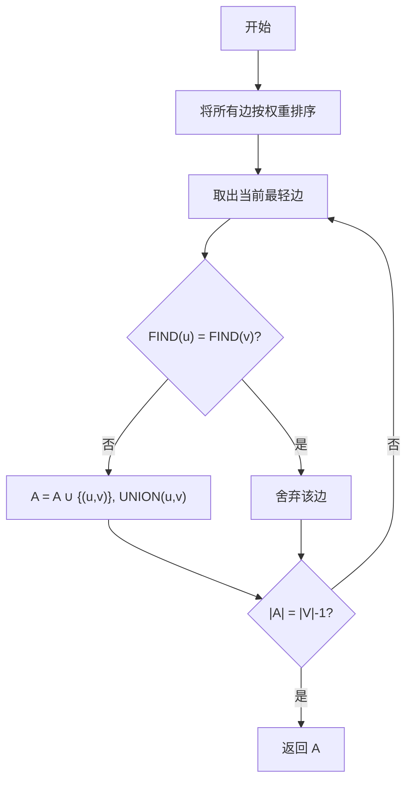

# Kruskal's Algorithm：最小生成树

> [!abstract] 一句话概括
>
> Kruskal 算法将所有边按权重从小到大处理；只要当前边连接两个不同的连通分量，就将其加入生成森林并合并这两个分量，直到选出 $|V|-1$ 条边。

## 目录

- [1. 问题定义](#1-问题定义)

- [2. 基本思想](#2-基本思想)

- [3. 具体过程](#3-具体过程)

- [4. 正确性依据](#4-正确性依据)

- [5. 并查集的作用](#5-并查集的作用)

- [6. 伪代码](#6-伪代码)

- [7. 时空间复杂度](#7-时空间复杂度)

- [8. 问题需要具有的性质](#8-问题需要具有的性质)

- [9. 典型例子](#9-典型例子)

- [10. 常见错误](#10-常见错误)

- [11. 与 Prim 算法的对比](#11-与-prim-算法的对比)

## 1. 问题定义

给定一个带权无向图：

$$
G=(V,E),\qquad w:E\rightarrow \mathbb{R}
$$

生成树 T 需要满足：

1. 覆盖图中的全部顶点；

2. 连通；

3. 不含环；

4. 恰好包含 $|V|-1$ 条边。

最小生成树（Minimum Spanning Tree, MST）要求生成树的总权重最小：

$$
T^*=\arg\min_{T\text{ 是 }G\text{ 的生成树}} \sum_{e\in T}w(e)
$$

> [!note] 最小生成树与最短路径树不同
>
> - 最小生成树最小化的是**整棵树的边权总和**。
> - 最短路径树最小化的是**指定源点到其他顶点的路径长度**。
> - 因此，Kruskal 算法不能替代 Dijkstra's Algorithm。

## 2. 基本思想

Kruskal 算法是一种贪心算法。

它不从某个起点扩张一棵树，而是从只有顶点、没有边的森林开始：

$$
A=\varnothing
$$

初始时，每个顶点都是一个独立的连通分量。随后将所有边按照权重非递减排序，并依次检查每条边 $(u,v)$：

- 若 $u$ 和 $v$ 属于**不同连通分量**，加入该边不会形成环，因此选择它；

- 若 $u$ 和 $v$ 已经属于**同一连通分量**，加入该边会形成环，因此舍弃它。

当已经选择 $|V|-1$ 条边时，算法结束。

> [!important] 核心不变量
>
> 在算法执行的任意时刻：
>
> 1. 已选边集合 $A$ 始终无环，因此构成一片森林；
> 2. $A$ 始终是某棵最小生成树的子集；
> 3. 每次只合并两个不同的连通分量；
> 4. 当 $|A|=|V|-1$ 时，$A$ 是一棵生成树。

### 2.1 Kruskal 的贪心选择

对于当前权重最小且连接两个不同连通分量的边 $e$，Kruskal 直接将其加入：

$$
e=\arg\min \left\{ w(x,y)\mid x,y\text{ 位于不同连通分量} \right\}
$$

这里的“最小”是针对**尚未处理的全部边**，而不是只看某个顶点附近的边。

## 3. 具体过程

### 3.1 初始化

对每个顶点 v\in V 建立一个只包含自身的集合：

$$
\{v\}
$$

此时：

- 每个顶点是一个独立连通分量；

- 已选边集合 $A$=\varnothing；

- 连通分量个数为 $|V|$。

### 3.2 对边排序

将所有边按照权重从小到大排列：

$$
w(e_1)\leq w(e_2)\leq\cdots\leq w(e_{|E|})
$$

若干条边权重相同，它们之间的相对顺序可以任意。

### 3.3 依次扫描边

对于排序后的每条边 $(u,v)$：

1. 查找 $u$ 所属连通分量；

2. 查找 $v$ 所属连通分量；

3. 若二者不同：

    - 将 $(u,v)$ 加入 $A$；

    - 合并两个连通分量；

4. 若二者相同：

    - 舍弃该边，因为加入后会形成环。

### 3.4 终止条件

对于连通图，当满足以下条件时结束：

$$
|A|=|V|-1
$$

此时所有顶点已经连通，且 A 无环，所以 $A$ 是一棵最小生成树。

### 3.5 流程图



## 4. 正确性依据

Kruskal 算法的正确性主要依赖最小生成树的**割性质（cut property）**。

> [!theorem] 割性质
>
> 设 $A$ 是某棵最小生成树的边子集。对于任意一个尊重 $A$ 的割，跨越该割的最轻边都是相对于 $A$ 的安全边，可以加入 $A$ 而不破坏最优性。

### 4.1 为什么 Kruskal 选择的边是安全边

设当前考虑的边为：

$$
e=(u,v)
$$

并且 $u$、$v$ 属于两个不同连通分量 $C_u$ 和 $C_v$。

取割：

$$
(C_u,V-C_u)
$$

由于当前已选边不会跨出连通分量 $C_u$，该割尊重已选边集合 $A$。

Kruskal 按照权重从小到大扫描边，因此，当 $e$ 被选择时，不存在一条权重更小、尚未选择并且连接 $C_u$ 与外部的合法边。于是 $e$ 是跨越该割的最轻边之一，根据割性质，$e$ 是安全边。

### 4.2 交换论证

假设存在一棵包含当前已选边集合 $A$ 的最小生成树 $T^*$，但 $T^*$ 不包含 Kruskal 即将选择的边 $e=(u,v)$：

1. 将 $e$ 加入 $T^*$，得到一个环；

2. 该环中必然存在另一条连接当前两个不同连通分量的边 $f$；

3. 由于 Kruskal 按权重升序处理边：

$$
w(e)\leq w(f)
$$

4. 删除 $f$ 并保留 $e$，仍得到一棵生成树：

$$
T' = T^* - \{f\} + \{e\}
$$

5. 新树满足：

$$
w(T')\leq w(T^*)
$$

因此 $T'$ 也是一棵最小生成树，并且包含 $A\cup\{e\}$。所以 Kruskal 的每次选择都不会破坏最优性。

> [!note] 环性质
>
> 在任意一个环中，若某条边严格重于环中的其他边，则这条边不可能属于任何最小生成树。Kruskal 舍弃会形成环的边，与该性质相容。

## 5. 并查集的作用

Kruskal 需要频繁判断两个顶点是否已经连通。通常使用并查集（Disjoint Set Union, DSU）完成。

并查集支持三种核心操作：

|操作|作用|
|---|---|
|`MAKE-SET(v)`|建立只包含顶点 v 的集合|
|`FIND-SET(v)`|返回 v 所属集合的代表元|
|`UNION(u, v)`|合并 u、v 所属的两个集合|

判断边 $(u,v)$ 是否形成环：

$$
\operatorname{FIND}(u)=\operatorname{FIND}(v)
$$

- 相等：两个顶点已经连通，加入该边会形成环；

- 不等：两个顶点尚未连通，可以安全地合并分量。

### 5.1 两项优化

1. **路径压缩（path compression）**：执行 `FIND` 时，让路径上的结点直接指向代表元；

2. **按秩合并或按大小合并（union by rank/size）**：将较小或较矮的树接到较大的树下。

同时使用两项优化后，并查集单次操作的均摊复杂度为：

$$
O(\alpha(V))
$$

其中 $\alpha$ 是反阿克曼函数，在实际规模下可视为接近常数。

## 6. 伪代码

### 6.1 Kruskal 主算法

```text
KRUSKAL(G, w):
    A <- empty set

    for each vertex v in G.V:
        MAKE-SET(v)

    sort G.E into nondecreasing order by edge weight w

    for each edge (u, v) in sorted G.E:
        if FIND-SET(u) != FIND-SET(v):
            A <- A union {(u, v)}
            UNION(u, v)

        if |A| = |G.V| - 1:
            break

    return A
```

### 6.2 更强调执行逻辑的精简版本

```text
KRUSKAL(V, E):
    mst <- empty list
    initialize DSU with every vertex in its own set
    sort E by increasing weight

    for each edge (u, v, weight) in E:
        if FIND(u) != FIND(v):
            append (u, v, weight) to mst
            UNION(u, v)

        if |mst| = |V| - 1:
            return mst

    return mst
```

> [!warning] 非连通图的返回结果
>
> 若扫描完所有边后仍有 $|A|<|V|-1$，输入图不连通，因此不存在覆盖全部顶点的生成树。此时 $A$ 是一个最小生成森林。

## 7. 时空间复杂度

设：

- 顶点数为 $|V|$；

- 边数为 $|E|$。

### 7.1 时间复杂度

#### 边排序

对所有边排序需要：

$$
O(E\log E)
$$

#### 并查集操作

每条边至多执行两次 `FIND`，被选择的边还会执行一次 `UNION`。使用路径压缩和按秩合并时，总复杂度为：

$$
O(E\alpha(V))
$$

#### 总时间复杂度

排序占主导，因此：

$$
\boxed{O(E\log E)}
$$

对于简单连通无向图：

$$
V-1\leq E\leq \frac{V(V-1)}{2}
$$

因此：

$$
\log E=\Theta(\log V)
$$

也常写为：

$$
\boxed{O(E\log V)}
$$

### 7.2 空间复杂度

若计入图的边表：

$$
\boxed{O(V+E)}
$$

其中：

- 边数组占 $O(E)$；

- 并查集的 `parent`、`rank` 或 `size` 数组占 $O(V)$；

- 最小生成树最多保存 $V-1$ 条边，占 $O(V)$。

若输入边表已经存在，并且原地排序，则算法的额外辅助空间主要为：

$$
O(V)
$$

> [!summary] 复杂度结论
>
> |部分|复杂度|
> |---|---|
> |边排序|$O(E\log E)$|
> |并查集操作总计|$O(E\alpha(V))$|
> |总时间|$O(E\log E)$|
> |总存储|$O(V+E)$|
> |额外辅助空间|通常为 $O(V)$，具体取决于排序实现|

## 8. 问题需要具有的性质

### 8.1 必要输入条件

Kruskal 算法直接求解的是：

> [!success] 适用问题
>
> **连通、带权、无向图的最小生成树问题。**

具体要求如下：

1. **无向图**

    - Kruskal 求解的是无向图生成树。

    - 有向图中的对应问题是最小树形图（minimum arborescence），不能直接使用 Kruskal。

2. **图是连通的**

    - 只有连通图才存在覆盖全部顶点的生成树。

    - 若图不连通，Kruskal 会得到最小生成森林（minimum spanning forest）。

3. **边具有可比较的权重**

    - 所有边必须能够按照权重排序。

4. **目标是最小化生成树的边权总和**

    - 若目标是最短路径、最大流或其他目标函数，需要使用对应算法。

### 8.2 不需要满足的条件

Kruskal 算法不要求：

- 边权必须为正数；

- 边权必须非负；

- 所有边权互不相同；

- 指定起始顶点；

- 图必须是稀疏图；

- 图必须是简单图。

> [!note] 关于特殊边
>
> - **负权边**：可以正常处理，且通常会被优先选择。
> - **重边/平行边**：可以保留，算法会选择其中有利且不成环的边。
> - **自环**：端点属于同一顶点，必然不会用于生成树，应直接忽略。

### 8.3 最小生成树的唯一性

- 若所有边权互不相同，则最小生成树唯一；

- 若存在相同权重的边，最小生成树可能不唯一；

- 相同权重边采用不同排序顺序，可能得到不同的树，但其最小总权重相同。

### 8.4 算法成立的结构性质

Kruskal 能够使用贪心策略，是因为最小生成树问题具有：

- **割性质**：跨越合法割的最轻边是安全边；

- **环性质**：环中的严格最重边不属于任何最小生成树；

- **最优子结构**：最优树的局部连接可对应子问题的最优结构；

- **贪心选择性质**：当前最轻的安全边可以直接确定，无需回溯。

> [!info]- 更抽象的解释：图拟阵 无向图中所有无环边集构成一个图拟阵（graphic matroid）。Kruskal 本质上是在该拟阵上按照边权执行贪心选择，因此能够得到最小权基。

## 9. 典型例子

### 9.1 输入图

顶点集合：

$$
V=\{1,2,3,4,5,6\}
$$

边及权重：

|边|权重|
|---|---|
|1-2|10|
|3-6|15|
|4-6|20|
|2-6|25|
|1-4|30|
|3-5|35|
|2-5|40|
|1-5|45|
|2-3|50|
|5-6|55|

### 9.2 按权重排序

$$
\begin{aligned} &(1,2,10),\\ &(3,6,15),\\ &(4,6,20),\\ &(2,6,25),\\ &(1,4,30),\\ &(3,5,35),\\ &(2,5,40),\\ &(1,5,45),\\ &(2,3,50),\\ &(5,6,55) \end{aligned}
$$

### 9.3 逐步执行

初始连通分量：

$$
\{1\},\{2\},\{3\},\{4\},\{5\},\{6\}
$$

#### 第 1 条边：$(1,2,10)$

顶点 1、2 位于不同分量，选择该边：

$$
A=\{(1,2)\}
$$

合并后得到分量：

$$
\{1,2\},\{3\},\{4\},\{5\},\{6\}
$$

#### 第 2 条边：$(3,6,15)$

顶点 3、6 位于不同分量，选择该边：

$$
A=\{(1,2),(3,6)\}
$$

#### 第 3 条边：$(4,6,20)$

顶点 4 与 6 位于不同分量，选择该边：

$$
A=\{(1,2),(3,6),(4,6)\}
$$

此时分量为：

$$
\{1,2\},\{3,4,6\},\{5\}
$$

#### 第 4 条边：$(2,6,25)$

顶点 2 与 6 位于不同分量，选择该边并合并：

$$
A=\{(1,2),(3,6),(4,6),(2,6)\}
$$

此时分量为：

$$
\{1,2,3,4,6\},\{5\}
$$

#### 第 5 条边：$(1,4,30)$

顶点 1、4 已经位于同一连通分量：

$$
\operatorname{FIND}(1)=\operatorname{FIND}(4)
$$

若加入该边，会形成环：

$$
1\rightarrow 2\rightarrow 6\rightarrow 4\rightarrow 1
$$

因此舍弃 $(1,4,30)$。

#### 第 6 条边：$(3,5,35)$

顶点 3、5 位于不同分量，选择该边：

$$
A=\{(1,2),(3,6),(4,6),(2,6),(3,5)\}
$$

此时：

$$
|A|=5=|V|-1
$$

算法结束。

### 9.4 执行表

|扫描顺序|边|权重|两端是否已连通|操作|已选边数|累计权重|
|---|---|---|---|---|---|---|
|1|(1,2)|10|否|选择|1|10|
|2|(3,6)|15|否|选择|2|25|
|3|(4,6)|20|否|选择|3|45|
|4|(2,6)|25|否|选择|4|70|
|5|(1,4)|30|是|舍弃，避免成环|4|70|
|6|(3,5)|35|否|选择|5|105|

### 9.5 最终结果

最小生成树边集：

$$
T= \{ (1,2), (3,6), (4,6), (2,6), (3,5) \}
$$

总权重：

$$
\begin{aligned} w(T) &=10+15+20+25+35\\ &=\boxed{105} \end{aligned}
$$

验证：

- 覆盖全部 6 个顶点；

- 包含 $6-1=5$ 条边；

- 连通且无环；

- 总权重为 105。

## 10. 常见错误

> [!warning] 错误 1：只要边权小就直接选择
>
> 还必须检查该边的两个端点是否已经连通。若已经连通，加入后会形成环。

> [!warning] 错误 2：使用 `visited` 数组代替并查集
>
> Kruskal 同时维护多个连通分量，并不是从单一起点扩张一棵树。仅记录顶点是否访问过，无法正确判断两个端点是否属于同一分量。

> [!warning] 错误 3：认为 Kruskal 必须指定起点
>
> Kruskal 不需要起点。指定起点并逐步扩张的是 Prim's Algorithm。

> [!warning] 错误 4：选出 $|V|$ 条边才停止
>
> 一棵包含 $|V|$ 个顶点的生成树恰好有 $|V|-1$ 条边。

> [!warning] 错误 5：相同权重边只能按某个固定顺序处理
>
> 相同权重边的相对顺序可以不同。结果可能是不同的最小生成树，但总权重仍相同。

> [!warning] 错误 6：边权必须非负
>
> Kruskal 可以处理负权边。最小生成树问题没有 Dijkstra 算法的非负权限制。

> [!warning] 错误 7：忘记无向边只存一份
>
> 若边表同时存储 $(u,v)$ 和 $(v,u)$，应确保它们不会被当作两条不同的实际边重复处理。

## 11. 与 Prim 算法的对比

| 对比项 | Kruskal | Prim |
|---|---|---|
| 生长方式 | 同时维护多棵树，逐步合并为一棵树 | 从一个起点不断扩张一棵树 |
| 每次选择 | 全局最轻且不成环的边 | 跨越当前割的最轻边 |
| 是否需要起点 | 不需要 | 需要任意选择一个起点 |
| 主要数据结构 | 边排序 + 并查集 | 邻接表/矩阵 + 最小优先队列 |
| 常用复杂度 | $O(E\log E)$ | $O(E\log V)$ |
| 更常见的适用场景 | 稀疏图、边表输入 | 稠密图或邻接结构输入 |
| 中间结构 | 森林 | 始终是一棵树 |

> [!tip] 快速区分
>
> - **Kruskal：看边。** 全局按边权排序，使用并查集避免成环。
> - **Prim：看点集。** 维护树内顶点集合，选择跨越当前割的最轻边。

## 12. 复习清单

- [ ]  能说明 Kruskal 为什么属于贪心算法
- [ ]  能解释“连接不同连通分量”为什么等价于“不形成环”
- [ ]  能手算边排序后的选择与舍弃过程
- [ ]  能写出 `MAKE-SET`、`FIND-SET`、`UNION` 在算法中的作用
- [ ]  能推导 $O(E\log E)$ 的时间复杂度
- [ ]  能说明负权边和重复权重不会破坏算法
- [ ]  能区分 Kruskal、Prim 与 Dijkstra

## 参考资料

- Thomas H. Cormen, Charles E. Leiserson, Ronald L. Rivest, Clifford Stein. _Introduction to Algorithms_, 3rd ed., Chapter 23: Minimum Spanning Trees.

- Prim's Algorithm：最小生成树

- 贪心算法

- 并查集