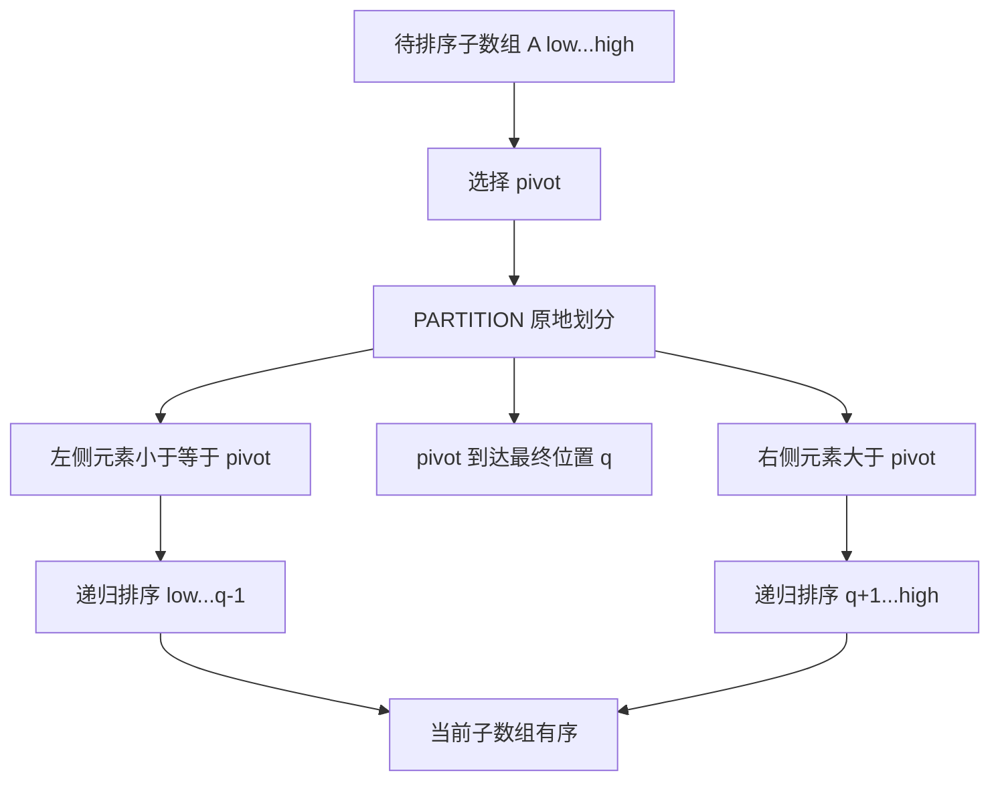

# Quick Sort 快速排序

> [!abstract] 核心结论
> 快速排序是一种基于分治法的**比较排序算法**。它先通过 `PARTITION` 将数组围绕一个枢轴（pivot）原地划分，再递归排序左右两部分。
>
> - 平均与随机化期望时间：$\Theta(n\log n)$
> - 最坏时间：$\Theta(n^2)$
> - 原地分区的数组辅助空间：$\Theta(1)$
> - 递归栈：期望 $\Theta(\log n)$，最坏 $\Theta(n)$
> - 标准实现通常**不稳定**

## 1. 问题定义

给定一个包含 $n$ 个可比较元素的数组：

$$
A[0\dots n-1]
$$

快速排序要将其重排为：

$$
A[0] \le A[1] \le \cdots \le A[n-1]
$$

排序只改变元素的位置，不改变元素集合。

## 2. 基本思想

快速排序使用“分治”策略：

1. **Divide（划分）**：选择一个枢轴 $x$，重新排列当前子数组，使枢轴左侧元素不大于它，右侧元素大于它。
2. **Conquer（解决）**：递归排序枢轴左侧和右侧两个子数组。
3. **Combine（合并）**：不需要额外合并；左右子数组有序后，整个子数组自然有序。



> [!important] 快速排序的关键
> 快速排序真正的核心不是递归，而是能够在线性时间内完成的 `PARTITION`。一次分区结束后，枢轴已经位于其最终排序位置，后续不再移动。

## 3. 具体过程

本文采用 **Lomuto partition scheme**，并统一使用 **0-based 下标**。

设当前需要排序的闭区间为：

$$
A[low\dots high]
$$

选择末尾元素作为枢轴：

$$
pivot=A[high]
$$

维护变量 $i$，使 $A[low\dots i]$ 始终是不大于枢轴的元素区域。

### 3.1 分区过程

初始化：

$$
i=low-1
$$

依次扫描：

$$
j=low,low+1,\dots,high-1
$$

- 若 $A[j]\le pivot$：令 $i\leftarrow i+1$，交换 $A[i]$ 和 $A[j]$。
- 若 $A[j]>pivot$：不交换，继续扫描。
- 扫描结束后，交换 $A[i+1]$ 和 $A[high]$，将枢轴放到最终位置。

最终返回：

$$
q=i+1
$$

此时满足：

$$
\begin{aligned}
A[low\dots q-1] &\le A[q],\\
A[q+1\dots high] &> A[q].
\end{aligned}
$$

### 3.2 递归过程

得到枢轴位置 $q$ 后，只需递归处理：

$$
A[low\dots q-1]
$$

和：

$$
A[q+1\dots high]
$$

当子数组长度不超过 $1$，即 $low\ge high$ 时，递归结束。

## 4. 分区循环不变式

在每次处理 $A[j]$ 之前，数组满足以下不变式：

| 区域                 | 内容                      |
| ------------------ | ----------------------- |
| $A[low\dots i]$    | 所有元素均满足 $A[k]\le pivot$ |
| $A[i+1\dots j-1]$  | 所有元素均满足 $A[k]>pivot$    |
| $A[j\dots high-1]$ | 尚未检查                    |
| $A[high]$          | 枢轴 $pivot$              |

### 4.1 初始化

开始时 $i=low-1$、$j=low$，前两个区域均为空，因此不变式成立。

### 4.2 保持

- 若 $A[j]\le pivot$，将它交换到“小于等于区”的末尾。
- 若 $A[j]>pivot$，它自然进入“大于区”。

因此每轮结束后不变式仍成立。

### 4.3 终止

循环终止时，所有非枢轴元素都已分类。将 $pivot$ 与 $A[i+1]$ 交换后，枢轴位于位置 $q=i+1$，且左右区域满足分区条件。

> [!success] 分区正确性
> `PARTITION` 返回的位置 $q$ 是枢轴在最终有序数组中的正确位置，但左右区域内部此时不一定有序。

## 5. 伪代码

### 5.1 Lomuto 分区

```text
PARTITION(A, low, high)
    pivot <- A[high]
    i <- low - 1

    for j <- low to high - 1
        if A[j] <= pivot
            i <- i + 1
            exchange A[i] <-> A[j]

    exchange A[i + 1] <-> A[high]
    return i + 1
```

### 5.2 快速排序

```text
QUICK-SORT(A, low, high)
    if low < high
        q <- PARTITION(A, low, high)
        QUICK-SORT(A, low, q - 1)
        QUICK-SORT(A, q + 1, high)
```

初始调用：

```text
QUICK-SORT(A, 0, length(A) - 1)
```

### 5.3 随机化快速排序

固定选择首元素或末元素作为枢轴时，有序输入可能持续产生极不平衡的划分。随机化版本在当前子数组中随机选择枢轴，再执行普通分区。

```text
RANDOMIZED-PARTITION(A, low, high)
    r <- RANDOM(low, high)
    exchange A[r] <-> A[high]
    return PARTITION(A, low, high)

RANDOMIZED-QUICK-SORT(A, low, high)
    if low < high
        q <- RANDOMIZED-PARTITION(A, low, high)
        RANDOMIZED-QUICK-SORT(A, low, q - 1)
        RANDOMIZED-QUICK-SORT(A, q + 1, high)
```

> [!note] 随机化的作用
> 随机化不会消除 $\Theta(n^2)$ 的理论最坏情况，但使运行时间不再系统性依赖原始输入顺序。对任意固定输入，随机化快速排序的期望运行时间为 $\Theta(n\log n)$。

## 6. 正确性

### 6.1 归纳命题

对任意闭区间 $A[low\dots high]$，调用 `QUICK-SORT(A, low, high)` 后，该区间按非递减顺序排列。

### 6.2 基础情况

当 $low\ge high$ 时，子数组长度为 $0$ 或 $1$，天然有序。

### 6.3 归纳步骤

假设所有长度小于 $n$ 的子数组均能被正确排序。对长度为 $n$ 的子数组：

1. `PARTITION` 将枢轴放到最终位置 $q$。
2. 左子数组 $A[low\dots q-1]$ 的元素均不大于 $A[q]$。
3. 右子数组 $A[q+1\dots high]$ 的元素均大于 $A[q]$。
4. 两个子数组长度都小于 $n$，根据归纳假设，递归调用可分别将它们排序。

因此：

$$
A[low\dots q-1]\le A[q]<A[q+1\dots high]
$$

整个区间有序。

## 7. 时间复杂度

设当前子数组长度为 $n$。一次 `PARTITION` 需要扫描 $n-1$ 个非枢轴元素，因此：

$$
P(n)=\Theta(n)
$$

若一次分区产生长度分别为 $k$ 和 $n-k-1$ 的两个子数组，则递归式为：

$$
T(n)=T(k)+T(n-k-1)+\Theta(n)
$$

### 7.1 最好情况

每次枢轴都接近中位数，划分基本均衡：

$$
T(n)=2T\left(\frac{n}{2}\right)+\Theta(n)
$$

根据主定理：

$$
T(n)=\Theta(n\log n)
$$

### 7.2 平均情况与随机化期望情况

虽然单次划分不一定对半，但只要划分在整体上不过度失衡，递归树高度为 $\Theta(\log n)$，每层分区工作的总和为 $\Theta(n)$：

$$
\mathbb{E}[T(n)]=\Theta(n\log n)
$$

对于元素互异的随机化快速排序，更精确地，比较次数的期望为：

$$
\mathbb{E}[C_n]
=2(n+1)H_n-4n
=2n\ln n+O(n)
$$

其中 $H_n$ 是第 $n$ 个调和数。

### 7.3 最坏情况

若每次枢轴都是当前子数组的最小值或最大值，则划分为 $0$ 和 $n-1$：

$$
T(n)=T(n-1)+\Theta(n)
$$

展开得：

$$
T(n)=\Theta(n+(n-1)+\cdots+1)=\Theta(n^2)
$$

典型触发条件：

- 输入已经有序或逆序；
- 始终固定选择首元素或末元素为枢轴；
- 大量重复元素与不合适的二路分区组合使用。

### 7.4 汇总

| 情况 | 划分特征 | 时间复杂度 |
|---|---|---:|
| 最好情况 | 每次近似均分 | $\Theta(n\log n)$ |
| 平均情况 | 整体划分较均衡 | $\Theta(n\log n)$ |
| 随机化期望 | 枢轴均匀随机选择 | $\Theta(n\log n)$ |
| 最坏情况 | 每次产生 $0:(n-1)$ 划分 | $\Theta(n^2)$ |

## 8. 空间复杂度

### 8.1 分区辅助空间

Lomuto 分区仅使用常数个变量：

$$
\Theta(1)
$$

因此快速排序通常被称为**原地排序（in-place sorting）**。

### 8.2 递归栈空间

真正的额外空间取决于递归深度：

| 情况 | 递归深度 | 栈空间 |
|---|---:|---:|
| 最好情况 | $\Theta(\log n)$ | $\Theta(\log n)$ |
| 随机化期望 | $\Theta(\log n)$ | $\Theta(\log n)$ |
| 最坏情况 | $\Theta(n)$ | $\Theta(n)$ |

> [!warning] “原地”不等于总空间恒为 $O(1)$
> 原地通常指元素划分不需要与输入同规模的辅助数组。递归实现仍需计算调用栈空间，因此标准快速排序的总辅助空间不能一概写成 $O(1)$。

### 8.3 栈空间优化

每次只递归处理较短的一侧，再用循环处理较长的一侧，可以把最坏递归栈深度限制为：

$$
O(\log n)
$$

```text
QUICK-SORT-BOUNDED-STACK(A, low, high)
    while low < high
        q <- PARTITION(A, low, high)

        if q - low < high - q
            QUICK-SORT-BOUNDED-STACK(A, low, q - 1)
            low <- q + 1
        else
            QUICK-SORT-BOUNDED-STACK(A, q + 1, high)
            high <- q - 1
```

## 9. 问题需要具有的性质

快速排序适用于满足以下条件的问题。

### 9.1 元素具有可比较关系

必须能通过比较器判断两个元素的相对次序。通常要求比较关系形成全序或至少全预序，例如满足：

- 自反性；
- 传递性；
- 任意两个元素可比较；
- 比较结果在算法执行期间保持一致。

### 9.2 可围绕枢轴进行划分

元素必须能够根据与枢轴的比较结果，被划分到“不大于枢轴”和“大于枢轴”的区域。

### 9.3 子问题相互独立

分区后，左、右子数组占据互不重叠的区间，可以独立递归排序。

### 9.4 合并操作必须简单

左右子数组排序完成后，不需要像[归并排序](/blog/cs-major-courses/introduction-to-algorithms/merge-sort-归并排序/)那样再执行线性合并；枢轴的最终位置保证三部分可以直接连接。

### 9.5 原地实现需要可修改且可随机访问的序列

原地快速排序需要频繁交换元素，因此数组或动态数组最合适。链表虽可实现类似思想，但难以发挥快速排序的原地交换和缓存局部性优势。

### 9.6 不要求稳定性

标准快速排序会交换远距离元素，因此通常不稳定。若任务要求保持相等键元素的原始相对顺序，应优先考虑稳定排序，或额外记录原始下标作为次关键字。

## 10. 典型例子

对数组进行升序排序：

$$
A=[9,4,8,3,1,2,5]
$$

选择末尾元素 $5$ 为枢轴。

### 10.1 第一次分区

| 扫描元素 | 操作后的数组 | $i$ |
|---:|---|---:|
| 初始 | `[9, 4, 8, 3, 1, 2, 5]` | $-1$ |
| $9>5$ | `[9, 4, 8, 3, 1, 2, 5]` | $-1$ |
| $4\le5$ | `[4, 9, 8, 3, 1, 2, 5]` | $0$ |
| $8>5$ | `[4, 9, 8, 3, 1, 2, 5]` | $0$ |
| $3\le5$ | `[4, 3, 8, 9, 1, 2, 5]` | $1$ |
| $1\le5$ | `[4, 3, 1, 9, 8, 2, 5]` | $2$ |
| $2\le5$ | `[4, 3, 1, 2, 8, 9, 5]` | $3$ |
| 放置枢轴 | `[4, 3, 1, 2, 5, 9, 8]` | $q=4$ |

第一次分区后：

$$
[4,3,1,2]\quad 5\quad [9,8]
$$

其中 $5$ 已在最终位置。

### 10.2 递归处理

左侧：

$$
[4,3,1,2]\rightarrow[1,2,4,3]\rightarrow[1,2,3,4]
$$

右侧：

$$
[9,8]\rightarrow[8,9]
$$

最终结果：

$$
[1,2,3,4,5,8,9]
$$

## 11. Python 实现

### 11.1 随机化原地快速排序

```python
from __future__ import annotations

import random
from collections.abc import MutableSequence
from typing import TypeVar

T = TypeVar("T")


def partition(a: MutableSequence[T], low: int, high: int) -> int:
    """使用 Lomuto 方法划分 a[low:high + 1]，返回枢轴最终下标。"""
    pivot = a[high]
    i = low - 1

    for j in range(low, high):
        if a[j] <= pivot:
            i += 1
            a[i], a[j] = a[j], a[i]

    pivot_index = i + 1
    a[pivot_index], a[high] = a[high], a[pivot_index]
    return pivot_index


def randomized_partition(
    a: MutableSequence[T],
    low: int,
    high: int,
    rng: random.Random,
) -> int:
    """随机选择枢轴，再调用普通分区。"""
    pivot_index = rng.randint(low, high)
    a[pivot_index], a[high] = a[high], a[pivot_index]
    return partition(a, low, high)


def quick_sort(a: MutableSequence[T], seed: int = 42) -> None:
    """原地随机化快速排序；相同 seed 可复现实验。"""
    rng = random.Random(seed)

    def sort(low: int, high: int) -> None:
        while low < high:
            q = randomized_partition(a, low, high, rng)

            # 递归较短一侧，循环处理较长一侧，限制调用栈深度。
            if q - low < high - q:
                sort(low, q - 1)
                low = q + 1
            else:
                sort(q + 1, high)
                high = q - 1

    sort(0, len(a) - 1)


if __name__ == "__main__":
    data = [9, 4, 8, 3, 1, 2, 5]
    expected = sorted(data)

    quick_sort(data, seed=42)

    assert data == expected
    print(data)
```

预期输出：

```text
[1, 2, 3, 4, 5, 8, 9]
```

### 11.2 验证方法

对随机输入验证结果与 Python 内置排序一致：

```python
import random

rng = random.Random(42)

for n in range(100):
    data = [rng.randint(-20, 20) for _ in range(n)]
    expected = sorted(data)

    quick_sort(data, seed=42)
    assert data == expected

print("all tests passed")
```

## 12. 大量重复元素：三路快速排序

当数组包含大量与枢轴相等的元素时，二路分区可能反复处理这些重复值。可使用 **3-way partition**，一次划分为：

$$
A[low\dots lt-1] < pivot
$$

$$
A[lt\dots gt] = pivot
$$

$$
A[gt+1\dots high] > pivot
$$

随后只递归处理“小于区”和“大于区”。若所有元素都相等，三路快速排序可在线性时间内完成，而普通二路实现可能退化到平方时间。

## 13. 常见错误

> [!bug] 错误 1：递归区间包含枢轴
> 分区后 $q$ 已经位于最终位置，正确递归区间是 `[low, q - 1]` 和 `[q + 1, high]`。若再次包含 $q$，可能导致无限递归。

> [!bug] 错误 2：混用闭区间和半开区间
> 本文伪代码使用闭区间 `[low, high]`。若 Python 实现改用半开区间 `[low, high)`，循环边界、枢轴位置和初始调用都必须同步修改。

> [!bug] 错误 3：只写数组辅助空间为 $O(1)$
> 完整空间分析必须同时给出递归栈：期望 $O(\log n)$，最坏 $O(n)$；采用“递归较短侧”优化后可保证栈空间 $O(\log n)$。

> [!bug] 错误 4：把随机化理解为平均输入假设
> 随机化快速排序不要求输入本身随机。随机性来自算法内部的枢轴选择。

## 14. 与其他排序算法对比

| 算法                      |              最好时间 |              平均时间 |              最坏时间 |                  额外空间 | 稳定性 |
| ----------------------- | ----------------: | ----------------: | ----------------: | --------------------: | --- |
| Quick Sort              | $\Theta(n\log n)$ | $\Theta(n\log n)$ |     $\Theta(n^2)$ | 期望 $\Theta(\log n)$ 栈 | 否   |
| [Merge Sort 归并排序](/blog/cs-major-courses/introduction-to-algorithms/merge-sort-归并排序/)     | $\Theta(n\log n)$ | $\Theta(n\log n)$ | $\Theta(n\log n)$ |    数组实现通常 $\Theta(n)$ | 是   |
| [Heap Sort 堆排序](/blog/cs-major-courses/introduction-to-algorithms/heap-sort-堆排序/)       | $\Theta(n\log n)$ | $\Theta(n\log n)$ | $\Theta(n\log n)$ |           $\Theta(1)$ | 否   |
| [Insertion Sort 插入排序](/blog/cs-major-courses/introduction-to-algorithms/insertion-sort-插入排序/) |       $\Theta(n)$ |     $\Theta(n^2)$ |     $\Theta(n^2)$ |           $\Theta(1)$ | 是   |

> [!tip] 实践建议
> - 一般数组排序：使用随机枢轴或高质量枢轴选择策略。
> - 小子数组：常切换为[插入排序](/blog/cs-major-courses/introduction-to-algorithms/insertion-sort-插入排序/)以降低常数开销。
> - 重复值很多：使用三路分区。
> - 必须保证最坏 $O(n\log n)$：考虑[归并排序](/blog/cs-major-courses/introduction-to-algorithms/merge-sort-归并排序/)、[堆排序](/blog/cs-major-courses/introduction-to-algorithms/heap-sort-堆排序/)或 introsort。
> - 必须稳定：不要直接使用标准原地快速排序。

## 15. 复习要点

- [x] 能解释快速排序的 Divide、Conquer、Combine。
- [x] 能手算一次 Lomuto 分区过程。
- [x] 能写出 `PARTITION` 和 `QUICK-SORT` 的 0-based 伪代码。
- [ ] 能用循环不变式证明分区正确。
- [ ] 能分别推导最好、期望和最坏时间复杂度。
- [ ] 能区分数组辅助空间与递归栈空间。
- [ ] 能解释随机化为什么降低输入顺序造成的退化风险。
- [ ] 能说明大量重复元素时为何应使用三路分区。

## 相关笔记

- [Merge Sort 归并排序](/blog/cs-major-courses/introduction-to-algorithms/merge-sort-归并排序/)
- [Insertion Sort 插入排序](/blog/cs-major-courses/introduction-to-algorithms/insertion-sort-插入排序/)
- [Heap Sort 堆排序](/blog/cs-major-courses/introduction-to-algorithms/heap-sort-堆排序/)
- [Order Statistic 顺序统计量](/blog/cs-major-courses/introduction-to-algorithms/order-statistic-顺序统计量/)

## 参考资料

1. Cormen, Thomas H.; Leiserson, Charles E.; Rivest, Ronald L.; Stein, Clifford. *Introduction to Algorithms*, 3rd ed., Chapter 7: Quicksort. MIT Press, 2009.
2. Demaine, Erik D.; Leiserson, Charles E. “Lecture 4: Quicksort, Randomized Algorithms.” MIT 6.046J, Fall 2005. [MIT OpenCourseWare 课程页面](https://ocw.mit.edu/courses/6-046j-introduction-to-algorithms-sma-5503-fall-2005/resources/lecture-4-quicksort-randomized-algorithms/).
3. Devadas, Srinivas. “Lecture 6: Randomization: Matrix Multiply, Quicksort.” MIT 6.046J, Spring 2015. [PDF](https://ocw.mit.edu/courses/6-046j-design-and-analysis-of-algorithms-spring-2015/cb55cb123a557eed0738a1187a452c24_MIT6_046JS15_lec06.pdf).
4. kepano. “Obsidian Flavored Markdown Skill.” [obsidian-skills](https://github.com/kepano/obsidian-skills/blob/main/skills/obsidian-markdown/SKILL.md).
