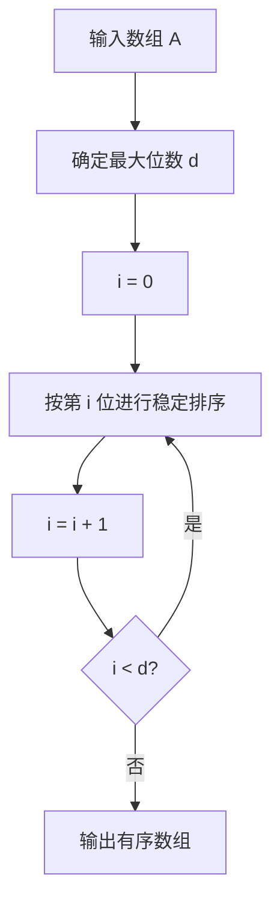

# Radix Sort 基数排序

> [!abstract] 核心结论
> 基数排序将一个关键字拆分成若干个“位”，逐位进行排序。
> 
> 本文主要讨论 **LSD Radix Sort（最低有效位优先基数排序）**：从最低位到最高位依次处理，并且每一趟必须使用==稳定排序==。
> 
> 若共有 $n$ 个元素、每个关键字有 $d$ 位、每一位有 $R$ 种可能取值，并使用计数排序处理每一位，则：
> 
> $$
> T(n)=\Theta\bigl(d(n+R)\bigr)
> $$

## 1. 问题定义

给定一个包含 $n$ 个非负整数的数组：

$$
A=[A[0],A[1],\dots,A[n-1]]
$$

将每个整数视为 $R$ 进制下由 $d$ 个数字组成的关键字，要求将数组按数值非递减顺序排列。

不足 $d$ 位的整数在高位补 $0$。例如，在十进制三位数排序中：

$$
7\equiv 007,\qquad 42\equiv 042
$$

第 $i$ 位数字采用 0-based 编号，其中 $i=0$ 表示最低位：

$$
\operatorname{digit}(x,i,R)
=
\left\lfloor\frac{x}{R^i}\right\rfloor\bmod R
$$

例如，当 $R=10$ 时：

$$
\operatorname{digit}(457,0,10)=7
$$

$$
\operatorname{digit}(457,1,10)=5
$$

$$
\operatorname{digit}(457,2,10)=4
$$

## 2. 基本思想

基数排序不直接比较两个完整关键字的大小，而是把关键字拆成多个位，再逐位排序。

LSD 基数排序按照以下顺序处理：

1. 先按最低位排序；
2. 再按次低位排序；
3. 重复该过程；
4. 最后按最高位排序。

处理完第 $i$ 位后，数组已经按照低 $i+1$ 位组成的关键字有序。

> [!important] 为什么必须使用稳定排序
> 稳定排序保证：当两个元素当前位相同时，它们在上一趟排序中形成的相对次序不会改变。
> 
> 因此，按第 $i$ 位排序时，已经按低 $i$ 位建立的顺序能够被保留下来。

例如，已知 `329` 和 `355` 的百位都为 `3`。在按百位排序时，稳定排序会保留它们此前根据十位和个位形成的顺序：

```text
329 < 355
```

若辅助排序不稳定，这一顺序可能被颠倒，导致最终结果错误。

## 3. 具体过程

设数组中的最大元素在 $R$ 进制下最多有 $d$ 位。

### 3.1 算法步骤

1. 确定最大关键字的位数 $d$；
2. 令当前位 $i=0$，即最低位；
3. 使用稳定排序，按照第 $i$ 位数字对整个数组排序；
4. 令 $i\leftarrow i+1$；
5. 当 $i=d$ 时结束，否则返回步骤 3。



### 3.2 每一趟排序的状态

在完成第 $i$ 趟排序后，数组按照每个元素的低 $i+1$ 位有序。

若使用十进制：

| 已处理的位 | 当前排序依据 |
|---|---|
| 第 0 趟 | 个位 |
| 第 1 趟 | 十位和个位组成的两位数 |
| 第 2 趟 | 百位、十位和个位组成的三位数 |
| $\vdots$ | $\vdots$ |
| 第 $d-1$ 趟 | 完整关键字 |

## 4. 伪代码

下面的伪代码统一使用 0-based 下标。

### 4.1 基数排序

```text
RADIX-SORT(A, R)
    if LENGTH(A) <= 1
        return A

    max_value <- MAX(A)
    exp <- 1

    while floor(max_value / exp) > 0
        A <- STABLE-SORT-BY-DIGIT(A, exp, R)
        exp <- exp * R

    return A
```

其中：

- `R`：基数，例如十进制时 $R=10$；
- `exp`：当前位的权值，依次为 $1,R,R^2,\dots$；
- 当前位数字为：

$$
\left\lfloor\frac{x}{\text{exp}}\right\rfloor\bmod R
$$

### 4.2 使用计数排序处理某一位

```text
STABLE-SORT-BY-DIGIT(A, exp, R)
    n <- LENGTH(A)
    B <- new array of length n
    count <- new array of length R, initialized to 0

    for i <- 0 to n - 1
        digit <- floor(A[i] / exp) mod R
        count[digit] <- count[digit] + 1

    for digit <- 1 to R - 1
        count[digit] <- count[digit] + count[digit - 1]

    for i <- n - 1 downto 0
        digit <- floor(A[i] / exp) mod R
        B[count[digit] - 1] <- A[i]
        count[digit] <- count[digit] - 1

    return B
```

> [!note] 为什么从右向左扫描输入数组
> 构造输出数组时，从右向左扫描可以保证相同数字的元素保持原有相对顺序，因此这一趟计数排序是稳定的。

## 5. 正确性证明

### 5.1 循环不变式

在开始处理第 $i$ 位之前，数组已经按照低 $i$ 位有序。

等价地，对任意两个元素 $x$ 和 $y$，它们的低 $i$ 位关键字为：

$$
L_i(x)=x\bmod R^i
$$

若 $L_i(x)<L_i(y)$，则 $x$ 位于 $y$ 之前。

### 5.2 初始化

处理最低位之前，$i=0$。

所有元素的低 $0$ 位都可以视为空关键字，因此数组天然按照低 $0$ 位有序，循环不变式成立。

### 5.3 维持

假设处理第 $i$ 位之前，数组已经按照低 $i$ 位有序。

现在使用稳定排序按照第 $i$ 位数字排序。

对于任意两个元素 $x$ 和 $y$：

- 若它们的第 $i$ 位不同，则当前排序会按照第 $i$ 位确定正确顺序；
- 若它们的第 $i$ 位相同，则稳定性会保留它们根据低 $i$ 位形成的原有顺序。

因此，排序完成后，数组按照低 $i+1$ 位有序，循环不变式得到维持。

### 5.4 终止

处理完第 $d-1$ 位后，数组按照低 $d$ 位有序。

由于每个关键字最多只有 $d$ 位，低 $d$ 位就是完整关键字，因此数组整体有序。

> [!success] 正确性结论
> 只要每一趟使用稳定排序，LSD 基数排序就能得到完整关键字的正确非递减序列。

## 6. 时空间复杂度

设：

- $n$：元素个数；
- $d$：每个关键字的位数；
- $R$：每一位可能的取值数量，即基数；
- 每一趟使用计数排序。

### 6.1 时间复杂度

计数排序处理一位的时间复杂度为：

$$
\Theta(n+R)
$$

一共处理 $d$ 位，因此总时间复杂度为：

$$
\boxed{\Theta\bigl(d(n+R)\bigr)}
$$

| 情况 | 时间复杂度 |
|---|---:|
| 一般情况 | $\Theta(d(n+R))$ |
| $R=O(n)$ | $\Theta(dn)$ |
| $d=O(1)$ 且 $R=O(n)$ | $\Theta(n)$ |

> [!warning] “线性时间”的前提
> 基数排序并非无条件为 $\Theta(n)$。
> 
> 只有当位数 $d$ 为常数，且每一位的取值范围 $R$ 不超过 $O(n)$ 时，才可以写成 $\Theta(n)$。

### 6.2 按位分组的复杂度

若每个关键字占 $W$ 个二进制位，每次取 $r$ 位作为一个数字，则：

- 基数为 $R=2^r$；
- 趟数为 $\lceil W/r\rceil$；
- 每一趟计数排序耗时 $\Theta(n+2^r)$。

因此：

$$
T(n,W,r)
=
\Theta\left(\left\lceil\frac{W}{r}\right\rceil(n+2^r)\right)
$$

增大 $r$ 会减少排序趟数，但会增大计数数组的规模 $2^r$，两者之间需要权衡。

### 6.3 空间复杂度

标准计数排序需要：

- 输出数组：$\Theta(n)$；
- 计数数组：$\Theta(R)$。

因此辅助空间复杂度为：

$$
\boxed{\Theta(n+R)}
$$

标准实现不是原地排序。

## 7. 需要问题具有的性质

基数排序适用于满足以下条件的问题。

### 7.1 关键字可以分解为有限个位

每个关键字必须能够表示成：

$$
(k_{d-1},k_{d-2},\dots,k_1,k_0)
$$

其中每一位 $k_i$ 都属于有限集合：

$$
k_i\in\{0,1,\dots,R-1\}
$$

典型对象包括：

- 非负整数；
- 固定位宽二进制整数；
- 定长字符串；
- 能够映射为整数关键字的记录。

### 7.2 每一位的取值范围可控

若 $R$ 过大，计数数组会消耗大量时间和空间，使基数排序失去优势。

### 7.3 每一趟辅助排序必须稳定

这是 LSD 基数排序正确性的核心条件。

常用的稳定辅助排序包括：

- [Counting Sort 计数排序](/blog/cs-major-courses/introduction-to-algorithms/counting-sort-计数排序/)；
- 稳定的桶分配过程；
- 稳定的归并排序。

### 7.4 所有关键字的位数需要统一

不同长度的整数可以在高位补 $0$。

不同长度的字符串需要额外定义：

- 缺失字符的排序规则；
- 字符表顺序；
- 是否采用特殊哨兵字符。

### 7.5 排序顺序必须能由各位的字典序决定

对于非负整数，数值顺序等价于固定长度数字序列的字典序。

对任意两个 $d$ 位整数，最先出现差异的最高位决定两个整数的大小。

### 7.6 负数需要额外处理

上述基本算法默认输入为非负整数。

处理负数时，常见方法是：

1. 将负数和非负数分开；
2. 对负数的绝对值进行基数排序；
3. 将负数部分逆序并恢复负号；
4. 再拼接非负数部分。

> [!warning]
> 不能直接将带符号整数代入只支持非负数的数字提取公式，否则排序结果可能错误。

## 8. 典型例子

对数组进行十进制 LSD 基数排序：

```text
A = [329, 457, 657, 839, 436, 720, 355]
```

所有元素均视为三位数，基数 $R=10$。

### 8.1 第 1 趟：按个位稳定排序

| 元素 | 个位 |
|---:|---:|
| 329 | 9 |
| 457 | 7 |
| 657 | 7 |
| 839 | 9 |
| 436 | 6 |
| 720 | 0 |
| 355 | 5 |

排序结果：

```text
[720, 355, 436, 457, 657, 329, 839]
```

### 8.2 第 2 趟：按十位稳定排序

```text
[720, 329, 436, 839, 355, 457, 657]
```

此时数组已按照后两位有序：

```text
20, 29, 36, 39, 55, 57, 57
```

### 8.3 第 3 趟：按百位稳定排序

```text
[329, 355, 436, 457, 657, 720, 839]
```

所有位均已处理，得到最终有序数组。

## 9. Python 实现

```python
from typing import List


def counting_sort_by_digit(values: List[int], exp: int, base: int) -> List[int]:
    """按照由 exp 指定的数位执行一次稳定计数排序。"""
    n = len(values)
    output = [0] * n
    count = [0] * base

    # 统计当前位上各数字出现的次数。
    for value in values:
        digit = (value // exp) % base
        count[digit] += 1

    # 转换为前缀和：count[d] 表示数字 <= d 的元素个数。
    for digit in range(1, base):
        count[digit] += count[digit - 1]

    # 从右向左放置元素，保证稳定性。
    for i in range(n - 1, -1, -1):
        value = values[i]
        digit = (value // exp) % base
        output[count[digit] - 1] = value
        count[digit] -= 1

    return output


def radix_sort(values: List[int], base: int = 10) -> List[int]:
    """使用 LSD 基数排序返回非负整数数组的有序副本。"""
    if base < 2:
        raise ValueError("base 必须不小于 2")

    if any(not isinstance(value, int) for value in values):
        raise TypeError("values 中的所有元素都必须是整数")

    if any(value < 0 for value in values):
        raise ValueError("该实现只支持非负整数")

    if len(values) <= 1:
        return values.copy()

    result = values.copy()
    max_value = max(result)
    exp = 1

    while max_value // exp > 0:
        result = counting_sort_by_digit(result, exp, base)
        exp *= base

    return result


if __name__ == "__main__":
    data = [329, 457, 657, 839, 436, 720, 355]
    result = radix_sort(data, base=10)

    print("原数组:", data)
    print("排序后:", result)

    assert result == sorted(data)
```

预期输出：

```text
原数组: [329, 457, 657, 839, 436, 720, 355]
排序后: [329, 355, 436, 457, 657, 720, 839]
```

验证方式：

```python
assert radix_sort(data) == sorted(data)
```

## 10. 与其他排序算法的比较

| 算法 | 类型 | 时间复杂度 | 辅助空间 | 稳定性 |
|---|---|---:|---:|---|
| 基数排序 | 非比较排序 | $\Theta(d(n+R))$ | $\Theta(n+R)$ | 取决于辅助排序 |
| [Counting Sort 计数排序](/blog/cs-major-courses/introduction-to-algorithms/counting-sort-计数排序/) | 非比较排序 | $\Theta(n+K)$ | $\Theta(n+K)$ | 可以稳定 |
| [Merge Sort 归并排序](/blog/cs-major-courses/introduction-to-algorithms/merge-sort-归并排序/) | 比较排序 | $\Theta(n\log n)$ | $\Theta(n)$ | 稳定 |
| [Quick Sort 快速排序](/blog/cs-major-courses/introduction-to-algorithms/quick-sort-快速排序/) | 比较排序 | 平均 $\Theta(n\log n)$ | 平均 $\Theta(\log n)$ | 通常不稳定 |
| [Heap Sort 堆排序](/blog/cs-major-courses/introduction-to-algorithms/heap-sort-堆排序/) | 比较排序 | $\Theta(n\log n)$ | $\Theta(1)$ | 不稳定 |

> [!tip] 基数排序为什么能突破 $\Omega(n\log n)$
> $\Omega(n\log n)$ 是比较排序模型的下界。
> 
> 基数排序利用了关键字可以拆分为有限位这一额外结构，并不是仅通过元素间比较确定顺序，因此不受该下界直接约束。

## 11. 常见错误

> [!bug] 错误 1：辅助排序不稳定
> 这会破坏上一趟已经建立的低位顺序。

> [!bug] 错误 2：从最高位直接向最低位排序
> 对普通 LSD 算法框架而言，这样不能保证低位排序不会破坏高位顺序。MSD Radix Sort 需要使用递归分桶等另一套算法结构。

> [!bug] 错误 3：忽略前导零
> 位数不同的数字必须视为高位补零，否则位的含义不统一。

> [!bug] 错误 4：直接写成 $O(n)$
> 应先写出完整复杂度 $\Theta(d(n+R))$，再说明何种条件下可以化简为 $\Theta(n)$。

> [!bug] 错误 5：基数选择过大
> 增大基数会减少趟数，但计数数组的时间和空间成本也会随之增大。

## 12. 总结

基数排序的核心可以概括为：

1. 将关键字拆分成多个位；
2. 从最低位到最高位依次排序；
3. 每一趟必须使用稳定排序；
4. 通过稳定性保留已经建立的低位顺序；
5. 总时间复杂度为 $\Theta(d(n+R))$；
6. 当 $d=O(1)$ 且 $R=O(n)$ 时，可达到线性时间。

## 13. 相关笔记

- [Counting Sort 计数排序](/blog/cs-major-courses/introduction-to-algorithms/counting-sort-计数排序/)
- [Bucket Sort 桶排序](/blog/cs-major-courses/introduction-to-algorithms/bucket-sort-桶排序/)
- [Merge Sort 归并排序](/blog/cs-major-courses/introduction-to-algorithms/merge-sort-归并排序/)
- [Quick Sort 快速排序](/blog/cs-major-courses/introduction-to-algorithms/quick-sort-快速排序/)
- [Heap Sort 堆排序](/blog/cs-major-courses/introduction-to-algorithms/heap-sort-堆排序/)

## 14. 参考资料

1. Thomas H. Cormen, Charles E. Leiserson, Ronald L. Rivest, Clifford Stein. *Introduction to Algorithms*, 3rd ed., Chapter 8.3: Radix Sort. MIT Press, 2009.
2. Erik D. Demaine, Charles E. Leiserson. *Introduction to Algorithms, Lecture 5: Sorting Lower Bounds and Linear-Time Sorting*. MIT, 2005.
3. Kepano. *Obsidian Flavored Markdown Skill*. `obsidian-skills/skills/obsidian-markdown`.
