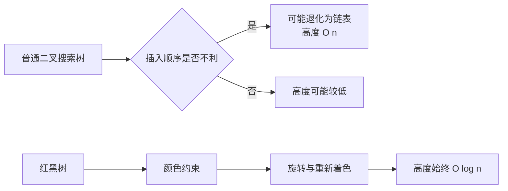
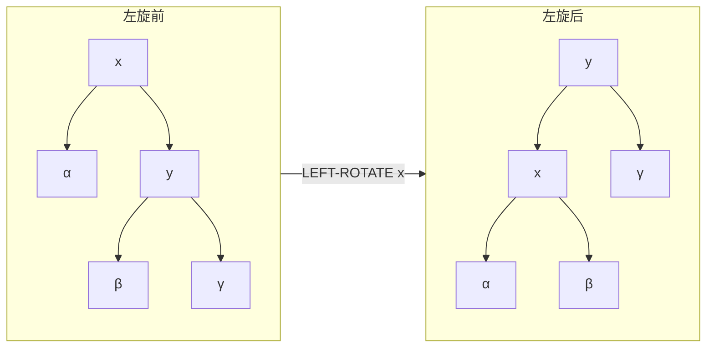
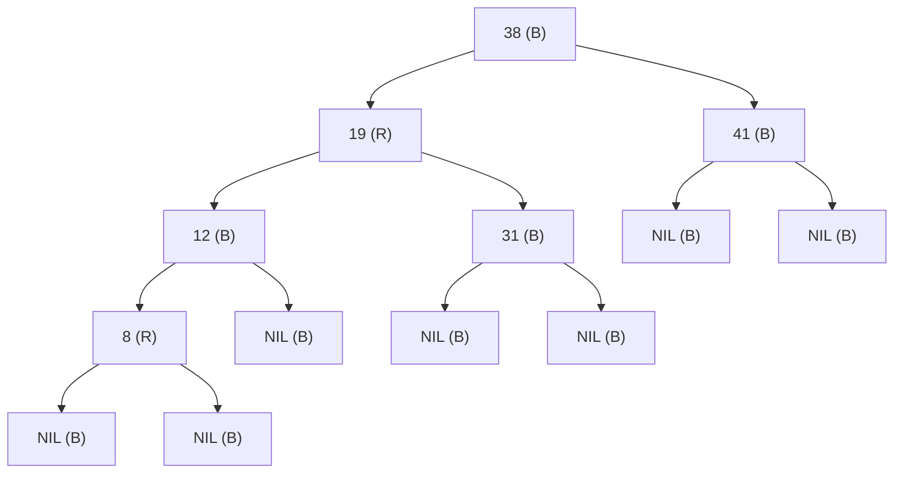

# Red-Black Tree 红黑树

> [!abstract] 核心结论
> **红黑树（Red-Black Tree）**是一种通过“结点着色 + 局部旋转 + 重新着色”维持近似平衡的[二叉搜索树](/blog/cs-major-courses/introduction-to-algorithms/binary-search-tree-二叉搜索树/)。
>
> 对含有 $n$ 个内部结点的红黑树，其高度满足
>
> $$
> h \le 2\log_2(n+1),
> $$
>
> 因而搜索、插入和删除的最坏时间复杂度均为 $O(\log n)$。

> [!info] 术语说明
> 英文标准名称是 **Red-Black Tree**，通常译为“红黑树”；“Black-Red Tree”不是常用名称，但可作为本笔记的别名。

## 1. 问题背景

普通二叉搜索树只维护键值的有序性：

- 左子树中的键不大于当前结点的键；
- 右子树中的键不小于当前结点的键。

如果按有序顺序插入键，普通二叉搜索树可能退化为链表，高度达到 $n-1$，搜索、插入和删除的最坏时间复杂度随之退化为 $O(n)$。

红黑树在二叉搜索树的基础上，为每个结点增加一个颜色字段，并通过一组颜色约束限制树的高度，使树始终保持**近似平衡**。



## 2. 基本思想

红黑树的基本思想可以概括为：

1. **保持二叉搜索树的有序性**，从而支持有序查找；
2. **使用红色结点吸收局部高度差异**；
3. **限制红色结点不能连续出现**，防止某条路径过长；
4. **保证所有根到叶路径具有相同黑高**，防止不同路径的有效高度相差过大；
5. 插入或删除破坏性质后，只在从修改位置到根的一条路径附近进行：
   - 重新着色（recoloring）；
   - 左旋（left rotation）；
   - 右旋（right rotation）。

> [!tip] 直观理解
> 可以将红色结点看成“附着”在黑色父结点上的额外键。把每个红色结点与其黑色父结点合并后，红黑树可对应一棵各叶子深度相同的 2-3-4 树。因此，红黑树不会严重偏斜。

## 3. 结点结构与 NIL 哨兵

每个内部结点至少包含以下字段：

```text
Node:
    key       // 用于比较的键
    color     // RED 或 BLACK
    left      // 左孩子
    right     // 右孩子
    parent    // 父结点
```

红黑树通常使用一个共享的黑色哨兵 `T.nil` 表示所有空孩子，而不是使用普通的 `null`。

```text
T.nil.color = BLACK
T.root = T.nil        // 空树
```

> [!warning] NIL 不是普通内部结点
> 红黑树性质中的“叶子”指黑色的 `NIL` 哨兵，不是没有孩子的普通键结点。一个没有真实孩子的内部结点仍然拥有两个指向 `T.nil` 的孩子指针。

## 4. 红黑树的五条性质

一棵二叉搜索树是红黑树，当且仅当满足以下性质：

1. 每个结点是红色或黑色；
2. 根结点是黑色；
3. 每个叶子结点 `NIL` 是黑色；
4. 如果一个结点是红色，则它的两个孩子都是黑色，即不存在连续的红色结点；
5. 对任意结点 $x$，从 $x$ 到其所有后代 `NIL` 叶子的简单路径都包含相同数量的黑色结点。

> [!important] 真正约束高度的两条性质
> - 性质 4 保证一条路径上的红色结点数量不会超过黑色结点数量；
> - 性质 5 保证从同一结点出发的不同路径具有相同黑高。

### 4.1 黑高

结点 $x$ 的**黑高（black-height）**记作 $bh(x)$：

> 从结点 $x$ 出发但不包含 $x$，到任意后代 `NIL` 叶子的路径上，黑色结点的数量。

由于红黑性质 5，$bh(x)$ 是良定义的。

## 5. 为什么高度是 $O(\log n)$

### 5.1 子树结点数下界

以结点 $x$ 为根、黑高为 $bh(x)$ 的子树，至少包含

$$
2^{bh(x)}-1
$$

个内部结点。

证明可对树高进行归纳：$x$ 的两个孩子黑高至少为 $bh(x)-1$，因此两个子树分别至少包含 $2^{bh(x)-1}-1$ 个内部结点，再加上 $x$ 自身即可。

### 5.2 黑高与树高的关系

由于红色结点不能连续出现，一条从根到叶子的路径中，红色结点数量至多与黑色结点数量相同，因此根的黑高至少为树高的一半：

$$
bh(\operatorname{root}) \ge \frac{h}{2}.
$$

设红黑树共有 $n$ 个内部结点，则

$$
\begin{aligned}
n &\ge 2^{bh(\operatorname{root})}-1 \\
  &\ge 2^{h/2}-1.
\end{aligned}
$$

所以

$$
\boxed{h\le 2\log_2(n+1)}.
$$

> [!success] 直接推论
> 所有沿树高执行的二叉搜索树操作，如 `SEARCH`、`MINIMUM`、`MAXIMUM`、`PREDECESSOR` 和 `SUCCESSOR`，在红黑树上的最坏时间复杂度均为 $O(\log n)$。

## 6. 旋转

旋转是在不破坏二叉搜索树中序顺序的前提下，局部改变父子关系的操作。

### 6.1 左旋

对结点 $x$ 左旋时，其右孩子 $y$ 上升，$x$ 成为 $y$ 的左孩子，$y$ 原来的左子树成为 $x$ 的右子树。



```text
LEFT-ROTATE(T, x):
    y = x.right
    x.right = y.left

    if y.left != T.nil:
        y.left.parent = x

    y.parent = x.parent

    if x.parent == T.nil:
        T.root = y
    else if x == x.parent.left:
        x.parent.left = y
    else:
        x.parent.right = y

    y.left = x
    x.parent = y
```

### 6.2 右旋

右旋是左旋的镜像操作。

```text
RIGHT-ROTATE(T, y):
    x = y.left
    y.left = x.right

    if x.right != T.nil:
        x.right.parent = y

    x.parent = y.parent

    if y.parent == T.nil:
        T.root = x
    else if y == y.parent.left:
        y.parent.left = x
    else:
        y.parent.right = x

    x.right = y
    y.parent = x
```

### 6.3 旋转保持有序性的原因

设左旋前：

- 子树 $\alpha$ 中所有键小于等于 $x.key$；
- 子树 $\beta$ 中所有键位于 $x.key$ 与 $y.key$ 之间；
- 子树 $\gamma$ 中所有键大于等于 $y.key$。

即

$$
\alpha \le x \le \beta \le y \le \gamma.
$$

左旋只改变连接关系，不改变上述中序顺序，因此仍然是一棵合法二叉搜索树。一次旋转只修改常数个指针，时间复杂度为 $O(1)$。

## 7. 查询过程

红黑树的查询过程与普通二叉搜索树完全相同，颜色只用于维护平衡，不参与键值比较。

```text
RB-SEARCH(T, key):
    x = T.root

    while x != T.nil and key != x.key:
        if key < x.key:
            x = x.left
        else:
            x = x.right

    return x
```

若返回 `T.nil`，表示键不存在。

## 8. 插入过程

### 8.1 总体过程

红黑树插入分为两个阶段：

1. 按普通二叉搜索树规则插入新结点 $z$；
2. 将 $z$ 染成红色，并执行 `RB-INSERT-FIXUP` 修复红黑性质。

新结点初始染成红色，是因为插入红结点不会改变任何路径上的黑色结点数量，因此不会直接破坏性质 5。

可能被破坏的主要是性质 4：$z$ 与其父结点可能同时为红色。

```text
RB-INSERT(T, z):
    y = T.nil
    x = T.root

    while x != T.nil:
        y = x
        if z.key < x.key:
            x = x.left
        else:
            x = x.right

    z.parent = y

    if y == T.nil:
        T.root = z
    else if z.key < y.key:
        y.left = z
    else:
        y.right = z

    z.left = T.nil
    z.right = T.nil
    z.color = RED

    RB-INSERT-FIXUP(T, z)
```

### 8.2 插入修复的三个基本情况

设：

- $z$ 为当前结点；
- $p$ 为 $z$ 的父结点；
- $g$ 为 $z$ 的祖父结点；
- $u$ 为 $z$ 的叔叔结点。

循环执行修复的前提是 $p$ 为红色。由于红黑树在插入前合法，因此 $g$ 一定存在且为黑色。

#### 情况 1：叔叔结点为红色

处理方法：

- 父结点染黑；
- 叔叔结点染黑；
- 祖父结点染红；
- 将 $z$ 上移到祖父结点，继续检查。

本质：将局部的“红红冲突”向树根方向转移。

#### 情况 2：叔叔为黑色，且形成内侧折线

以父结点是祖父左孩子为例：$z$ 是父结点的右孩子，形成“左—右”结构。

处理方法：

- 对父结点执行左旋；
- 将情况 2 转化为情况 3。

#### 情况 3：叔叔为黑色，且形成外侧直线

以“左—左”结构为例：

- 父结点染黑；
- 祖父结点染红；
- 对祖父结点右旋；
- 冲突消除。

右侧情形与上述三个情况完全镜像。

```text
RB-INSERT-FIXUP(T, z):
    while z.parent.color == RED:
        if z.parent == z.parent.parent.left:
            u = z.parent.parent.right

            if u.color == RED:                    // 情况 1
                z.parent.color = BLACK
                u.color = BLACK
                z.parent.parent.color = RED
                z = z.parent.parent
            else:
                if z == z.parent.right:           // 情况 2
                    z = z.parent
                    LEFT-ROTATE(T, z)

                z.parent.color = BLACK            // 情况 3
                z.parent.parent.color = RED
                RIGHT-ROTATE(T, z.parent.parent)
        else:
            u = z.parent.parent.left

            if u.color == RED:                    // 镜像情况 1
                z.parent.color = BLACK
                u.color = BLACK
                z.parent.parent.color = RED
                z = z.parent.parent
            else:
                if z == z.parent.left:            // 镜像情况 2
                    z = z.parent
                    RIGHT-ROTATE(T, z)

                z.parent.color = BLACK            // 镜像情况 3
                z.parent.parent.color = RED
                LEFT-ROTATE(T, z.parent.parent)

    T.root.color = BLACK
```

> [!note] 插入旋转次数
> 情况 1 只重新着色并可能向上重复；一旦进入情况 2 或情况 3，本轮最多进行两次旋转后结束。因此，一次插入最多执行 **2 次旋转**。

## 9. 删除过程

### 9.1 为什么删除更复杂

删除红色结点通常不会改变路径黑高；删除黑色结点则可能使某些路径比其他路径少一个黑色结点，从而破坏性质 5。

为便于理解，常把替代被删除黑结点的结点 $x$ 看成携带一层额外的黑色，即“**双重黑（double black）**”。双重黑只是分析概念，不是第三种实际颜色。

### 9.2 子树替换

```text
RB-TRANSPLANT(T, u, v):
    if u.parent == T.nil:
        T.root = v
    else if u == u.parent.left:
        u.parent.left = v
    else:
        u.parent.right = v

    v.parent = u.parent
```

### 9.3 删除主过程

```text
TREE-MINIMUM(T, x):
    while x.left != T.nil:
        x = x.left
    return x
```

```text
RB-DELETE(T, z):
    y = z
    yOriginalColor = y.color

    if z.left == T.nil:
        x = z.right
        RB-TRANSPLANT(T, z, z.right)

    else if z.right == T.nil:
        x = z.left
        RB-TRANSPLANT(T, z, z.left)

    else:
        y = TREE-MINIMUM(T, z.right)
        yOriginalColor = y.color
        x = y.right

        if y.parent == z:
            x.parent = y
        else:
            RB-TRANSPLANT(T, y, y.right)
            y.right = z.right
            y.right.parent = y

        RB-TRANSPLANT(T, z, y)
        y.left = z.left
        y.left.parent = y
        y.color = z.color

    if yOriginalColor == BLACK:
        RB-DELETE-FIXUP(T, x)
```

这里真正从原位置移走的结点是 $y$。只有当 $y$ 原来为黑色时，才可能破坏红黑性质，需要修复。

### 9.4 删除修复的四种基本情况

假设 $x$ 是其父结点的左孩子，$w$ 是 $x$ 的兄弟结点；右侧情形完全镜像。

#### 情况 1：兄弟 $w$ 为红色

由于红色兄弟的孩子必为黑色：

- 将 $w$ 染黑；
- 将父结点染红；
- 对父结点左旋；
- 更新兄弟结点 $w$。

作用：把红色兄弟情况转换为兄弟为黑色的情况。

#### 情况 2：兄弟为黑色，且兄弟的两个孩子都为黑色

- 将兄弟染红；
- 把额外的黑色从 $x$ 与 $w$ 所在层向父结点转移；
- 令 $x=x.parent$，继续向上修复。

#### 情况 3：兄弟为黑色，近侄子为红色，远侄子为黑色

对 $x$ 为左孩子的情形：

- 将近侄子 `w.left` 染黑；
- 将兄弟 $w$ 染红；
- 对 $w$ 右旋；
- 转换为情况 4。

#### 情况 4：兄弟为黑色，远侄子为红色

- 兄弟继承父结点颜色；
- 父结点染黑；
- 远侄子染黑；
- 对父结点左旋；
- 令 $x=T.root$，结束循环。

```text
RB-DELETE-FIXUP(T, x):
    while x != T.root and x.color == BLACK:
        if x == x.parent.left:
            w = x.parent.right

            if w.color == RED:                    // 情况 1
                w.color = BLACK
                x.parent.color = RED
                LEFT-ROTATE(T, x.parent)
                w = x.parent.right

            if w.left.color == BLACK and w.right.color == BLACK:
                w.color = RED                     // 情况 2
                x = x.parent
            else:
                if w.right.color == BLACK:        // 情况 3
                    w.left.color = BLACK
                    w.color = RED
                    RIGHT-ROTATE(T, w)
                    w = x.parent.right

                w.color = x.parent.color          // 情况 4
                x.parent.color = BLACK
                w.right.color = BLACK
                LEFT-ROTATE(T, x.parent)
                x = T.root
        else:
            w = x.parent.left

            if w.color == RED:                    // 镜像情况 1
                w.color = BLACK
                x.parent.color = RED
                RIGHT-ROTATE(T, x.parent)
                w = x.parent.left

            if w.right.color == BLACK and w.left.color == BLACK:
                w.color = RED                     // 镜像情况 2
                x = x.parent
            else:
                if w.left.color == BLACK:         // 镜像情况 3
                    w.right.color = BLACK
                    w.color = RED
                    LEFT-ROTATE(T, w)
                    w = x.parent.left

                w.color = x.parent.color          // 镜像情况 4
                x.parent.color = BLACK
                w.left.color = BLACK
                RIGHT-ROTATE(T, x.parent)
                x = T.root

    x.color = BLACK
```

> [!note] 删除旋转次数
> 情况 2 可能沿树向上传播，但只重新着色；情况 1、3、4 的组合最多执行 **3 次旋转**。因此删除仍为 $O(\log n)$。

## 10. 具体过程总结

### 10.1 搜索

1. 从根结点开始；
2. 目标键较小则进入左子树，否则进入右子树；
3. 找到目标键或遇到 `T.nil` 时结束。

### 10.2 插入

1. 按普通二叉搜索树规则找到插入位置；
2. 插入红色新结点，两个孩子指向 `T.nil`；
3. 若父结点为黑色，直接结束；
4. 若父结点为红色，根据叔叔颜色和局部形态执行：
   - 重新着色；
   - 单旋；
   - 双旋；
5. 最后强制将根染黑。

### 10.3 删除

1. 按普通二叉搜索树规则确定实际移走的结点；
2. 使用后继结点替换拥有两个真实孩子的待删结点；
3. 若实际移走的是红色结点，通常无需修复；
4. 若实际移走的是黑色结点，从替代结点 $x$ 开始修复黑高；
5. 根据兄弟及其两个孩子的颜色执行四种情况之一；
6. 最终将 $x$ 染黑，消除额外黑色。

## 11. 时空复杂度

设树中有 $n$ 个内部结点。

| 操作 | 最坏时间复杂度 | 说明 |
|---|---:|---|
| 搜索 `SEARCH` | $O(\log n)$ | 沿树高下降 |
| 最小值 / 最大值 | $O(\log n)$ | 沿最左或最右路径下降 |
| 前驱 / 后继 | $O(\log n)$ | 沿子树或父指针移动 |
| 插入 | $O(\log n)$ | BST 插入 + 向上修复 |
| 删除 | $O(\log n)$ | BST 删除 + 向上修复 |
| 单次旋转 | $O(1)$ | 修改常数个指针 |
| 中序遍历 | $O(n)$ | 每个内部结点访问一次 |
| 依次插入 $n$ 个键建树 | $O(n\log n)$ | 每次插入 $O(\log n)$ |

空间复杂度：

- 存储整棵树：$O(n)$；
- 每个结点额外维护颜色和父指针：$O(1)$；
- 迭代实现单次操作的辅助空间：$O(1)$；
- 若查询或遍历使用递归，调用栈最多为 $O(\log n)$。

## 12. 需要数据或应用场景具有的性质

> [!question] “需要问题具有的性质”如何理解？
> 红黑树是数据结构，不是动态规划或贪心算法，因此不存在“最优子结构”之类的算法适用条件。这里应理解为：什么数据和操作需求适合使用红黑树。

### 12.1 键必须可比较

键集合必须定义一致的全序关系，或提供满足下列要求的比较器：

- 反自反性：不存在 $a<a$；
- 传递性：若 $a<b$ 且 $b<c$，则 $a<c$；
- 不矛盾性：不能同时有 $a<b$ 和 $b<a$；
- 等价键的处理策略明确。

### 12.2 需要维护动态有序集合

适合的操作组合包括：

- 动态插入；
- 动态删除；
- 精确查找；
- 最小值、最大值；
- 前驱、后继；
- 按键范围遍历。

### 12.3 需要最坏情况性能保证

红黑树适合不能接受普通二叉搜索树退化为 $O(n)$ 的场景。它不依赖随机输入，能保证单次操作最坏为 $O(\log n)$。

### 12.4 更新较频繁

与平衡约束更严格的 AVL 树相比，红黑树通常允许更松的平衡，因此在插入和删除频繁的动态集合中具有较好的综合性能。

### 12.5 重复键策略必须预先规定

红黑树本身不强制唯一键。实现时应明确：

- 禁止重复键；
- 相等键统一插入左侧或右侧；
- 在结点中维护计数；
- 将 `(key, unique_id)` 作为复合键。

> [!warning] 不适合的场景
> - 只做精确查找、不需要顺序：哈希表平均性能可能更合适；
> - 数据完全静态：排序数组通常更紧凑，并支持二分查找；
> - 需要磁盘或数据库页级索引：B 树或 B+ 树通常更合适；
> - 需要极严格的最小树高、查询远多于更新：可考虑 AVL 树。

## 13. 典型例子：依次插入 41、38、31、12、19、8

以下采用经典插入序列：

$$
[41,38,31,12,19,8].
$$

### 13.1 插入 41

41 成为根，最终染黑。

```text
41(B)
```

### 13.2 插入 38

38 为红色，父结点 41 为黑色，不需要修复。

```text
    41(B)
   /
38(R)
```

### 13.3 插入 31

31 与 38 形成红红冲突；叔叔为黑色 `NIL`，结构为“左—左”：

1. 38 染黑；
2. 41 染红；
3. 对 41 右旋。

```text
      38(B)
     /     \
 31(R)    41(R)
```

### 13.4 插入 12

12 的父结点 31 为红色，叔叔 41 也为红色，属于情况 1：

1. 31 与 41 染黑；
2. 38 暂时染红；
3. 38 是根，最终重新染黑。

```text
       38(B)
      /     \
   31(B)   41(B)
   /
12(R)
```

### 13.5 插入 19

19 的父结点 12 为红色，叔叔为黑色 `NIL`，局部结构为“左—右”：

1. 对 12 左旋，将其转为“左—左”；
2. 19 染黑，31 染红；
3. 对 31 右旋。

```text
        38(B)
       /     \
    19(B)   41(B)
    /   \
 12(R) 31(R)
```

### 13.6 插入 8

8 的父结点 12 为红色，叔叔 31 也为红色，属于情况 1：

1. 12 与 31 染黑；
2. 19 染红；
3. 19 的父结点 38 为黑色，修复结束。

最终红黑树为：



### 13.7 验证红黑性质

- 根 38 为黑色；
- 所有 `NIL` 为黑色；
- 红色结点 19 和 8 的孩子均为黑色；
- 从根到任意 `NIL` 路径的黑结点数量相同。

例如，不计起点、计入 `NIL`：

- $38\to41\to NIL$：黑结点为 $41,NIL$；
- $38\to19\to31\to NIL$：黑结点为 $31,NIL$；
- $38\to19\to12\to8\to NIL$：黑结点为 $12,NIL$。

三条路径黑高均为 2。

## 14. 插入与删除修复对比

| 对比项 | 插入修复 | 删除修复 |
|---|---|---|
| 主要破坏 | 红结点与红父结点相邻 | 某些路径少一个黑结点 |
| 分析对象 | 父结点、叔叔、祖父 | 兄弟、近侄子、远侄子、父结点 |
| 是否可能向上传播 | 是 | 是 |
| 最大旋转次数 | 2 | 3 |
| 最坏时间复杂度 | $O(\log n)$ | $O(\log n)$ |
| 理解难点 | 三种情况及镜像 | 四种情况及镜像、双重黑 |

## 15. 正确性要点

### 15.1 旋转不破坏二叉搜索树性质

旋转保持中序遍历顺序不变，因此所有键的相对大小关系保持不变。

### 15.2 插入修复维持黑高

- 情况 1 只是将祖父的一层黑色下推给父与叔叔，各条路径黑高不变；
- 情况 2 只改变形态；
- 情况 3 通过旋转与换色消除红红冲突，同时保持各路径黑高。

### 15.3 删除修复消除额外黑色

删除修复的四种情况要么：

- 将额外黑色向父结点上移；
- 将额外黑色吸收到红色结点中；
- 通过旋转和重新着色重新分配局部黑高并终止。

循环结束后将 $x$ 染黑，即可恢复所有红黑性质。

## 16. 常见错误

> [!bug] 错误 1：把普通空指针当成 NIL
> 删除修复需要读取兄弟孩子的颜色，例如 `w.left.color`。若使用普通 `null` 而不额外判断，会产生空指针错误。

> [!bug] 错误 2：旋转后忘记维护父指针或根指针
> 旋转不仅交换两个结点，还必须更新中间子树、祖父连接和 `T.root`。

> [!bug] 错误 3：删除时只检查待删结点 z 的颜色
> 应检查真正从原位置移走的结点 `y` 的原始颜色，即 `yOriginalColor`。

> [!bug] 错误 4：忘记插入后将根染黑
> 修复过程中冲突可能被移动到根。最后必须执行 `T.root.color = BLACK`。

> [!bug] 错误 5：镜像分支不完整
> 插入和删除修复均同时包含左侧情形及其左右互换后的镜像情形。

> [!bug] 错误 6：误认为红黑树是完全平衡树
> 红黑树只保证最长根到叶路径不超过最短路径的约两倍，并不要求任意结点左右子树高度差最多为 1。

## 17. 红黑树与其他结构比较

| 数据结构 | 搜索 | 插入 | 删除 | 是否有序 | 主要特点 |
|---|---:|---:|---:|---|---|
| 普通 BST | 平均 $O(\log n)$，最坏 $O(n)$ | 同左 | 同左 | 是 | 实现简单，但可能退化 |
| 红黑树 | 最坏 $O(\log n)$ | 最坏 $O(\log n)$ | 最坏 $O(\log n)$ | 是 | 平衡较宽松，更新性能稳定 |
| AVL 树 | 最坏 $O(\log n)$ | 最坏 $O(\log n)$ | 最坏 $O(\log n)$ | 是 | 平衡更严格，查询路径通常更短 |
| 哈希表 | 平均 $O(1)$ | 平均 $O(1)$ | 平均 $O(1)$ | 否 | 不直接支持前驱、后继和有序遍历 |
| 排序数组 | $O(\log n)$ | $O(n)$ | $O(n)$ | 是 | 静态数据查询高效、空间紧凑 |

## 18. 典型应用

红黑树适用于实现：

- 有序集合（ordered set）；
- 有序映射（ordered map）；
- 事件按时间排序的动态调度表；
- 需要前驱、后继查询的索引；
- 区间树和动态顺序统计树等增强型数据结构。

在结点中额外维护子树大小，可得到顺序统计树（Order-Statistic Tree），支持：

- 查询第 $i$ 小元素；
- 查询某个元素的排名。

在结点中额外维护子树区间端点最大值，可得到区间树（Interval Tree），支持动态区间重叠查询。

## 19. 记忆框架

> [!tip] 插入：看叔叔
> - 叔叔红：父叔变黑、祖父变红，问题上移；
> - 叔叔黑：先把折线旋成直线，再旋祖父并换色。

> [!tip] 删除：看兄弟和侄子
> - 兄弟红：先旋转，转换为黑兄弟；
> - 黑兄弟 + 两黑侄：兄弟变红，双黑上移；
> - 黑兄弟 + 近红远黑：旋兄弟，转为远红；
> - 黑兄弟 + 远红：旋父结点并换色，结束。

## 20. 参考资料

1. Cormen, Thomas H.; Leiserson, Charles E.; Rivest, Ronald L.; Stein, Clifford. *Introduction to Algorithms*, 3rd ed., Chapter 13: Red-Black Trees. MIT Press, 2009.
2. Demaine, Erik D.; Leiserson, Charles E. *Introduction to Algorithms, Lecture 10: Balanced Search Trees*. MIT, 2005.
3. Kepano. *Obsidian Flavored Markdown Skill*. `obsidian-skills/skills/obsidian-markdown/SKILL.md`.

## 21. 相关笔记

- [Binary Search Tree 二叉搜索树](/blog/cs-major-courses/introduction-to-algorithms/binary-search-tree-二叉搜索树/)
- [Hashing I 哈希](/blog/cs-major-courses/introduction-to-algorithms/hashing-i-哈希/)
- [Order Statistic 顺序统计量](/blog/cs-major-courses/introduction-to-algorithms/order-statistic-顺序统计量/)
