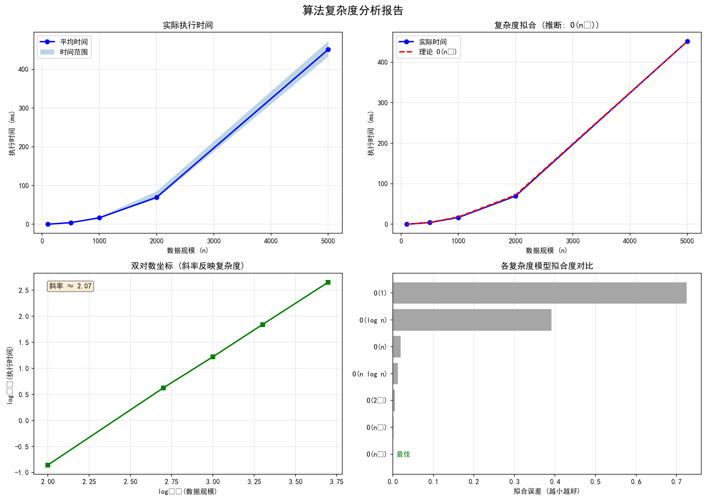

# 算法分析报告

[Jump to source code](#source-code)

**生成时间**: 2026-03-09 14:26:14

---

## 1. 执行摘要

- **正确性测试**: ✅ 通过
- **推断复杂度**: `O(n²)`
- **置信度**: 95.0%

## 2. 正确性测试

**总计**: 8 个测试用例
**通过**: 8
**失败**: 0

| 测试用例 | 状态 | 输入 | 输出/错误 |
|----------|------|------|-----------|
| 空数组 | ✅ 通过 | `[]` | `[]` |
| 单元素 | ✅ 通过 | `[1]` | `[1]` |
| 基本排序 | ✅ 通过 | `[3, 1, 2]` | `[1, 2, 3]` |
| 逆序数组 | ✅ 通过 | `[5, 4, 3, 2, 1]` | `[1, 2, 3, 4, 5]` |
| 已排序数组 | ✅ 通过 | `[1, 2, 3, 4, 5]` | `[1, 2, 3, 4, 5]` |
| 重复元素 | ✅ 通过 | `[2, 2, 1, 1, 3, 3]` | `[1, 1, 2, 2, 3, 3]` |
| 包含负数 | ✅ 通过 | `[-3, -1, -2, 0, 1]` | `[-3, -2, -1, 0, 1]` |
| 大数值 | ✅ 通过 | `[1000000, 1, 500]` | `[1, 500, 1000000]` |

## 3. 效率测试

**测试轮数**: 每规模 5 轮
**总测试次数**: 25 次

| 数据规模 | 平均时间 (ms) | 最小时间 (ms) | 最大时间 (ms) |
|----------|---------------|---------------|---------------|
| 100 | 0.139 | 0.130 | 0.154 |
| 500 | 4.204 | 3.787 | 4.752 |
| 1000 | 16.666 | 15.752 | 18.848 |
| 2000 | 69.588 | 64.998 | 84.648 |
| 5000 | 451.168 | 432.548 | 471.991 |

## 4. 复杂度分析

**推断复杂度**: `O(n²)`
**置信度**: 95.0%
**增长趋势**: 快速增长
**数据点**: 5 个

### 增长率分析

| 规模变化 | 时间变化倍数 | 对数时间比 |
|----------|--------------|------------|
| 5.00x | 30.180x | 4.916 |
| 2.00x | 3.964x | 1.987 |
| 2.00x | 4.175x | 2.062 |
| 2.50x | 6.483x | 2.697 |

### 各复杂度模型拟合度

| 复杂度 | 拟合误差 (越小越好) |
|--------|---------------------|
| O(n²) | 0.0000 ⭐ |
| O(n³) | 0.0018  |
| O(2ⁿ) | 0.0050  |
| O(n log n) | 0.0122  |
| O(n) | 0.0191  |
| O(log n) | 0.3910  |
| O(1) | 0.7247  |

## 5. 可视化分析



## 6. 结论与建议

### ✅ 正确性
算法通过了所有正确性测试用例，实现正确。

### 📊 复杂度评估
算法表现为 `O(n²)`，适用于小规模数据。对于大规模数据，建议考虑更高效的算法。

# Source Code
```python 
def sort(nums):
    nums = list(nums)
    for j in range(1, len(nums)):
        key = nums[j]
        i = j - 1
        while i >= 0 and nums[i] > key:
            nums[i+1] = nums[i]
            i -= 1
        nums[i+1] = key
    return nums
```
